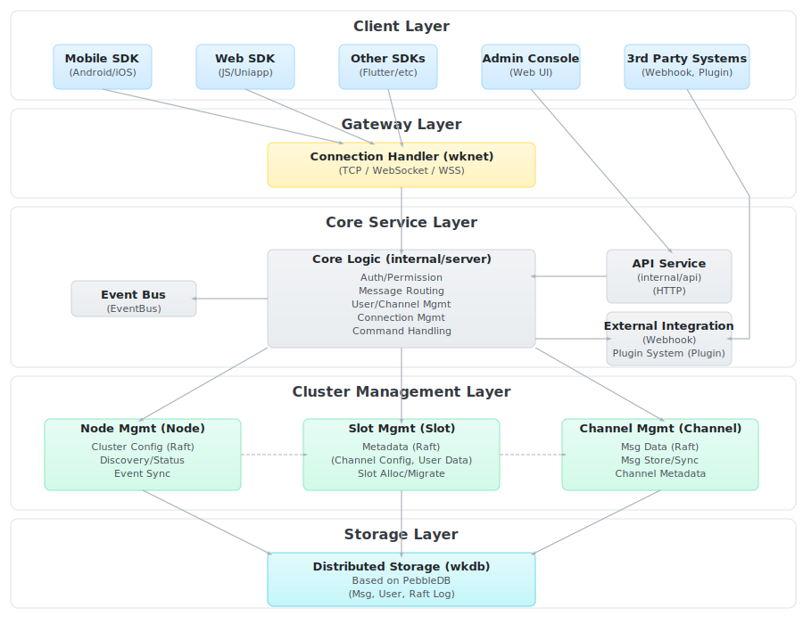
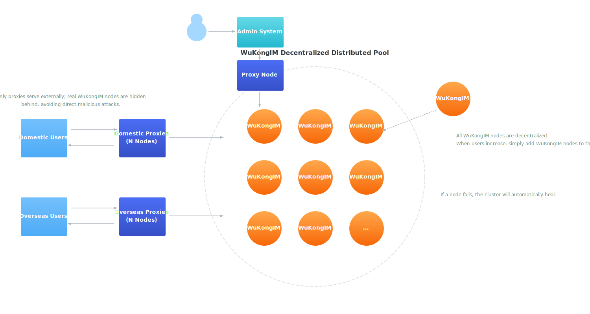

##  WuKongIM (Making Communication Simpler)

A high-performance universal communication service, refined over 10 years (2015-2025). Supports instant messaging, in-app/system notifications, messaging middleware, IoT communication, audio/video signaling, live streaming comments, customer service systems, AI communication, instant communities, and more.


`This project requires Go 1.20.0 or higher to compile`

`Windows is no longer supported`


Key Features of Distributed IM: Automatic failover, decentralized design, data redundancy between nodes, fast auto-scaling, proxy node mechanism

Technical Highlights: Custom protocol, Distributed Raft (modified pull mode), Multi-group Raft (modified pull mode), Relational database internals, Distributed database design, Reactors architecture, Innovative multi-layer distributed leadership mechanism, and more


[中文](./README_CN.md)

<p align="center">

<ul>
<li><strong>Website</strong>: https://githubim.com</li>
<li><strong>Protocol 1</strong>: <a href="https://githubim.com/server/advance/proto.html">WuKongIM Binary Protocol</a></li>
<li><strong>Protocol 2</strong>: <a href="https://githubim.com/server/advance/jsonrpc.html">WuKongIM JSON Protocol (WebSocket only)</a></li>
<li><strong>Issues</strong>: https://github.com/WuKongIM/WuKongIM/issues</li>
<li><strong>Documentation</strong>: https://githubim.com</li>
<li><strong>Architecture Docs</strong>: https://deepwiki.com/WuKongIM/WuKongIM</li>
</ul>
</p>

[](./LICENSE)
[](https://github.com/WuKongIM/WuKongIM)
[](https://goreportcard.com/report/github.com/WuKongIM/WuKongIM)
<a href="https://join.slack.com/t/wukongim/shared_invite/zt-22o7we8on-2iKNUmgigB9ERdF9XUivmw"></a>

Architecture
--------






Video Demonstrations
--------


<table>
  <thead>
    <tr>
      <th style="text-align: center;">Failover Demo</th>
      <th style="text-align: center;">AI Demo</th>
    </tr>
  </thead>
  <tbody>
    <tr>
      <td style="text-align: center;">
        
      </td>
      <td style="text-align: center;">
         
      </td>
    </tr>
  </tbody>
</table>


Live Demo
--------

**Chat Demo**

Web chat demo: http://imdemo.githubim.com

Backend monitoring demo: http://monitor.githubim.com/web

Stress test report: https://githubim.com/server/advance/stressSingleReport.html


Highlights
--------

The only `decentralized` distributed IM in open source

The only IM capable of `200,000+` concurrent sends on a single machine in open source

The only IM with built-in self-developed distributed storage in open source

The only distributed IM that doesn't depend on any middleware in open source

Features
--------

🎦 **Uniqueness**

No limit on group members, easily supports 100,000-member group chats, messages can be stored permanently.

📚 **Low Resource Consumption**

Self-developed binary protocol, heartbeat packets are only 1 byte, saves bandwidth and battery, faster transmission.

🔐 **Security**

End-to-end encryption for message channels and content, prevents man-in-the-middle attacks and message tampering, real-time server data backup, no data loss.


🚀 **Performance**

Built on PebbleDB KV database, we developed a specialized distributed database for IM services, eliminating performance overhead from generic databases. Fast storage means fast messaging.

🔥 **High Availability**

Modified Raft distributed protocol enables automatic disaster recovery - when one machine goes down, another automatically takes over, seamless to users.

Decentralized, no single point of failure, no central node, every node is independent and equal, all can provide service.

Easy scaling, just add machines, no downtime needed, no data migration required, automatic data distribution by policy.

0⃣️ **Ease of Use**

No dependency on any third-party middleware, simple deployment, start with a single command.

Channel-based publish/subscribe design philosophy, easy to understand, easy to get started.

Simple like Redis, high-performance like Kafka, reliable like MySQL

🌲 **Technical Support**

Official team provides technical support, documentation, community discussion groups, and issue feedback.


Feature List
---------------


- [x] Custom message support
- [x] Subscribe/Publish pattern support
- [x] Personal/Group/Customer Service/Community channels
- [x] Channel blacklist support
- [x] Channel whitelist support
- [x] Permanent message roaming, no message loss when switching devices
- [x] Online status, multi-device online for same account
- [x] Real-time message sync across devices
- [x] Server-maintained recent conversation list
- [x] Command messages support
- [x] Offline command interface
- [x] Webhook support for easy business system integration
- [x] Datasource support for seamless business data integration
- [x] WebSocket connection support
- [x] TLS 1.3 support
- [x] Proxy protocol support
- [x] JSON protocol communication
- [x] Prometheus monitoring support
- [x] Monitoring system development
- [x] Streaming messages (like ChatGPT output stream)
- [x] Distributed support
    - [x] Decentralized design, cluster auto-repairs when any node goes down
    - [x] Data redundancy between cluster nodes, any node damage doesn't affect data integrity
    - [x] Fast automatic cluster scaling


Quick Start
---------------

```shell

git clone https://github.com/WuKongIM/WuKongIM.git

cd WuKongIM/docker/cluster

sudo docker compose up -d

```

Admin panel: http://127.0.0.1:15300/web

Chat demo: http://127.0.0.1:15172/login


Development
---------------

### Standalone

```shell


go run main.go

(or go run main.go --config config/wk.yaml)

```

### Distributed
    
```yaml

# Start first node
go run main.go --config  ./exampleconfig/cluster1.yaml

# Start second node
go run main.go --config  ./exampleconfig/cluster2.yaml

# Start third node
go run main.go --config  ./exampleconfig/cluster3.yaml

```


### Access

Admin panel: http://127.0.0.1:5300/web

Chat demo: http://127.0.0.1:5172/chatdemo

### Client Usage

```typescript
import { WKIM, WKIMChannelType, WKIMEvent } from 'easyjssdk';

// 1. Initialize
const im = WKIM.init("ws://your-wukongim-server.com:5200", {
    uid: "your_user_id", // Current user's uid
    token: "your_auth_token" // Auth token (optional if auth is disabled)
});

// 2. Listen
im.on(WKIMEvent.Connect, () => {
    console.log("IM Connected!");
    // Send message
    const result = await im.send("target user",WKIMChannelType.Person,{ type: "text", content: "Hello from EasyJSSDK!" })
});

// Listen for incoming messages
im.on(WKIMEvent.Message, (message) => {
    console.log("Received:", message);
});

// Listen for errors
im.on(WKIMEvent.Error, (error) => {
    console.error("IM Error:", error);
});

// 3. Connect
await im.connect()


```


Production Deployment
---------------

Please refer to the [Deployment Guide](https://githubim.com/install)


SDKs and Demos
---------------


| Project | Github | Example | Docs | Description |
| ---- | ---------- | --------- | ---- |  ---- |
|   WuKongIM   |   [Github](https://github.com/WuKongIM/WuKongIM)         |     N/A |  [Docs](https://githubim.com)  &nbsp;&nbsp;&nbsp;&nbsp;       |    WuKongIM server, handles connections and message delivery |
|   WuKongIMAndroidSDK   |   [Github](https://github.com/WuKongIM/WuKongIMAndroidSDK)         |     [Example](https://github.com/WuKongIM/WuKongIMAndroidSDK/tree/master/app) | [Docs](https://githubim.com/sdk/android/intro.html)    |    WuKongIM Android SDK  |
|   WuKongIMiOSSDK   |   [Github](https://github.com/WuKongIM/WuKongIMiOSSDK)         |     [Example](https://github.com/WuKongIM/WuKongIMiOSSDK/tree/main/Example)  | [Docs](https://githubim.com/sdk/iossdk/intro.html)     |    WuKongIM iOS SDK  |
|   WuKongIMUniappSDK   |   [Github](https://github.com/WuKongIM/WuKongIMUniappSDK)         |     [Example](https://github.com/WuKongIM/WuKongIMUniappSDK/tree/main/examples)  | [Docs](https://githubim.com/sdk/uniapp.html)      |    WuKongIM Uniapp SDK  |
|   WuKongIMJSSDK   |   [Github](https://github.com/WuKongIM/WuKongIMJSSDK)         |     [Example](https://github.com/WuKongIM/WuKongIMJSSDK/tree/main/examples)   | [Docs](https://githubim.com/sdk/jssdk/intro.html)     |    WuKongIM JS SDK  |
|   WuKongIMFlutterSDK   |    [Github](https://github.com/WuKongIM/WuKongIMFlutterSDK)        |    [Example](https://github.com/WuKongIM/WuKongIMFlutterSDK/tree/master/example)   |[Docs](https://githubim.com/sdk/flutter/intro.html)    |    WuKongIM Flutter SDK |
|   WuKongIMReactNativeDemo   |   [Github](https://github.com/wengqianshan/WuKongIMReactNative)         |     N/A  |  N/A  |    WuKongIM React Native Demo (contributed by [wengqianshan](https://github.com/wengqianshan))  |
|   WuKongIMHarmonyOSSDK   |   [Github](https://github.com/WuKongIM/WuKongIMHarmonyOSSDK)         |     [Example](https://github.com/WuKongIM/WuKongIMHarmonyOSSDK/tree/main/entry)  |  [Docs](https://githubim.com/sdk/harmonyos/intro.html)   |   WuKongIM HarmonyOS SDK  |


Node Failover Demo
--------


Screenshots
---------------


||||
|:---:|:---:|:--:|
||||
||||
||||
|||  |
|  |  |

Star
---------------

Our team has been dedicated to instant messaging development. We need your encouragement! If you find this project helpful, please give us a star. Your support is our greatest motivation.

Case Study
---------------

**Project Name**

TangSengDaoDao

**Open Source**

https://github.com/TangSengDaoDao/TangSengDaoDaoServer

**Screenshots**

||||
|:---:|:---:|:--:|
||||


|||          |
|:---:|:---:|:-------------------:|


Contact
---------------

WeChat ID: wukongimgo (mention you want to join the group)


License
---------------

WuKongIM is licensed under the [Apache License 2.0](./LICENSE).
