##  悟空IM（让信息传递更简单）

9年积累，沉淀出来的高性能通用通讯服务，支持即时通讯，站内/系统消息，消息中台，物联网通讯，音视频信令，直播弹幕，客服系统，AI通讯，即时社区等场景。

`本项目需要在go1.20.0或以上环境编译`

`不再支持Windows系统`


分布式IM重要特性： 故障自动转移，去中心化设计，节点之间数据互备，支持集群快速自动扩容，代理节点机制

涉及到的知识点：  自定义协议， 分布式Raft（魔改pull模式），多组Raft（魔改pull模式），关系数据库底层原理，分布式数据库设计， Reactors设计，独创分布式多层领导机制 等等


[English](./README_EN.md)

<p align="center">

<ul>
<!-- <li><strong>QQ群</strong>: <a href="#">750224611</a></li> -->
<!-- <li><strong>微信</strong>: <a href="#">wukongimgo（备注进群）</a></li> -->
<li><strong>官网</strong>: https://githubim.com</li>
<li><strong>通讯协议</strong>: <a href="https://githubim.com/server/advance/proto.html">WuKongIM协议</a></li>
<li><strong>提问</strong>: https://github.com/WuKongIM/WuKongIM/issues</li>
<li><strong>文档</strong>: https://githubim.com</li>
</ul>
</p>

[](./LICENSE)
[](https://github.com/WuKongIM/WuKongIM)
[](https://goreportcard.com/report/github.com/WuKongIM/WuKongIM)
<a href="https://join.slack.com/t/wukongim/shared_invite/zt-22o7we8on-2iKNUmgigB9ERdF9XUivmw"></a>

架构图
--------


演示
--------

**聊天Demo**

web聊天场景演示： http://imdemo.githubim.com

后端监控演示： http://monitor.githubim.com/web

<!-- 愿景
--------

深知开发一个即时通讯系统的复杂性，我们希望通过开源的方式，让更多的开发者可以快速的搭建自己的即时通讯系统，让信息传递更简单。 -->


吹个牛
--------

开源中唯一`去中心化`的分布式IM

开源中唯一单机发送并发超`10万`的IM

开源中唯一内置自研分布式存储的IM

开源中唯一不依赖任何中间件的分布式IM

特点
--------

🎦**独特性**

群成员无上限，轻松支持10万人群聊，消息可永久存储。

📚**资源消耗低**

自研二进制协议，心跳包只有1字节，省流量，省电量，传输更迅速。

🔐**安全性**

消息通道和消息内容全程加密，防中间人攻击和窜改消息内容，服务端数据实时备份，数据不丢失。


🚀 **性能**

基于pebble kv数据库，研发了针对于IM这种服务的特有分布式数据库，省了其他数据库为了通用性而带来的性能损耗， 因为存储快，所以消息快。

🔥**高可用**

通过魔改raft分布式协议，实现了自动容灾，一台机器宕机，另一台机器自动接管，对外无感知。

去中心化，无单点，无中心节点，每个节点都是独立且平等的，都可以提供服务。

扩容方便，只需增加机器，不需要停机，不需要迁移数据，自动按策略分配数据。

0⃣️ **易用性**

不依赖任何第三方中间件，部署简单，一条命令即可启动。

采用频道订阅发布的设计理念，容易理解，容易上手。

与Redis一样简单，Kafka一样高性能，MySQL一样可靠

🌲**技术支持**

官方团队提供技术支持，提供技术文档，提供技术交流群，提供issue反馈。    


功能特性
---------------


- [x] 支持自定义消息
- [x] 支持订阅/发布者模式
- [x] 支持个人/群聊/客服/社区资讯频道
- [x] 支持频道黑名单
- [x] 支持频道白名单
- [x] 支持消息永久漫游，换设备登录，消息不丢失
- [x] 支持在线状态，支持同账号多设备同时在线
- [x] 支持多设备消息实时同步
- [x] 支持用户最近会话列表服务端维护
- [x] 支持指令消息
- [x] 支持离线指令接口
- [x] 支持Webhook，轻松对接自己的业务系统
- [x] 支持Datasource，无缝对接自己的业务系统数据源
- [x] 支持Websocket连接
- [x] 支持TLS 1.3
- [x] 支持Prometheus监控
- [x] 监控系统开发
- [x] 支持流式消息，类似chatgpt的结果输出流
- [x] 支持分布式
    - [x] 去中心化设计，任意一个节点宕机，集群自动修复
    - [x] 集群节点之间数据互备，任意一个节点损害，不影响数据完整性
    - [x] 支持集群快速自动扩容
    <!-- - [ ] 支持长连接CDN，解决跨国跨地区长连接不稳定问题 -->


快速部署体验
---------------

```shell

git clone https://github.com/WuKongIM/WuKongIM.git

cd WuKongIM/docker/cluster

sudo docker compose up -d

```

后台管理系统： http://127.0.0.1:15300/web

聊天演示地址：http://127.0.0.1:15172/login


源码开发
---------------

### 单机

```shell


go run main.go

(或 go run main.go --config config/wk.yaml)

```

### 分布式
    
```yaml

# 启动第一个节点
go run main.go --config  ./exampleconfig/cluster1.yaml

# 启动第二个节点
go run main.go --config  ./exampleconfig/cluster2.yaml

# 启动第三个节点
go run main.go --config  ./exampleconfig/cluster3.yaml

```


### 访问

后台管理系统： http://127.0.0.1:5300/web

聊天演示地址：http://127.0.0.1:5172/chatdemo


正式部署
---------------

请参考[部署文档](https://githubim.com/install)


配套SDK源码和Demo
---------------


| 项目名 | Github地址 | Example | 文档 | 说明 |
| ---- | ---------- | --------- | ---- |  ---- |
|   WuKongIM   |   [Github](https://github.com/WuKongIM/WuKongIM)         |     无 |  [文档](https://githubim.com)  &nbsp;&nbsp;&nbsp;&nbsp;       |    悟空IM通讯端，负责长连接维护，消息投递等等 |
|   WuKongIMAndroidSDK   |   [Github](https://github.com/WuKongIM/WuKongIMAndroidSDK)         |     [Example](https://github.com/WuKongIM/WuKongIMAndroidSDK/tree/master/app) | [文档](https://githubim.com/sdk/android/intro.html)    |    悟空IM的Android SDK  |
|   WuKongIMiOSSDK   |   [Github](https://github.com/WuKongIM/WuKongIMiOSSDK)         |     [Example](https://github.com/WuKongIM/WuKongIMiOSSDK/tree/main/Example)  | [文档](https://githubim.com/sdk/iossdk/intro.html)     |    悟空IM的iOS SDK  |
|   WuKongIMUniappSDK   |   [Github](https://github.com/WuKongIM/WuKongIMUniappSDK)         |     [Example](https://github.com/WuKongIM/WuKongIMUniappSDK/tree/main/examples)  | [文档](https://githubim.com/sdk/uniapp.html)      |    悟空IM的 Uniapp SDK  |
|   WuKongIMJSSDK   |   [Github](https://github.com/WuKongIM/WuKongIMJSSDK)         |     [Example](https://github.com/WuKongIM/WuKongIMJSSDK/tree/main/examples)   | [文档](https://githubim.com/sdk/jssdk/intro.html)     |    悟空IM的 JS SDK  |
|   WuKongIMFlutterSDK   |    [Github](https://github.com/WuKongIM/WuKongIMFlutterSDK)        |    [Example](https://github.com/WuKongIM/WuKongIMFlutterSDK/tree/master/example)   |[文档](https://githubim.com/sdk/flutter/intro.html)    |    悟空IM的 Flutter SDK |
|   WuKongIMReactNativeDemo   |   [Github](https://github.com/wengqianshan/WuKongIMReactNative)         |     无  |  无  |    悟空IM的 React Native Demo(由贡献者 [wengqianshan](https://github.com/wengqianshan) 提供)  |
|   WuKongIMHarmonyOSSDK   |   [Github](https://github.com/WuKongIM/WuKongIMHarmonyOSSDK)         |     [Example](https://github.com/WuKongIM/WuKongIMHarmonyOSSDK/tree/main/entry)  |  [文档](https://githubim.com/sdk/harmonyos/intro.html)   |   WuKongIM的纯血鸿蒙OS SDK  |


节点故障转移演示
--------


后台截图
---------------


||||
|:---:|:---:|:--:|
|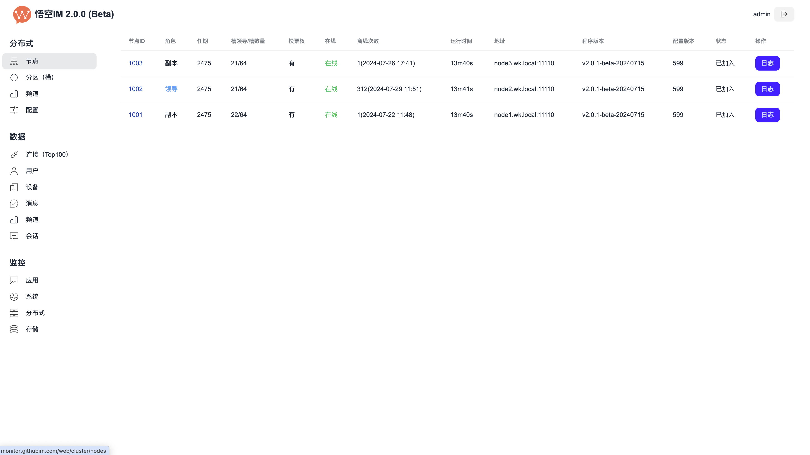|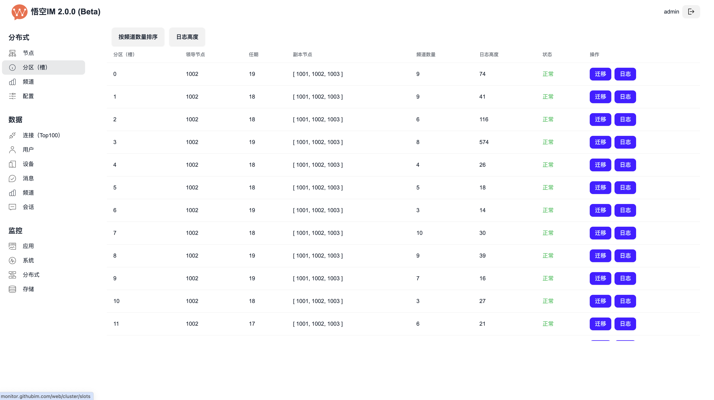|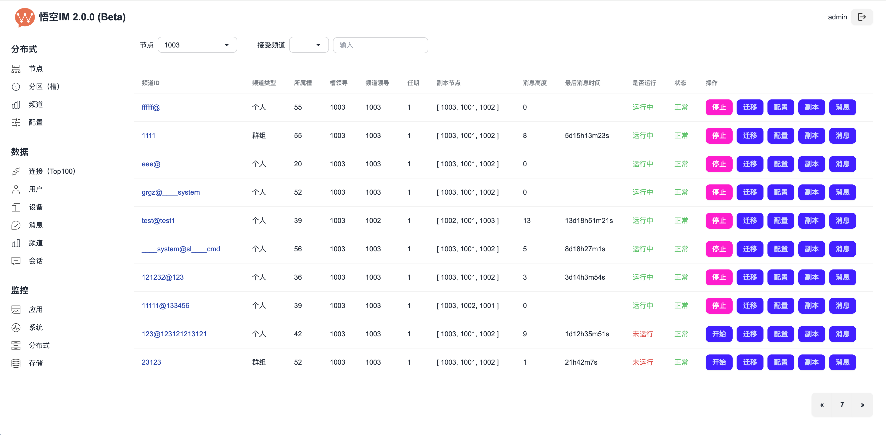|
|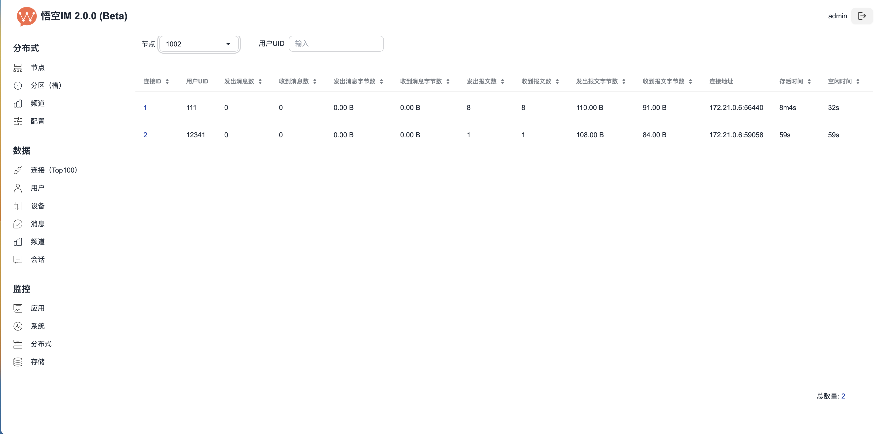|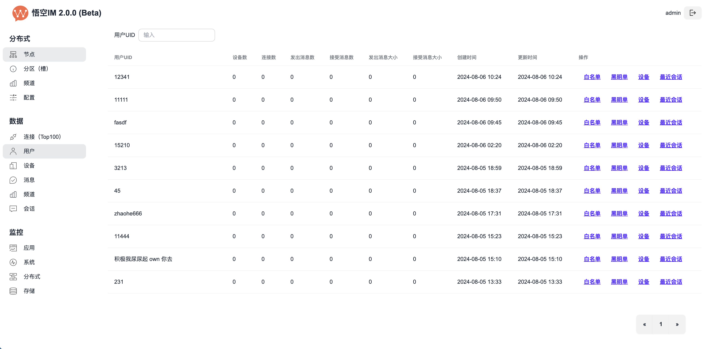|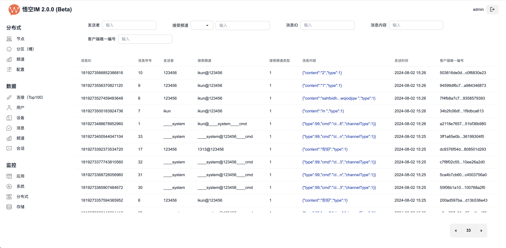|
|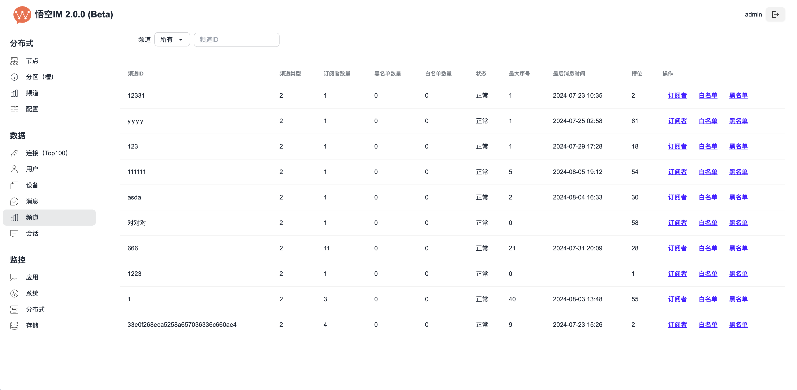|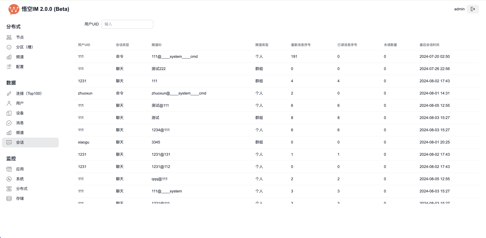|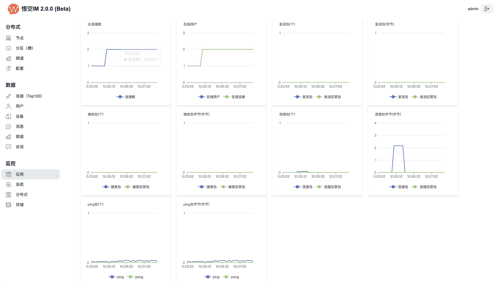|
|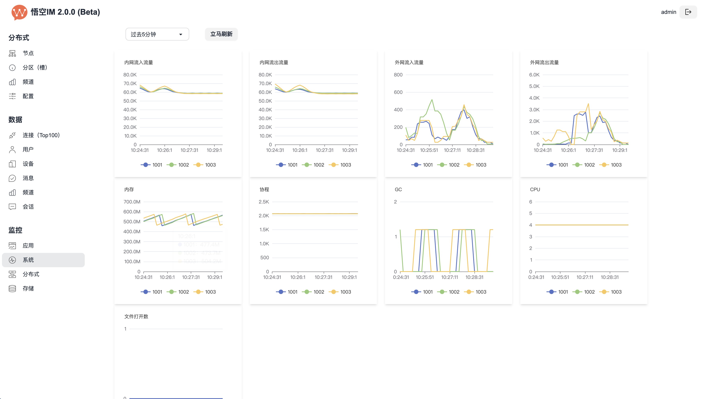|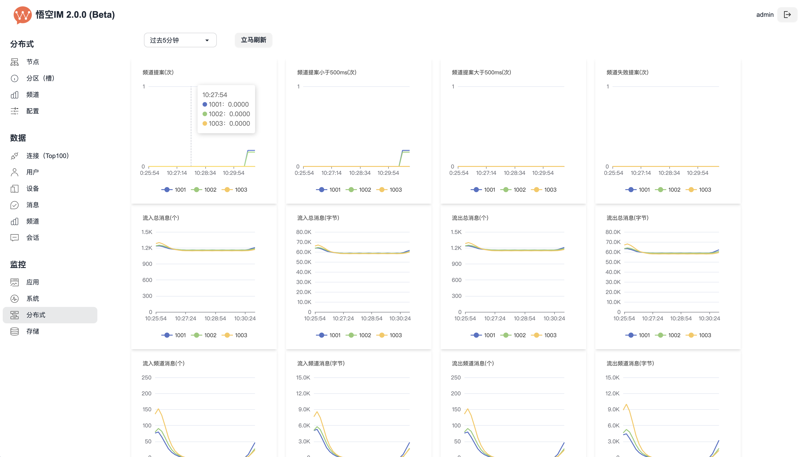|  |
| 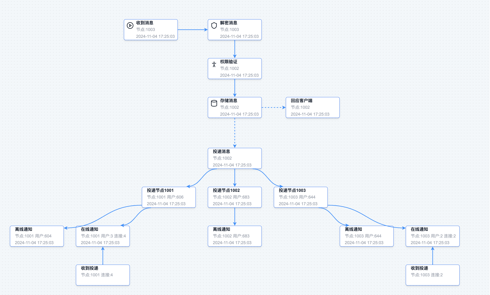 | 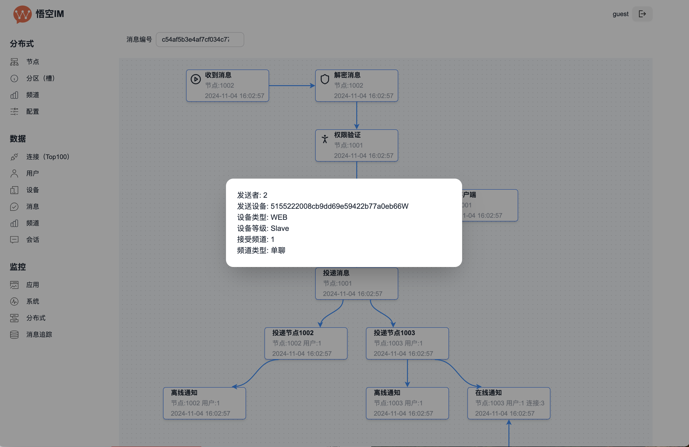 |

Star
---------------

我们团队一直致力于即时通讯的研发，需要您的鼓励，如果您觉得本项目对您有帮助，欢迎点个star，您的支持是我们最大的动力。

案例展示
---------------

**项目名**

TangSengDaoDao

**开源地址**

https://github.com/TangSengDaoDao/TangSengDaoDaoServer

**截图**

||||
|:---:|:---:|:--:|
||||


|||          |
|:---:|:---:|:-------------------:|


Wechat
---------------

如果有需要，加我拉你进群，微信号：wukongimgo


License
---------------

WuKongIM is licensed under the [Apache License 2.0](./LICENSE).
