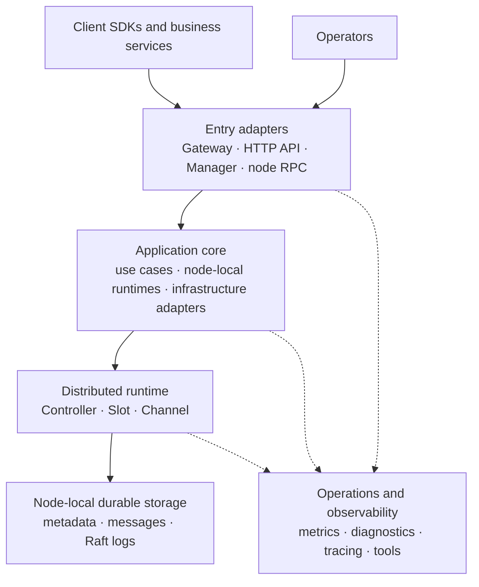

<p align="center">
  
</p>

<h1 align="center">WuKongIM v3 Beta</h1>

<p align="center">
  High-performance distributed communication infrastructure for instant messaging and real-time interaction.
</p>

<p align="center">
  <a href="./README_CN.md">简体中文</a> ·
  <a href="https://githubim.com">Website</a> ·
  <a href="https://docs.githubim.com/en">Documentation</a> ·
  <a href="https://github.com/WuKongIM/WuKongIM/releases">Releases</a> ·
  <a href="https://github.com/WuKongIM/WuKongIM/issues">Issues</a>
</p>

<p align="center">
  <a href="https://github.com/WuKongIM/WuKongIM/actions/workflows/ci.yml"></a>
  
  
  <a href="https://www.apache.org/licenses/LICENSE-2.0"></a>
</p>

> [!NOTE]
> WuKongIM v3 is in beta, so APIs, configuration, and durable formats may change before the stable release; validate the system against your workload before production use.

## Why WuKongIM?

WuKongIM is a channel-oriented communication server for chat, notifications, customer service, IoT, audio/video signaling, live interaction, communities, and AI messaging. Clients publish ordered messages to personal, group, or custom channels; WuKongIM handles persistence, replication, synchronization, presence, and online delivery.

| Design goal | What WuKongIM provides |
| --- | --- |
| One deployment model | Single-node and multi-node deployments use the same Controller, Slot, Channel, routing, and storage paths. A one-node deployment is a **single-node cluster**, not a separate standalone mode. |
| Self-contained core | Pebble-backed message, metadata, and Raft storage are built in. The core server does not require an external database, cache, or message queue. |
| Predictable messaging | Per-channel ordering, idempotency lookup, explicit commit boundaries, offline sync, multi-device sessions, and bounded online delivery. |
| High-cardinality design | Hash-slot routing, multi-reactor Channel runtimes, batching, bounded workers, and backpressure make resource use explicit under many users and channels. |
| Operability | Health and readiness endpoints, Prometheus metrics, diagnostics, tracing, runtime pressure views, a Manager UI, and dedicated operations tools. |

## Common use cases

- Instant messaging, group chat, and real-time communities
- In-app notifications and messaging middleware
- Customer service and agent communication
- IoT communication and audio/video signaling
- Live interaction and streaming messages
- AI assistants and generated-message workflows

## Quick start

### Run a single-node cluster from source

Requirements: Git and Go `1.25.11`.

```bash
git clone https://github.com/WuKongIM/WuKongIM.git
cd WuKongIM

cp wukongim.toml.example wukongim.toml
GOWORK=off go run ./cmd/wukongim -config ./wukongim.toml
```

Check readiness from another terminal:

```bash
curl --fail http://127.0.0.1:5001/readyz
```

The example starts the complete cluster path on one node and embeds both browser applications:

| Purpose | Address |
| --- | --- |
| Chat Demo | <http://127.0.0.1:5001/demo/> |
| Manager Web UI | <http://127.0.0.1:5301> (`admin` / `a1234567`) |
| HTTP API, health, and metrics | `http://127.0.0.1:5001` |
| WKProto TCP | `127.0.0.1:5100` |
| WebSocket multiplexer | `ws://127.0.0.1:5200` |
| Node transport | `127.0.0.1:7001` |

Open the Chat Demo, enter a unique test UID, and start sending messages. No separate frontend process is required.

### Run the three-node development environment

Requirements: Docker with the Compose plugin.

```bash
docker compose up -d --build
docker compose ps
curl --retry 30 --retry-delay 2 --retry-all-errors --fail \
  http://127.0.0.1:15001/readyz
```

The default stack starts three WuKongIM nodes, Prometheus, and Grafana:

| Service | Address |
| --- | --- |
| Manager Web UI | <http://127.0.0.1:18080> (`admin` / `a1234567`) |
| Chat Demo | <http://127.0.0.1:15001/demo/> |
| Node 1 API / metrics | `http://127.0.0.1:15001` |
| Node 1 WKProto / WebSocket | `127.0.0.1:15100` / `ws://127.0.0.1:15200` |
| Prometheus | <http://127.0.0.1:9091> |
| Grafana | <http://127.0.0.1:3000> (`admin` / `Aa12345678`) |

> [!CAUTION]
> `docker-compose.yml` is a development environment. It exposes development credentials and benchmark surfaces and uses local bind-mounted data directories. Do not use these defaults for production.

Stop the development stack with:

```bash
docker compose down
```

## Core capabilities

| Area | Capabilities |
| --- | --- |
| Client access | WKProto over TCP, WebSocket multiplexing for WKProto and JSON-RPC, pluggable listeners, and bounded asynchronous dispatch. |
| Messaging | Personal, group, and custom channels; ordered append; custom payloads; idempotency; command messages; stream events; and committed message sync. |
| Channel policy | Subscribers, blacklist, whitelist, ban/disband state, stranger policy, system users, and large-group-aware subscriber access. |
| User and conversation state | Multi-device sessions, distributed presence, online status, device logout, recent conversations, read cursors, and unread state. |
| Delivery | Owner-node online delivery, `RECVACK` tracking, bounded retries, recipient routing, and best-effort post-commit fan-out. |
| Extensibility | HTTP webhooks and node-local PDK-compatible plugins with lifecycle, message hooks, and host RPC. |

## Architecture


```mermaid
flowchart TB
    Client["Client SDKs and business services"]
    Operator["Operators"]
    Access["Entry adapters<br/>Gateway · HTTP API · Manager · node RPC"]
    Core["Application core<br/>use cases · node-local runtimes · infrastructure adapters"]
    Cluster["Distributed runtime<br/>Controller · Slot · Channel"]
    Storage["Node-local durable storage<br/>metadata · messages · Raft logs"]
    Observe["Operations and observability<br/>metrics · diagnostics · tracing · tools"]

    Client --> Access
    Operator --> Access
    Access --> Core
    Core --> Cluster
    Cluster --> Storage
    Access -.-> Observe
    Core -.-> Observe
    Cluster -.-> Observe
```

| Layer | Responsibility | Model |
| --- | --- | --- |
| Controller | Cluster membership, node health, hash-slot table, physical Slot assignments, and operator tasks. | A small Raft quorum owns canonical control state and stays out of the normal message hot path. |
| Slot | Users, channels, membership, conversations, plugin bindings, and Channel runtime metadata. | Metadata is sharded across physical Multi-Raft groups and routed through 256 logical hash slots by default. |
| Channel | Ordered message logs, leaders and replicas, commit progress, retention boundaries, and runtime lifecycle. | Per-channel state machines preserve ordering while bounded storage and RPC workers perform durable append and replication. |

`internal/app` is the composition root. Entry adaptation stays in `internal/access`, reusable orchestration in `internal/usecase`, node-local state in `internal/runtime`, and concrete adapters in `internal/infra`. All nodes share the same transport and cluster semantics, including a single-node cluster.

For deeper design details, see the [distributed architecture index](./docs/wiki/architecture/README.md).

## Before production

- Replace all example credentials, JWT secrets, join tokens, and internal capabilities.
- Terminate client and administrative traffic with an appropriate TLS and network-access policy.
- Place node data on independent durable storage and define capacity and retention limits.
- Configure, exercise, and monitor backup and restore procedures; see [Backup and Restore](./docs/development/BACKUP_AND_RESTORE.md).
- Validate expected traffic, large groups, failure recovery, and tail latency with your own workload; see [Performance Triage](./docs/development/PERF_TRIAGE.md).
- Restrict debug, benchmark, diagnostics, Manager, and metrics endpoints to trusted networks.

## SDKs

| Platform | Repository |
| --- | --- |
| Android | [WuKongIMAndroidSDK](https://github.com/WuKongIM/WuKongIMAndroidSDK) |
| iOS | [WuKongIMiOSSDK](https://github.com/WuKongIM/WuKongIMiOSSDK) |
| JavaScript / Web | [WuKongIMJSSDK](https://github.com/WuKongIM/WuKongIMJSSDK) |
| Flutter | [WuKongIMFlutterSDK](https://github.com/WuKongIM/WuKongIMFlutterSDK) |
| UniApp | [WuKongIMUniappSDK](https://github.com/WuKongIM/WuKongIMUniappSDK) |
| HarmonyOS | [WuKongIMHarmonyOSSDK](https://github.com/WuKongIM/WuKongIMHarmonyOSSDK) |

See the [SDK overview](https://docs.githubim.com/en/sdk/overview) to choose an integration path.

## Operations and tooling

| Tool | Purpose |
| --- | --- |
| Manager | Browser UI and HTTP API for cluster state, connections, messages, plugins, migrations, diagnostics, and metrics. |
| [`wkcli`](./cmd/wkcli/README.md) | Command-line contexts, node operations, runtime `top`, simulation, and lightweight send checks. |
| [`wkbench`](./cmd/wkbench/README.md) | Black-box validation, workload execution, development simulation, capacity searches, and reports. |
| [`wkdb`](./cmd/wkdb/README.md) | Node-local offline inspection plus explicit export, import, and diff workflows. |
| Prometheus and Grafana | Metrics collection and dashboards for gateway, cluster, storage, delivery, transport, and process pressure. |

## Configuration

The main configuration format is TOML. Environment variables use the `WK_` prefix and override file values; list fields use a JSON string for complete replacement.

Without `-config`, WuKongIM checks:

1. `./wukongim.toml`
2. `./conf/wukongim.toml`
3. `/etc/wukongim/wukongim.toml`

Start with [`wukongim.toml.example`](./wukongim.toml.example), which documents the available configuration domains and fields.

## Development

The repository uses Go `1.25.11`; the Manager Web UI uses Bun `1.3.11`.

```bash
GOWORK=off go build ./cmd/wukongim ./cmd/wkcli ./cmd/wkbench ./cmd/wkdb
GOWORK=off go test ./cmd/... ./internal/... ./pkg/... ./scripts/... ./docker/... -count=1
```

See [`AGENTS.md`](./AGENTS.md) for repository conventions and [CI](./docs/development/CI.md) for the complete validation matrix.

## Community

- Website: <https://githubim.com>
- Documentation: <https://docs.githubim.com/en>
- Issues: <https://github.com/WuKongIM/WuKongIM/issues>
- Releases: <https://github.com/WuKongIM/WuKongIM/releases>
- WeChat: `wukongimgo` — mention that you want to join the WuKongIM community group.

## License

WuKongIM is licensed under the [Apache License 2.0](https://www.apache.org/licenses/LICENSE-2.0).
