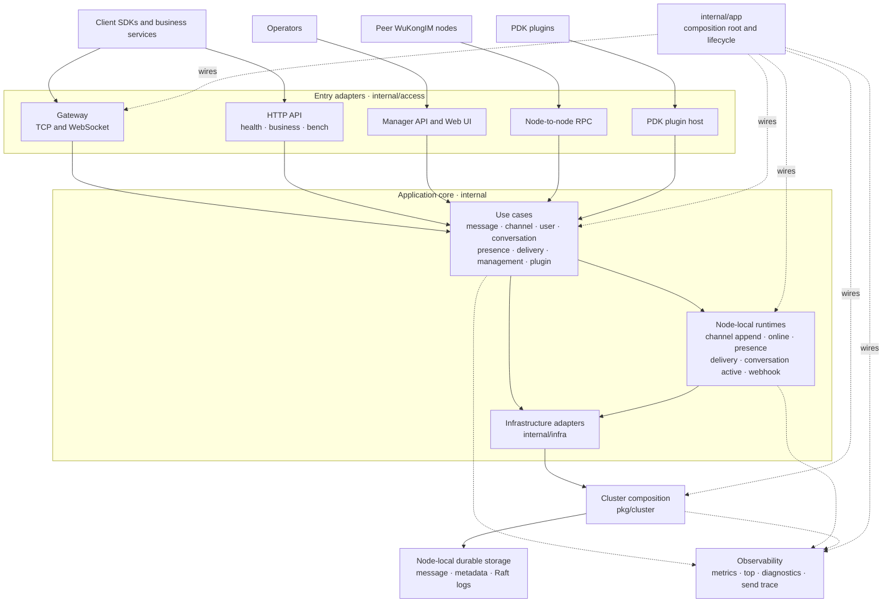
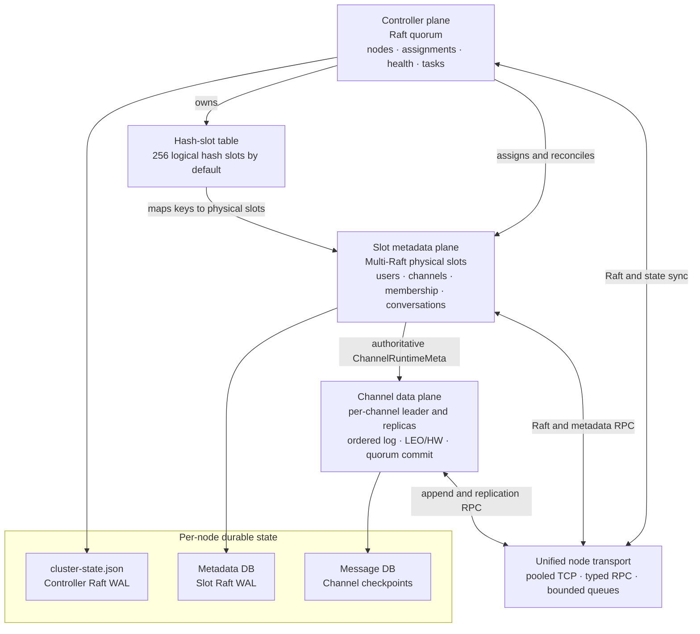
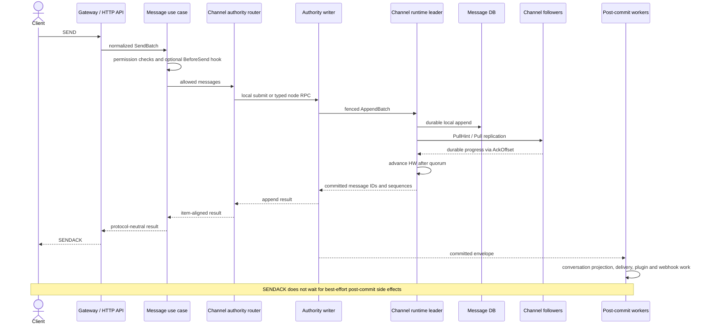

<p align="center">
  
</p>

<h1 align="center">WuKongIM v3 Beta</h1>

<p align="center">
  High-performance distributed communication infrastructure for instant messaging, notifications, IoT, live interaction, customer service, and AI messaging.
</p>

<p align="center">
  <a href="./README_CN.md">简体中文</a> ·
  <a href="https://githubim.com">Website</a> ·
  <a href="https://docs.githubim.com">Documentation</a> ·
  <a href="https://github.com/WuKongIM/WuKongIM/releases">Releases</a> ·
  <a href="https://github.com/WuKongIM/WuKongIM/issues">Issues</a>
</p>

<p align="center">
  <a href="https://github.com/WuKongIM/WuKongIM/actions/workflows/ci.yml"></a>
  
  
  <a href="./LICENSE"></a>
</p>

> [!WARNING]
> The `main` branch contains the WuKongIM v3 beta. APIs, configuration, and durable formats may still change. Use it for new deployments and evaluation only after testing it against your workload. Do not assume that a v2 production data directory can be reused: this repository does not yet provide a complete, verified v2-to-v3 migration procedure.

## What is WuKongIM?

WuKongIM is a channel-oriented communication server. Clients publish ordered messages to personal, group, customer-service, community, or custom channels; the server handles durable storage, replication, synchronization, presence, and online delivery.

The core server embeds its own storage and does not require an external database, cache, or message queue. A one-node deployment uses exactly the same cluster path as a multi-node deployment: it is a **single-node cluster**, not a separate standalone mode.

Typical uses include:

- Instant messaging and real-time communities
- In-app notifications and messaging middleware
- Customer service and agent communication
- IoT communication and audio/video signaling
- Live interaction, streaming messages, and AI-generated content

## Why v3?

| Design goal | v3 approach |
| --- | --- |
| One deployment model | Single-node and multi-node deployments share the same Controller, Slot, Channel, routing, and storage semantics. |
| Predictable message durability | `SENDACK` follows the Channel commit boundary; a successful acknowledgement is not produced before the configured local or quorum commit completes. |
| High-cardinality workloads | Hash-slot routing, multi-reactor Channel runtimes, per-channel ordering, bounded worker pools, batching, and backpressure keep work explicit under many users and channels. |
| Large-group delivery | Subscriber access is paged, large-group state is explicit, and recipient routing and delivery use bounded batches instead of unbounded per-request fan-out. |
| Clear ownership | Entry adapters, use cases, node-local runtimes, infrastructure adapters, distributed runtimes, and storage have separate package boundaries. |
| Operability | Health/readiness, Prometheus metrics, runtime pressure, diagnostics, send tracing, Raft inspection, migration tasks, and a manager UI are built into the runtime. |

## Core capabilities

| Area | Capabilities |
| --- | --- |
| Client access | WKProto over TCP, WebSocket multiplexing for WKProto and JSON-RPC, pluggable gateway listeners, and bounded asynchronous frame dispatch. |
| Messaging | Custom payloads, personal/group/custom channels, ordered per-channel append, idempotency lookup, command messages, streaming message events, and committed message sync. |
| Channel policy | Subscribers, blacklist, whitelist, ban/disband state, stranger policy, system users, and large-group-aware subscriber handling. |
| User state | Multi-device sessions, distributed presence authority, online status, route expiry, connection inspection, and device logout. |
| Conversations | UID-owned recent conversation projection, ordinary/CMD isolation, read cursors, unread state, delete barriers, and committed last-message hydration. |
| Delivery | Owner-node online delivery, `RECVACK` tracking, bounded retry, recipient-authority partitioning, and best-effort post-commit fan-out. |
| Extensibility | HTTP webhooks and node-local PDK-compatible plugins with lifecycle, send, receive, persist-after, and host RPC hooks. |
| Operations | Manager API and Web UI, dynamic node lifecycle, Slot and Channel migration tasks, Raft log/status inspection, `wkcli`, `wkdb`, and `wkbench`. |

## Architecture

### 1. System overview


```mermaid
flowchart TB
    Client["Client SDKs and business services"]
    Operator["Operators"]
    Plugin["PDK plugins"]
    Peer["Peer WuKongIM nodes"]

    subgraph Access["Entry adapters · internal/access"]
        Gateway["Gateway<br/>TCP and WebSocket"]
        API["HTTP API<br/>health · business · bench"]
        Manager["Manager API and Web UI"]
        NodeRPC["Node-to-node RPC"]
        PluginHost["PDK plugin host"]
    end

    subgraph Core["Application core · internal"]
        Usecase["Use cases<br/>message · channel · user · conversation<br/>presence · delivery · management · plugin"]
        Runtime["Node-local runtimes<br/>channel append · online · presence<br/>delivery · conversation active · webhook"]
        Infra["Infrastructure adapters<br/>internal/infra"]
    end

    Cluster["Cluster composition<br/>pkg/cluster"]
    Storage["Node-local durable storage<br/>message · metadata · Raft logs"]
    Observe["Observability<br/>metrics · top · diagnostics · send trace"]
    App["internal/app<br/>composition root and lifecycle"]

    Client --> Gateway
    Client --> API
    Operator --> Manager
    Plugin --> PluginHost
    Peer --> NodeRPC
    Gateway --> Usecase
    API --> Usecase
    Manager --> Usecase
    NodeRPC --> Usecase
    PluginHost --> Usecase
    Usecase --> Runtime
    Usecase --> Infra
    Runtime --> Infra
    Infra --> Cluster
    Cluster --> Storage
    Usecase -.-> Observe
    Runtime -.-> Observe
    Cluster -.-> Observe
    App -.->|wires| Gateway
    App -.->|wires| Usecase
    App -.->|wires| Runtime
    App -.->|wires| Cluster
    App -.->|wires| Observe
```

`internal/app` is the only composition root. Protocol adaptation stays in `internal/access`, reusable business orchestration stays in `internal/usecase`, node-local state stays in `internal/runtime`, and concrete cluster/runtime adaptation stays in `internal/infra`.

### 2. Distributed architecture


```mermaid
flowchart TB
    Controller["Controller plane<br/>Raft quorum<br/>nodes · assignments · health · tasks"]
    HashTable["Hash-slot table<br/>256 logical hash slots by default"]
    Slot["Slot metadata plane<br/>Multi-Raft physical slots<br/>users · channels · membership · conversations"]
    Channel["Channel data plane<br/>per-channel leader and replicas<br/>ordered log · LEO/HW · quorum commit"]
    Transport["Unified node transport<br/>pooled TCP · typed RPC · bounded queues"]

    subgraph Durable["Per-node durable state"]
        ControlStore["cluster-state.json<br/>Controller Raft WAL"]
        MetaStore["Metadata DB<br/>Slot Raft WAL"]
        MessageStore["Message DB<br/>Channel checkpoints"]
    end

    Controller -->|owns| HashTable
    Controller -->|assigns and reconciles| Slot
    HashTable -->|maps keys to physical slots| Slot
    Slot -->|authoritative ChannelRuntimeMeta| Channel
    Controller <-->|Raft and state sync| Transport
    Slot <-->|Raft and metadata RPC| Transport
    Channel <-->|append and replication RPC| Transport
    Controller --> ControlStore
    Slot --> MetaStore
    Channel --> MessageStore
```

| Layer | Owns | Consistency and performance model |
| --- | --- | --- |
| Controller | Cluster membership, node health, hash-slot table, physical Slot assignments, and operator tasks | A small Raft quorum persists the control state. It plans and reconciles topology but stays out of the normal message hot path. |
| Slot | Users, channels, subscribers, conversation projections, plugin bindings, and Channel runtime metadata | Metadata is sharded across physical Multi-Raft groups and routed through logical hash slots. |
| Channel | Ordered message logs, per-channel leadership, replicas, LEO/HW, retention boundaries, and runtime lifecycle | Multi-reactor state machines preserve per-channel ordering; blocking storage and RPC work runs in bounded workers; quorum commit advances HW. |
| Transport | Controller Raft traffic, Slot Raft traffic, Channel replication, append forwarding, and typed node RPC | Shared pooled TCP connections, fixed wire frames, service isolation, priorities, batching, and bounded queues. |

### 3. Message path


```mermaid
sequenceDiagram
    actor Client
    participant Entry as Gateway / HTTP API
    participant Message as Message use case
    participant Router as Channel authority router
    participant Writer as Authority writer
    participant Leader as Channel runtime leader
    participant DB as Message DB
    participant Followers as Channel followers
    participant Effects as Post-commit workers

    Client->>Entry: SEND
    Entry->>Message: normalized SendBatch
    Message->>Message: permission checks and optional BeforeSend hook
    Message->>Router: allowed messages
    Router->>Writer: local submit or typed node RPC
    Writer->>Leader: fenced AppendBatch
    Leader->>DB: durable local append
    Leader->>Followers: PullHint / Pull replication
    Followers-->>Leader: durable progress via AckOffset
    Leader->>Leader: advance HW after quorum
    Leader-->>Writer: committed message IDs and sequences
    Writer-->>Router: append result
    Router-->>Message: item-aligned result
    Message-->>Entry: protocol-neutral result
    Entry-->>Client: SENDACK
    Writer-->>Effects: committed envelope
    Effects->>Effects: conversation projection, delivery, plugin and webhook work
    Note over Client,Effects: SENDACK does not wait for best-effort post-commit side effects
```

The foreground path is deliberately narrow: validate, route, append, replicate, commit, acknowledge. Conversation activity, online delivery, plugin `PersistAfter`, and webhook notifications run after the durable decision and cannot turn a successful commit into a failed `SENDACK`.

## Code map

| Area | Location | Responsibility |
| --- | --- | --- |
| Product entrypoint | `cmd/wukongim` | Load TOML and `WK_*` overrides, build the app, and own process signals. |
| Composition | `internal/app` | Wire dependencies and enforce startup/shutdown order. |
| Entry adapters | `internal/access` | Gateway, HTTP API, manager API, node RPC, and plugin protocol adaptation. |
| Business orchestration | `internal/usecase` | Entry-independent message, channel, user, conversation, presence, delivery, management, and plugin rules. |
| Node-local runtimes | `internal/runtime` | Bounded in-memory state and workers for channel append, presence, online sessions, delivery, conversations, hooks, and webhooks. |
| Runtime adapters | `internal/infra` | Adapt internal ports to the distributed and storage runtimes. |
| Gateway foundation | `pkg/gateway` | Listeners, transports, protocols, sessions, authentication, and dispatch. |
| Cluster composition | `pkg/cluster` | Controller, routing, Slot runtime, Channel runtime, discovery, typed node RPC, readiness, and migrations. |
| Control plane | `pkg/controller` | Controller Raft, canonical cluster state, planning, task state, snapshots, and mirror sync. |
| Metadata plane | `pkg/slot`, `pkg/hashslot` | Multi-Raft metadata state machines, distributed proxy, and hash-slot routing. |
| Message data plane | `pkg/channel` | Multi-reactor Channel log, replication, append, lifecycle, retention, and worker pools. |
| Storage | `pkg/db`, `pkg/raftlog` | Pebble-backed message/meta stores and durable Raft logs/snapshots. |
| Protocols | `pkg/protocol` | WKProto frames/codecs, channel IDs, and JSON-RPC bridge. |
| Tools | `cmd/wkcli`, `cmd/wkbench`, `cmd/wkdb` | Operations, black-box benchmarks, and node-local read-only storage inspection. |

## Quick start

### Docker Compose: complete three-node development environment

Requirements: Docker with the Compose plugin.

```bash
git clone https://github.com/WuKongIM/WuKongIM.git
cd WuKongIM

docker compose up -d --build
docker compose ps
curl --retry 30 --retry-delay 2 --retry-all-errors --fail \
  http://127.0.0.1:15001/readyz
```

The default Compose stack starts three WuKongIM nodes, the manager Web UI, Prometheus, and Grafana. The optional `wk-sim` benchmark simulator is behind the `dev-sim` profile.

| Service | Address | Development credentials / notes |
| --- | --- | --- |
| Manager Web UI | <http://127.0.0.1:18080> | `admin` / `a1234567` |
| Node 1 API and readiness | <http://127.0.0.1:15001/readyz> | Metrics: <http://127.0.0.1:15001/metrics> |
| Node 1 WKProto TCP | `127.0.0.1:15100` | Client connection endpoint |
| Node 1 WebSocket | `ws://127.0.0.1:15200` | WKProto / JSON-RPC multiplexing |
| Prometheus | <http://127.0.0.1:9091> | External Prometheus used by the Compose stack |
| Grafana | <http://127.0.0.1:3000> | `admin` / `Aa12345678` |

Start the optional simulator with:

```bash
docker compose --profile dev-sim up -d wk-sim
curl --retry 30 --retry-delay 2 --retry-all-errors --fail \
  http://127.0.0.1:19091/healthz
```

> [!CAUTION]
> `docker-compose.yml` is a development environment. It enables debug/benchmark surfaces, contains development credentials, and uses local bind-mounted data directories. Replace secrets, review exposed ports, use independent durable storage, and define backup, TLS, capacity, and observability policies before production use.

### Source: single-node cluster

Requirements: Go `1.25.11`.

```bash
git clone https://github.com/WuKongIM/WuKongIM.git
cd WuKongIM

cp wukongim.toml.example wukongim.toml
GOWORK=off go run ./cmd/wukongim -config ./wukongim.toml
```

In another terminal:

```bash
curl --fail http://127.0.0.1:5001/readyz
```

The example starts one Controller voter, one physical Slot, 256 logical hash slots, and one Channel replica. It listens on:

| Purpose | Address |
| --- | --- |
| HTTP API / health / metrics | `127.0.0.1:5001` |
| Manager API | `127.0.0.1:5301` |
| WKProto TCP | `127.0.0.1:5100` |
| WebSocket multiplexer | `ws://127.0.0.1:5200` |
| Node transport | `127.0.0.1:7001` |

This command starts the server only; it does not start `web/`, external Prometheus, or Grafana.

## Configuration

The product configuration is TOML-first. Use `-config` for an explicit file:

```bash
GOWORK=off go run ./cmd/wukongim -config ./wukongim.toml
```

Without `-config`, the loader checks these paths in order:

1. `./wukongim.toml`
2. `./conf/wukongim.toml`
3. `/etc/wukongim/wukongim.toml`

Environment variables use the `WK_` prefix and override TOML values. List and object-list values use one JSON string for complete replacement:

```bash
WK_CLUSTER_NODES='[{"id":1,"addr":"node1:7000"},{"id":2,"addr":"node2:7000"}]' \
  GOWORK=off go run ./cmd/wukongim -config ./wukongim.toml
```

Start from [`wukongim.toml.example`](./wukongim.toml.example). It documents node, cluster, API, manager, gateway, message, presence, conversation, delivery, observability, diagnostics, webhook, and plugin settings.

## Operations and tooling

- **Manager Web UI and API** — node/Slot/Channel inventory, lifecycle operations, migration tasks, connections, messages, plugins, logs, database inspection, diagnostics, and realtime metrics.
- **`wkcli`** — extensible operations CLI, including the node-local/multi-node `top` runtime view.
- **`wkbench`** — black-box workload validation, doctor, coordinator/worker execution, Docker `dev-sim`, and report generation without importing server internals.
- **`wkdb`** — node-local, read-only message and metadata inspection with query and REPL modes.
- **Prometheus and Grafana** — low-cardinality metrics for gateway, Controller, Slot, Channel, storage, delivery, conversations, transport, and process pressure.

## Development

The Go CI toolchain is `go1.25.11`. The manager Web UI uses Bun `1.3.11`.

Compile-check the main command packages:

```bash
GOWORK=off go build ./cmd/wukongim ./cmd/wkcli ./cmd/wkbench ./cmd/wkdb
```

Run the repository unit gate:

```bash
GOWORK=off go test ./cmd/... ./internal/... ./pkg/... ./scripts/... ./docker/... -count=1
```

Additional gates:

```bash
GOWORK=off go vet ./cmd/... ./internal/... ./pkg/... ./scripts/... ./docker/...
GOWORK=off go test -tags=integration ./internal/... ./pkg/... -count=1
GOWORK=off go test -tags=e2e ./test/e2e/... -count=1
```

Integration and end-to-end suites are heavier and are not required for every local change. Do not use a repository-root `go test ./...`: Go scans ignored local directories such as `tmp/` and `web/node_modules/`; use the explicit roots above.

## SDKs

| Platform | Repository |
| --- | --- |
| Android | [WuKongIMAndroidSDK](https://github.com/WuKongIM/WuKongIMAndroidSDK) |
| iOS | [WuKongIMiOSSDK](https://github.com/WuKongIM/WuKongIMiOSSDK) |
| JavaScript / Web | [WuKongIMJSSDK](https://github.com/WuKongIM/WuKongIMJSSDK) |
| Flutter | [WuKongIMFlutterSDK](https://github.com/WuKongIM/WuKongIMFlutterSDK) |
| UniApp | [WuKongIMUniappSDK](https://github.com/WuKongIM/WuKongIMUniappSDK) |
| HarmonyOS | [WuKongIMHarmonyOSSDK](https://github.com/WuKongIM/WuKongIMHarmonyOSSDK) |

See the [SDK overview](https://docs.githubim.com/zh/sdk/overview) for integration guidance.

## Community

- Website: <https://githubim.com>
- Documentation: <https://docs.githubim.com>
- Issues: <https://github.com/WuKongIM/WuKongIM/issues>
- Releases: <https://github.com/WuKongIM/WuKongIM/releases>
- WeChat: `wukongimgo` — mention that you want to join the WuKongIM community group.

## License

WuKongIM is licensed under the [Apache License 2.0](./LICENSE).
