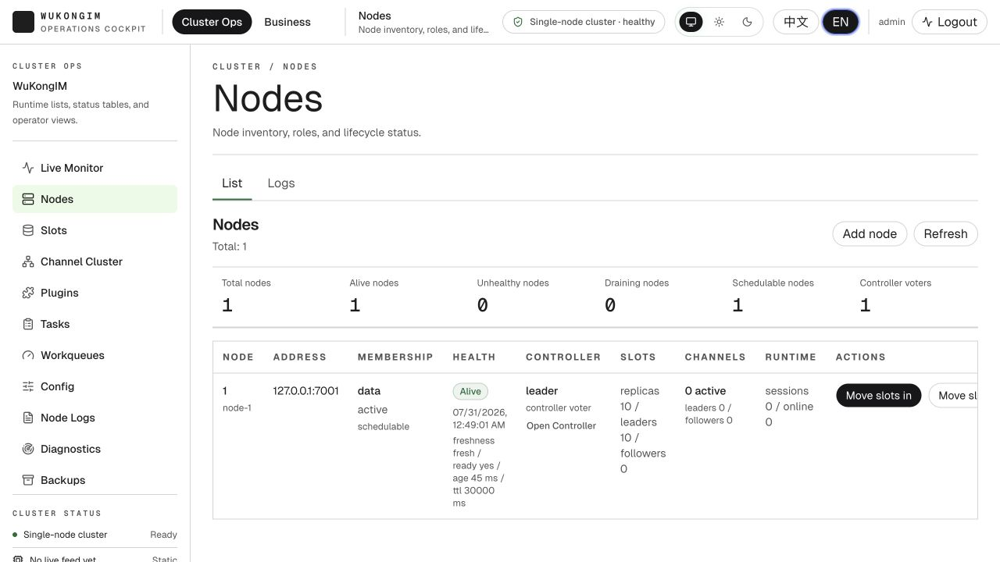
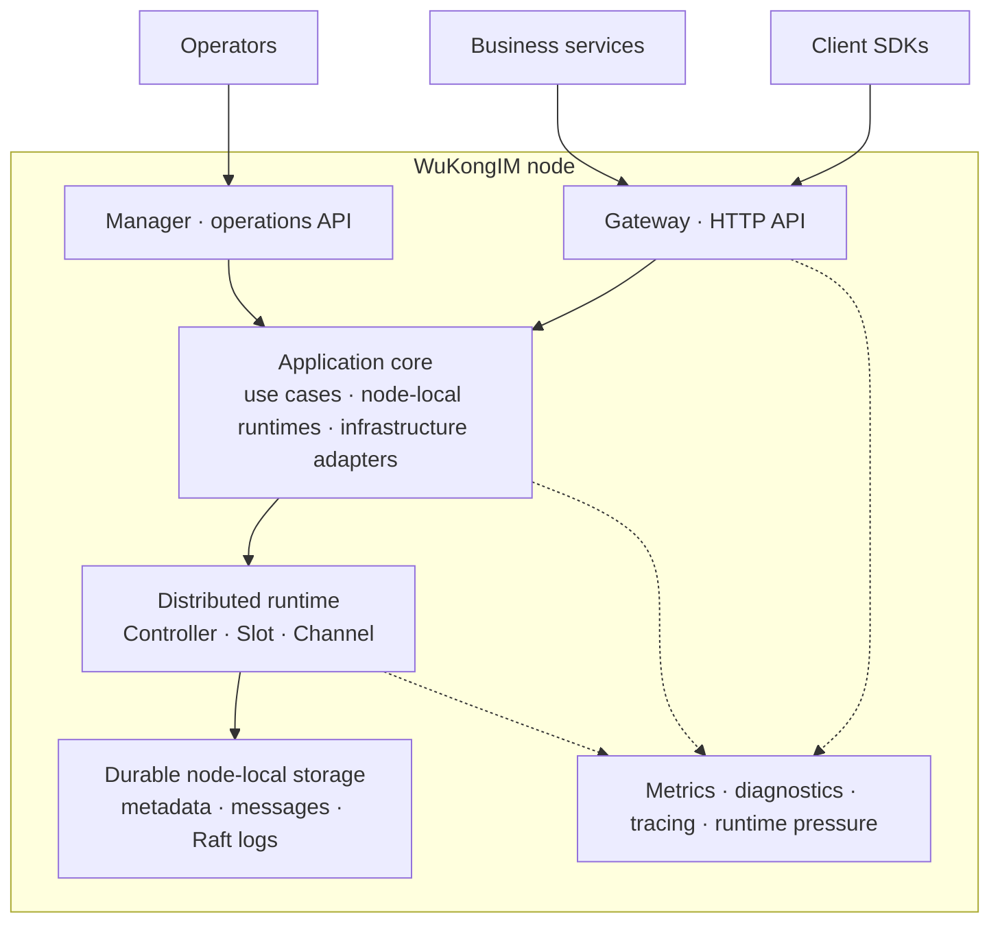
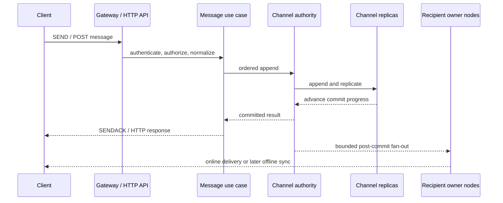

<p align="center">
  
</p>

<h1 align="center">WuKongIM</h1>

<p align="center">
  <strong>High-performance distributed communication infrastructure for real-time messaging.</strong>
</p>

<p align="center">
  Build chat, notifications, customer service, IoT, live interaction, and AI messaging on one channel-oriented core.
</p>

<p align="center">
  <a href="#quick-start"><strong>Quick start</strong></a> ·
  <a href="https://docs.githubim.com/en"><strong>Documentation</strong></a> ·
  <a href="https://github.com/WuKongIM/WuKongIM"><strong>GitHub</strong></a>
</p>

<p align="center">
  <a href="./README_CN.md">简体中文</a> ·
  <a href="https://githubim.com">Website</a> ·
  <a href="https://github.com/WuKongIM/WuKongIM/releases">Releases</a> ·
  <a href="https://github.com/WuKongIM/WuKongIM/issues">Issues</a>
</p>

<p align="center">
  
  
  <a href="https://github.com/WuKongIM/WuKongIM/stargazers"></a>
  <a href="https://www.apache.org/licenses/LICENSE-2.0"></a>
</p>

<p align="center">
  
</p>

<p align="center"><sub>One messaging core, from a single-node cluster to a distributed deployment.</sub></p>

> [!NOTE]
> WuKongIM v3 is currently in beta. APIs, configuration, and durable formats may change before the stable release; validate the system with your workload before production use.

## Why WuKongIM?

WuKongIM is a channel-oriented communication server. Clients publish ordered messages to personal, group, or custom channels; WuKongIM handles persistence, replication, synchronization, presence, and online delivery.

<table>
  <tr>
    <td width="25%" align="center"><strong>🧭 One cluster model</strong><br><sub>Single-node and multi-node deployments share the same Controller, Slot, Channel, routing, and storage paths.</sub></td>
    <td width="25%" align="center"><strong>💾 Self-contained core</strong><br><sub>Pebble-backed message, metadata, and Raft storage are built in—no external database, cache, or queue is required.</sub></td>
    <td width="25%" align="center"><strong>⚡ Predictable messaging</strong><br><sub>Per-channel ordering, idempotency, explicit commit boundaries, offline sync, and multi-device sessions.</sub></td>
    <td width="25%" align="center"><strong>🔭 Built to operate</strong><br><sub>Readiness, metrics, tracing, diagnostics, pressure views, Manager UI, and dedicated operations tools.</sub></td>
  </tr>
</table>

### Built for

| 💬 Messaging | 📣 Interaction | 🔌 Infrastructure |
| --- | --- | --- |
| Instant messaging, group chat, communities | Notifications, customer service, live streams | IoT, audio/video signaling, messaging middleware |
| Multi-device sessions and offline sync | AI assistants and generated-message workflows | Custom channel models and plugin integrations |

## Quick start

### Run a single-node cluster from source

Requirements: Git and Go `1.25.11`.

```bash
git clone https://github.com/WuKongIM/WuKongIM.git
cd WuKongIM

cp wukongim.toml.example wukongim.toml
GOWORK=off go run ./cmd/wukongim -config ./wukongim.toml
```

Verify readiness from another terminal:

```bash
curl --fail http://127.0.0.1:5001/readyz
```

The example starts the complete cluster path on one node and embeds both browser applications:

| Open | Address |
| --- | --- |
| Chat Demo | <http://127.0.0.1:5001/demo/> |
| Manager | <http://127.0.0.1:5301> — `admin` / `a1234567` |
| API and metrics | `http://127.0.0.1:5001` |

Open the Chat Demo, enter a unique test UID, and send a message—no separate frontend process is required.

### Explore a three-node cluster

Requirements: Docker with the Compose plugin.

```bash
docker compose up -d --build
curl --retry 30 --retry-delay 2 --retry-all-errors --fail \
  http://127.0.0.1:15001/readyz
```

The development stack starts three WuKongIM nodes, Prometheus, and Grafana. Open the [Manager](http://127.0.0.1:18080) or [Chat Demo](http://127.0.0.1:15001/demo/), and use `docker compose down` when finished.

> [!CAUTION]
> The Compose environment exposes development credentials and local benchmark surfaces. Do not use its defaults in production.

## See it running

### Operate the cluster

<p align="center">
  
</p>

<p align="center"><sub>The v3 Manager brings cluster health, lifecycle, Slots, Channels, diagnostics, backups, and runtime pressure into one operations cockpit.</sub></p>

### Send and receive in real time

<p align="center">
  
</p>

<p align="center"><sub>The embedded Chat Demo exercises the same API, gateway, Channel ordering, persistence, and delivery path used by client integrations.</sub></p>

## Architecture


```mermaid
flowchart TB
    Clients["Client SDKs"] --> Access
    Services["Business services"] --> Access
    Operators["Operators"] --> Manager

    subgraph Node["WuKongIM node"]
        Access["Gateway · HTTP API"]
        Manager["Manager · operations API"]
        Core["Application core<br/>use cases · node-local runtimes · infrastructure adapters"]
        Cluster["Distributed runtime<br/>Controller · Slot · Channel"]
        Storage["Durable node-local storage<br/>metadata · messages · Raft logs"]
        Observe["Metrics · diagnostics · tracing · runtime pressure"]

        Access --> Core
        Manager --> Core
        Core --> Cluster
        Cluster --> Storage
        Access -.-> Observe
        Core -.-> Observe
        Cluster -.-> Observe
    end
```

- **Controller** owns canonical membership, node health, the physical hash-slot table, logical Slot placement, and operator tasks.
- **Slot** Raft Groups shard users, channels, membership, conversations, plugin bindings, and Channel runtime metadata. Stable routing first uses 256 physical hash slots by default, then maps those fences onto the logical Slot Groups.
- **Channel** owns ordered message logs, replicas, commit progress, retention boundaries, and runtime lifecycle.

A one-node deployment is a **single-node cluster**, not a standalone bypass. See the [server architecture guide](https://docs.githubim.com/en/server/architecture) for the deeper model.

### Message lifecycle


```mermaid
sequenceDiagram
    participant Client
    participant Access as Gateway / HTTP API
    participant Core as Message use case
    participant Channel as Channel authority
    participant Replicas as Channel replicas
    participant Owners as Recipient owner nodes

    Client->>Access: SEND / POST message
    Access->>Core: authenticate, authorize, normalize
    Core->>Channel: ordered append
    Channel->>Replicas: append and replicate
    Replicas-->>Channel: advance commit progress
    Channel-->>Core: committed result
    Core-->>Client: SENDACK / HTTP response
    Channel-->>Owners: bounded post-commit fan-out
    Owners-->>Client: online delivery or later offline sync
```

## Core capabilities

| Area | What is included |
| --- | --- |
| Client access | WKProto over TCP, WebSocket multiplexing for WKProto and JSON-RPC, pluggable listeners, bounded asynchronous dispatch |
| Messaging | Personal, group, and custom channels; ordered append; idempotency; custom payloads; command messages; stream events |
| Channel policy | Subscribers, blacklist, whitelist, ban/disband state, stranger policy, system users, large-group-aware access |
| User state | Distributed presence, multi-device sessions, online status, recent conversations, read cursors, unread state |
| Delivery | Owner-node routing, `RECVACK` tracking, bounded retries, recipient partitioning, best-effort post-commit fan-out |
| Extensibility | HTTP webhooks and node-local PDK-compatible plugins with lifecycle, message hooks, and host RPC |

## Performance you can verify

WuKongIM does not publish a context-free “maximum QPS” number. Hardware, storage, channel shape, replication, online fan-out, and latency targets all change the result.

- Use [`wkbench`](./cmd/wkbench/README.md) to search stable ingress capacity, stress hot channels, and inspect tail latency.
- Follow the [performance triage runbook](./docs/development/PERF_TRIAGE.md) to capture metrics and profiles consistently.
- Review the checked-in [performance reports](./docs/superpowers/reports/) and reproduce the scenario that matches your workload.

## SDKs

| Platform | Repository |
| --- | --- |
| Android | [WuKongIMAndroidSDK](https://github.com/WuKongIM/WuKongIMAndroidSDK) |
| iOS | [WuKongIMiOSSDK](https://github.com/WuKongIM/WuKongIMiOSSDK) |
| JavaScript / Web | [WuKongIMJSSDK](https://github.com/WuKongIM/WuKongIMJSSDK) |
| Flutter | [WuKongIMFlutterSDK](https://github.com/WuKongIM/WuKongIMFlutterSDK) |
| UniApp | [WuKongIMUniappSDK](https://github.com/WuKongIM/WuKongIMUniappSDK) |
| HarmonyOS | [WuKongIMHarmonyOSSDK](https://github.com/WuKongIM/WuKongIMHarmonyOSSDK) |

See the [SDK overview](https://docs.githubim.com/en/sdk/overview) to choose an integration path.

## Operations toolkit

| Tool | Purpose |
| --- | --- |
| Manager | Browser cockpit for cluster state, connections, messages, plugins, migrations, diagnostics, backups, and metrics |
| [`wkcli`](./cmd/wkcli/README.md) | Command-line contexts, node operations, runtime `top`, simulation, and lightweight send checks |
| [`wkbench`](./cmd/wkbench/README.md) | Black-box workload validation, capacity searches, simulations, and reports |
| [`wkdb`](./cmd/wkdb/README.md) | Node-local offline inspection plus explicit export, import, and diff workflows |
| Prometheus and Grafana | Gateway, cluster, storage, delivery, transport, and process-pressure observability |

Configuration is TOML-first, with `WK_` environment variables overriding file values. Start with [`wukongim.toml.example`](./wukongim.toml.example).

## Before production

- Replace every example credential, JWT secret, join token, and internal capability.
- Protect client and administrative traffic with appropriate TLS and network-access controls.
- Put node data on independent durable storage and define capacity and retention boundaries.
- Exercise [backup and restore](./docs/development/BACKUP_AND_RESTORE.md) before relying on recovery.
- Validate expected traffic, large groups, failover, and tail latency with your own workload.
- Restrict Manager, metrics, diagnostics, debug, and benchmark surfaces to trusted networks.

## Development

The repository uses Go `1.25.11`; the Manager uses Bun `1.3.11`.

```bash
GOWORK=off go build ./cmd/wukongim ./cmd/wkcli ./cmd/wkbench ./cmd/wkdb
GOWORK=off go test ./cmd/... ./internal/... ./pkg/... ./scripts/... ./docker/... -count=1
```

See [`AGENTS.md`](./AGENTS.md) for repository conventions and [CI](./docs/development/CI.md) for the validation matrix.

## Community

- Website: <https://githubim.com>
- Documentation: <https://docs.githubim.com/en>
- Issues: <https://github.com/WuKongIM/WuKongIM/issues>
- Releases: <https://github.com/WuKongIM/WuKongIM/releases>
- WeChat: `wukongimgo` — mention that you want to join the WuKongIM community group.

## License

WuKongIM is licensed under the [Apache License 2.0](./LICENSE).
