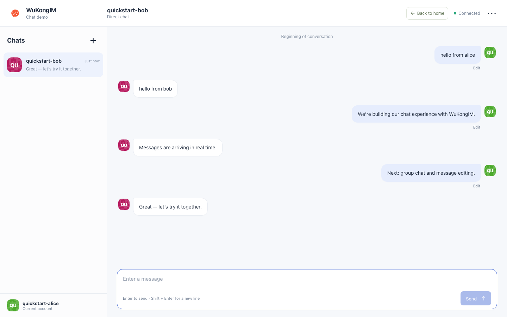
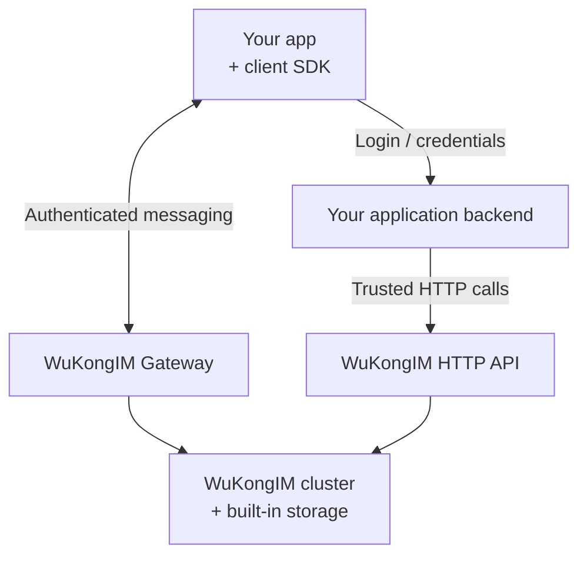
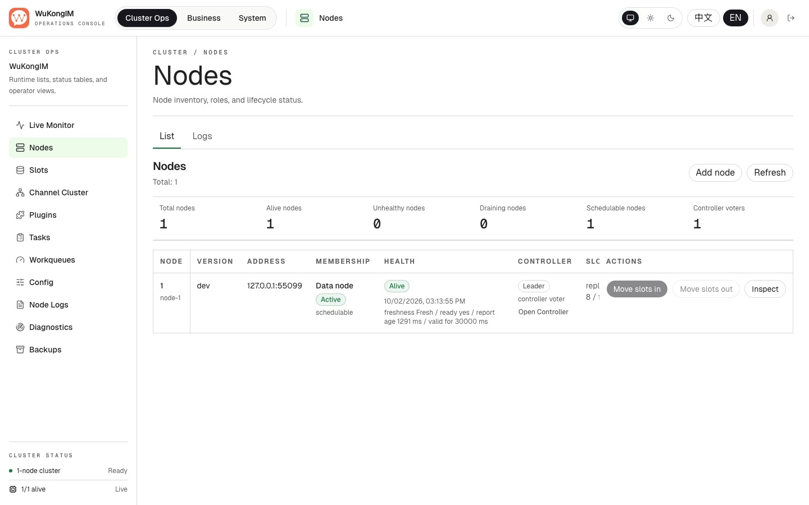

<p align="center">
  
</p>

<h1 align="center">WuKongIM</h1>

<p align="center">
  <strong>Real-time messaging. Your infrastructure. Your product.</strong><br>
  Open-source messaging for chat, notifications, and AI conversations.<br>
  Built-in storage and clustering. No external database, cache, or message queue required.
</p>

<p align="center">
  <a href="#quick-start">Quick start</a> ·
  <a href="https://demo.githubim.com/">Live demo</a> ·
  <a href="#built-with-wukongim">Showcase</a> ·
  <a href="https://docs.githubim.com/en/">Documentation</a> ·
  <a href="./README_CN.md">简体中文</a>
</p>

<p align="center">
  <a href="https://github.com/WuKongIM/WuKongIM/releases"></a>
  <a href="./go.mod"></a>
  <a href="./LICENSE"></a>
</p>

<p align="center">
  
</p>

WuKongIM handles connections, message storage, synchronization, presence, and online delivery. Build your own experience on top: personal and group chat, customer support, application notifications, or streaming AI replies. Your application owns the UI, accounts, and business rules.

## Why WuKongIM?

| Capability | What it gives you |
| --- | --- |
| **Self-contained messaging core** | Built-in message, metadata, and replication storage; fewer services to deploy and operate. |
| **One cluster model** | Start with a single-node cluster, then deploy multiple nodes using the same messaging model. 256 hash slots by default. |
| **Messaging building blocks** | Per-channel ordering, offline synchronization, multi-device sessions, and personal, group, or custom channels. |
| **Tools you can use immediately** | Four runnable demos, an embedded Manager, metrics, diagnostics, and backup tools. |

> [!NOTE]
> **v3 is in beta.** APIs, configuration, and durable formats may change. Review the [upgrade guidance](https://docs.githubim.com/en/server/operations/upgrade-and-migration/) before changing versions; check installed packages with `wukongim version`.

## Built with WuKongIM

### TangSengDaoDao · 唐僧叨叨

**An open-source, self-hosted messaging application.** TangSengDaoDao provides chat applications for iOS, Android, Web, Windows, macOS, and Ubuntu Linux, helping enterprises run their own messaging service.

WuKongIM powers its persistent connections, message delivery, and storage. TangSengDaoDao builds the product experience on top, including chat interfaces, contacts, groups, and other business features—a concrete example of using WuKongIM as the messaging core of a complete application.

[Website](https://tsdaodao.com/) · [Source code and architecture](https://github.com/TangSengDaoDao/TangSengDaoDaoServer)

## Quick start

### 1. Run the demos on your computer

Requires **Go 1.25+**, **Node.js 22.12+ or 20.19+**, and **npm**. From a fresh checkout:

```bash
git clone https://github.com/WuKongIM/WuKongIM.git
cd WuKongIM
node demo/start.mjs
```

Already have the repository? Run `node demo/start.mjs` from its root.

The launcher builds the server, prepares the demo backends, and opens the demo home page when ready. It starts a single-node cluster with **256 hash slots**; all services listen on loopback. The default model is simulated, so **no model API key is needed**. The first run downloads Go and npm dependencies.

| Demo | Explore | Source and guide |
| --- | --- | --- |
| **Chat** | Direct and group conversations, message editing, and history recovery | [Chat Demo](./demo/chatdemo/README.md) |
| **Streaming replies** | Incremental replies, model integration, cancellation, and failures | [Streaming Demo](./demo/streamdemo/README.md) |
| **Customer support** | AI reception, human takeover, and multiple visitor conversations | [Support Demo](./demo/supportdemo/README.md) |
| **Agent** | Tool calls, task confirmation, pause, and cancellation | [Agent Demo](./demo/agentdemo/README.md) |

<details>
<summary><strong>Preview the current demos</strong> — streaming replies, customer support, Agent, and mobile chat</summary>

Captured from the running repository demos on October 2, 2026. These interfaces use Chinese; the Chat Demo supports Chinese and English. Click any screenshot to view it at full size.

<p><strong>Streaming replies</strong> — a completed reply from the simulated model, delivered through the real messaging service.</p>
<p align="center">
  <a href="./resources/readme/stream-demo.webp"></a>
</p>

<p><strong>Customer support</strong> — a visitor hands off to a human agent, who replies from the support workspace.</p>
<p align="center">
  <a href="./resources/readme/support-demo.webp"></a>
</p>

<p><strong>Agent</strong> — document retrieval completes; creating a test to-do awaits confirmation.</p>
<p align="center">
  <a href="./resources/readme/agent-demo.webp"></a>
</p>

<p><strong>Mobile chat</strong> — the same conversation, with history synchronized on a phone-sized viewport.</p>
<p align="center">
  <a href="./resources/readme/chat-demo-mobile-cn.webp"></a>
</p>

</details>

Keep the launcher running while exploring. Press **Ctrl+C** to stop its processes. Each run keeps its configuration, logs, data, and `run.json` under `demo/.runs/`; the next launch creates a fresh run. For terminal-only startup, use `node demo/start.mjs --no-open`. See the [launcher guide](./demo/README.md) for options.

### 2. Exchange your first messages

Open **Chat** from the demo home page in two independent browser sessions, such as a normal window and a private window. Keep the supplied **API base URL** and use these test credentials:

| Session | Account (UID) | Token |
| --- | --- | --- |
| Alice | `quickstart-alice` | `alice-local-token` |
| Bob | `quickstart-bob` | `bob-local-token` |

1. On both pages, select **Create or update demo credentials (test accounts only)** and click **Log in**. Wait for both to show **Connected**.
2. On Alice's page, open **Demo tools** → **Start a chat** → **Direct chat**, enter `quickstart-bob`, and confirm. On Bob's page, start a direct chat with `quickstart-alice`.
3. Send `hello from alice` and confirm it appears on Bob's page. Reply with `hello from bob` and confirm Alice receives it.

You have now verified connection, sending, and online delivery in both directions. Test credential registration calls `/user/token` directly; in your product, your trusted backend must verify identity and issue tokens.

<p align="center">
  <a href="./resources/readme/chat-demo-en.png"></a>
</p>

### Prefer a server deployment?

| Deployment | Start here |
| --- | --- |
| **Linux packages** | [APT / RPM installation](https://docs.githubim.com/en/server/deployment/linux/) — systemd service, configuration initialization, and readiness checks |
| **Docker** | [Docker deployment](https://docs.githubim.com/en/server/deployment/docker/) — run a single-node cluster in a container |
| **Multiple nodes** | [Multi-node deployment](https://docs.githubim.com/en/server/deployment/multi-node/) — cluster configuration and network setup |

<details>
<summary><strong>Linux package quick start</strong> — install, initialize, and open Chat Demo</summary>

The Preview package repository supports **amd64/x86_64** on Ubuntu 24.04, Debian 13, Rocky Linux 9, AlmaLinux 9, and RHEL 9. Requires systemd, sudo, and curl; Go is not required.

On the **Linux server**, install using your package manager:

```bash
# Ubuntu / Debian
curl -fsSL https://packages.githubim.com/repo | sudo sh
sudo apt update
sudo apt install -y wukongim
```

```bash
# Rocky Linux / AlmaLinux / RHEL 9
curl -fsSL https://packages.githubim.com/repo | sudo sh
sudo dnf -y --disablerepo='*' --enablerepo=wukongim-preview makecache --refresh
sudo dnf install -y wukongim
```

Initialize configuration, save the Manager administrator password printed once, then start the service:

```bash
wukongim version
sudo wukongim init
sudo wukongim config validate --config /etc/wukongim/wukongim.toml
sudo systemctl enable --now wukongim
curl --retry 30 --retry-delay 2 --retry-all-errors --max-time 5 --fail \
  http://127.0.0.1:5001/readyz
```

Wait for `{"ready":true}`. The generated configuration listens on loopback. To use a remote server, run this **on your computer**, replacing `user@server-ip` with your SSH login, and keep the terminal open:

```bash
ssh -N \
  -L 127.0.0.1:5001:127.0.0.1:5001 \
  -L 127.0.0.1:5200:127.0.0.1:5200 \
  -L 127.0.0.1:5301:127.0.0.1:5301 \
  user@server-ip
```

Skip the tunnel if your browser runs on the server itself.

| Application | Address | Login |
| --- | --- | --- |
| Chat Demo | <http://127.0.0.1:5001/demo/?lang=en> | Follow the two-user exchange above; use API base URL `http://127.0.0.1:5001` |
| Manager | <http://127.0.0.1:5301> | `admin` / the password saved during initialization |

Older packages may have a different Demo UI. If readiness or connections fail, inspect `sudo journalctl -u wukongim -n 100 --no-pager` and confirm the tunnel forwards port `5200`.

Stop with `sudo systemctl stop wukongim`; resume with `sudo systemctl start wukongim`. Package data remains in `/var/lib/wukongim`.

</details>

## Connect your application

Start with the [JavaScript / Web quickstart](https://docs.githubim.com/en/sdk/javascript/quickstart/). Its runnable example includes a development backend, two client sessions, and offline recovery. Then replace the example backend with your own authenticated application backend.


```mermaid
flowchart TB
    Client["Your app<br/>+ client SDK"] -->|"Login / credentials"| Backend["Your application backend"]
    Client <-->|"Authenticated messaging"| Gateway["WuKongIM Gateway"]
    Backend -->|"Trusted HTTP calls"| API["WuKongIM HTTP API"]
    Gateway --> Core["WuKongIM cluster<br/>+ built-in storage"]
    API --> Core
```

| WuKongIM provides | Your application owns |
| --- | --- |
| Connections, channel message storage, replication, and online delivery | Account login, token issuance, and WuKongIM HTTP API access control |
| Channel, subscriber, and synchronization APIs | Business permissions, friend/group workflows, and SDK synchronization providers |
| Client SDKs, webhooks, and plugin interfaces | Product UI, media storage, and application-specific behavior |

**Keep the WuKongIM HTTP API behind a trusted backend or an authenticated API gateway:** it has no built-in business caller authentication. Manager login protects Manager only. A successful send confirms the server send result; recipient delivery and processing are separate events. Offline recovery requires client synchronization.

### Choose your SDK

| SDK | Best for | Platforms |
| --- | --- | --- |
| [**WuKongIMSDK**](https://docs.githubim.com/en/sdk/wukongim/) | Chat state, conversations, unread counts, and offline recovery | Android, iOS, JavaScript/Web, Flutter, HarmonyOS |
| [**WuKongEasySDK**](https://docs.githubim.com/en/sdk/easy/) | Lightweight online connections, messaging, and events | Android, iOS, JavaScript/Web, Flutter, Rust, C#, C++, Python |

See [SDK selection](https://docs.githubim.com/en/sdk/) for maintained versions and platform guides. For the discontinued standalone UniApp SDK, follow the [JavaScript / UniApp migration guide](https://docs.githubim.com/en/sdk/javascript/advanced/offline-and-uniapp/).

## Operate with visibility

The embedded **Manager** brings cluster state, connections, channels, messages, diagnostics, and backups into one interface.

<p align="center">
  <a href="./resources/readme/manager-nodes-en.jpg"></a>
</p>

| Task | Guide |
| --- | --- |
| Configure credentials and network access | [Security and access](https://docs.githubim.com/en/server/configuration/security/) |
| Protect data and rehearse recovery | [Backup and restore](https://docs.githubim.com/en/server/operations/backup-and-restore/) |
| Understand the cluster and its tools | [Architecture](https://docs.githubim.com/en/server/architecture/) · [Operations tools](https://docs.githubim.com/en/server/tools/) |
| Measure your workload | [`wkcli bench`](./cmd/wkcli/internal/benchmark/README.md) · [Performance runbook](./docs/development/PERF_TRIAGE.md) |

For published measurements, see the [conversation and messaging performance report](./docs/superpowers/reports/2026-08-06-membership-conversation-performance-acceptance.md). Its results describe the historical revision and three-process, single-host setup recorded there; measure your own version, hardware, and workload.

## Build and contribute

The repository pins **Go 1.25.11**. Follow the [configuration and startup guide](https://docs.githubim.com/en/server/configuration/) for source development.

```bash
GOWORK=off go build ./cmd/wukongim ./cmd/wkcli
GOWORK=off go test ./cmd/... ./internal/... ./pkg/... ./scripts/... ./docker/... -count=1
```

Read the [repository conventions](./AGENTS.md) and [CI guide](./docs/development/CI.md). For frontend work, follow the [Manager](./web/README.md) and [Chat Demo](./demo/chatdemo/README.md) build guides; rebuild and commit their generated assets, which are embedded in the Go binary.

[Report an issue](https://github.com/WuKongIM/WuKongIM/issues) · [Browse releases](https://github.com/WuKongIM/WuKongIM/releases) · [Read the changelog](./CHANGELOG.md)

For the community group, add **`wukongimgo`** on WeChat and mention WuKongIM.

<p align="center">
  <a href="https://githubim.com">Website</a> ·
  <a href="https://docs.githubim.com/en/">Documentation</a> ·
  <a href="./README_CN.md">简体中文</a><br>
  Licensed under the <a href="./LICENSE">Apache License 2.0</a>.
</p>
