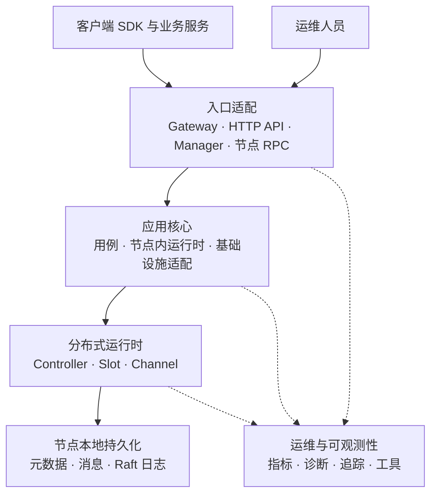

<p align="center">
  
</p>

<h1 align="center">WuKongIM v3 Beta</h1>

<p align="center">
  面向即时通讯与实时交互场景的高性能分布式通信基础设施。
</p>

<p align="center">
  <a href="./README.md">English</a> ·
  <a href="https://githubim.com">官网</a> ·
  <a href="https://docs.githubim.com/zh">文档</a> ·
  <a href="https://github.com/WuKongIM/WuKongIM/releases">版本发布</a> ·
  <a href="https://github.com/WuKongIM/WuKongIM/issues">问题反馈</a>
</p>

<p align="center">
  <a href="https://github.com/WuKongIM/WuKongIM/actions/workflows/ci.yml"></a>
  
  
  <a href="https://www.apache.org/licenses/LICENSE-2.0"></a>
</p>

> [!NOTE]
> WuKongIM v3 当前处于 Beta 阶段，API、配置和持久化格式在正式版前仍可能调整，生产使用前请按实际负载完成验证。

## 为什么选择 WuKongIM？

WuKongIM 是基于频道模型的通信服务，适用于聊天、通知、客服、IoT、音视频信令、直播互动、即时社区和 AI 消息等场景。客户端向个人、群组或自定义频道发布有序消息，WuKongIM 负责持久化、复制、同步、在线状态和在线投递。

| 设计目标 | WuKongIM 的实现 |
| --- | --- |
| 统一部署模型 | 单节点与多节点部署共用 Controller、Slot、Channel、路由和存储路径。单节点部署是**单节点集群**，不是独立的单机模式。 |
| 内置核心存储 | 内置基于 Pebble 的消息、元数据和 Raft 存储，核心服务不要求外部数据库、缓存或消息队列。 |
| 可预期的消息语义 | 支持频道内有序、幂等查询、明确的提交边界、离线同步、多设备会话和有界在线投递。 |
| 面向高基数场景 | Hash Slot 路由、多 Reactor Channel 运行时、批处理、有界 Worker 和背压，使大量用户与频道下的资源使用保持明确。 |
| 可运维性 | 内置健康与就绪检查、Prometheus 指标、诊断、追踪、运行时压力视图、Manager UI 和专用运维工具。 |

## 常见场景

- 即时通讯、群聊和实时社区
- 应用内通知和消息中间件
- 客服与坐席通信
- IoT 通信和音视频信令
- 直播互动和流式消息
- AI 助手和生成式消息工作流

## 快速开始

### 从源码启动单节点集群

环境要求：Git、Go `1.25.11`。

```bash
git clone https://github.com/WuKongIM/WuKongIM.git
cd WuKongIM

cp wukongim.toml.example wukongim.toml
GOWORK=off go run ./cmd/wukongim -config ./wukongim.toml
```

在另一个终端检查就绪状态：

```bash
curl --fail http://127.0.0.1:5001/readyz
```

该示例在一个节点上启动完整集群路径，并内嵌两个浏览器应用：

| 用途 | 地址 |
| --- | --- |
| Chat Demo | <http://127.0.0.1:5001/demo/> |
| Manager Web UI | <http://127.0.0.1:5301>（`admin` / `a1234567`） |
| HTTP API、健康检查与指标 | `http://127.0.0.1:5001` |
| WKProto TCP | `127.0.0.1:5100` |
| WebSocket 多路复用入口 | `ws://127.0.0.1:5200` |
| 节点间 Transport | `127.0.0.1:7001` |

打开 Chat Demo，输入一个唯一测试 UID 即可开始发送消息，无需单独启动前端进程。

### 启动三节点开发环境

环境要求：安装带 Compose 插件的 Docker。

```bash
docker compose up -d --build
docker compose ps
curl --retry 30 --retry-delay 2 --retry-all-errors --fail \
  http://127.0.0.1:15001/readyz
```

默认环境包含三个 WuKongIM 节点、Prometheus 和 Grafana：

| 服务 | 地址 |
| --- | --- |
| Manager Web UI | <http://127.0.0.1:18080>（`admin` / `a1234567`） |
| Chat Demo | <http://127.0.0.1:15001/demo/> |
| 节点 1 API / 指标 | `http://127.0.0.1:15001` |
| 节点 1 WKProto / WebSocket | `127.0.0.1:15100` / `ws://127.0.0.1:15200` |
| Prometheus | <http://127.0.0.1:9091> |
| Grafana | <http://127.0.0.1:3000>（`admin` / `Aa12345678`） |

> [!CAUTION]
> `docker-compose.yml` 仅用于开发。它暴露开发凭据和 Benchmark 接口，并使用本地目录挂载数据；不要将这些默认设置用于生产环境。

使用以下命令停止开发环境：

```bash
docker compose down
```

## 核心能力

| 领域 | 能力 |
| --- | --- |
| 客户端接入 | TCP 上的 WKProto、WKProto/JSON-RPC WebSocket 多路复用、可插拔 Listener 和有界异步分发。 |
| 消息 | 个人/群组/自定义频道、有序追加、自定义 Payload、幂等、命令消息、流式事件和已提交消息同步。 |
| 频道策略 | 订阅者、黑名单、白名单、封禁/解散、陌生人策略、系统用户和大群感知的订阅者访问。 |
| 用户与会话状态 | 多设备会话、分布式 Presence、在线状态、设备退出、最近会话、已读游标和未读状态。 |
| 投递 | Owner 节点在线投递、`RECVACK` 跟踪、有界重试、接收者路由和提交后尽力 Fan-out。 |
| 扩展能力 | HTTP Webhook，以及支持生命周期、消息 Hook 和 Host RPC 的节点内 PDK 兼容插件。 |

## 架构


```mermaid
flowchart TB
    Client["客户端 SDK 与业务服务"]
    Operator["运维人员"]
    Access["入口适配<br/>Gateway · HTTP API · Manager · 节点 RPC"]
    Core["应用核心<br/>用例 · 节点内运行时 · 基础设施适配"]
    Cluster["分布式运行时<br/>Controller · Slot · Channel"]
    Storage["节点本地持久化<br/>元数据 · 消息 · Raft 日志"]
    Observe["运维与可观测性<br/>指标 · 诊断 · 追踪 · 工具"]

    Client --> Access
    Operator --> Access
    Access --> Core
    Core --> Cluster
    Cluster --> Storage
    Access -.-> Observe
    Core -.-> Observe
    Cluster -.-> Observe
```

| 分层 | 职责 | 模型 |
| --- | --- | --- |
| Controller | 集群成员、节点健康、Hash Slot 表、物理 Slot 分配和运维任务。 | 小规模 Raft Quorum 维护权威控制面状态，不进入普通消息热路径。 |
| Slot | 用户、频道、成员关系、会话、插件绑定和 Channel 运行时元数据。 | 元数据分片到物理 Multi-Raft Group，默认通过 256 个逻辑 Hash Slot 路由。 |
| Channel | 有序消息日志、Leader/Replica、提交进度、保留边界和运行时生命周期。 | 每频道状态机保持顺序，有界存储与 RPC Worker 执行持久化追加和复制。 |

`internal/app` 是唯一组合根。入口适配位于 `internal/access`，可复用业务编排位于 `internal/usecase`，节点内状态位于 `internal/runtime`，具体适配位于 `internal/infra`。所有节点使用同一套 Transport 和集群语义，单节点集群也不例外。

深入设计请阅读[分布式架构索引](./docs/wiki/architecture/README.md)。

## 生产使用前

- 替换所有示例账号、JWT Secret、Join Token 和内部 Capability。
- 为客户端与管理流量配置合适的 TLS 和网络访问策略。
- 将节点数据放在独立持久化存储上，并定义容量和数据保留边界。
- 配置、演练并监控备份恢复流程，参见[备份与恢复](./docs/development/BACKUP_AND_RESTORE.md)。
- 使用实际负载验证预期流量、大群、故障恢复和尾延迟，参见[性能排查](./docs/development/PERF_TRIAGE.md)。
- 仅向可信网络开放 Debug、Benchmark、诊断、Manager 和指标接口。

## SDK

| 平台 | 仓库 |
| --- | --- |
| Android | [WuKongIMAndroidSDK](https://github.com/WuKongIM/WuKongIMAndroidSDK) |
| iOS | [WuKongIMiOSSDK](https://github.com/WuKongIM/WuKongIMiOSSDK) |
| JavaScript / Web | [WuKongIMJSSDK](https://github.com/WuKongIM/WuKongIMJSSDK) |
| Flutter | [WuKongIMFlutterSDK](https://github.com/WuKongIM/WuKongIMFlutterSDK) |
| UniApp | [WuKongIMUniappSDK](https://github.com/WuKongIM/WuKongIMUniappSDK) |
| HarmonyOS | [WuKongIMHarmonyOSSDK](https://github.com/WuKongIM/WuKongIMHarmonyOSSDK) |

请通过 [SDK 概览](https://docs.githubim.com/zh/sdk/overview) 选择合适的集成方式。

## 运维与工具

| 工具 | 用途 |
| --- | --- |
| Manager | 用于集群状态、连接、消息、插件、迁移、诊断和指标的浏览器 UI 与 HTTP API。 |
| [`wkcli`](./cmd/wkcli/README.md) | 提供命令行 Context、节点操作、运行时 `top`、模拟和轻量发送检查。 |
| [`wkbench`](./cmd/wkbench/README.md) | 提供黑盒校验、负载执行、开发模拟、容量搜索和报告。 |
| [`wkdb`](./cmd/wkdb/README.md) | 提供节点本地离线检查，以及显式导出、导入和 Diff 流程。 |
| Prometheus 与 Grafana | 采集并展示 Gateway、集群、存储、投递、Transport 和进程压力指标。 |

## 配置

主配置格式为 TOML。环境变量统一使用 `WK_` 前缀并覆盖配置文件；列表字段通过一个 JSON 字符串整体覆盖。

未传入 `-config` 时，WuKongIM 按以下顺序查找：

1. `./wukongim.toml`
2. `./conf/wukongim.toml`
3. `/etc/wukongim/wukongim.toml`

请从 [`wukongim.toml.example`](./wukongim.toml.example) 开始，其中记录了可用的配置领域和字段。

## 开发

仓库使用 Go `1.25.11`，Manager Web UI 使用 Bun `1.3.11`。

```bash
GOWORK=off go build ./cmd/wukongim ./cmd/wkcli ./cmd/wkbench ./cmd/wkdb
GOWORK=off go test ./cmd/... ./internal/... ./pkg/... ./scripts/... ./docker/... -count=1
```

仓库约定请阅读 [`AGENTS.md`](./AGENTS.md)，完整验证矩阵请阅读 [CI](./docs/development/CI.md)。

## 社区

- 官网：<https://githubim.com>
- 文档：<https://docs.githubim.com/zh>
- 问题反馈：<https://github.com/WuKongIM/WuKongIM/issues>
- 版本发布：<https://github.com/WuKongIM/WuKongIM/releases>
- 微信：`wukongimgo`，备注加入 WuKongIM 技术交流群。

## License

WuKongIM 使用 [Apache License 2.0](https://www.apache.org/licenses/LICENSE-2.0)。
