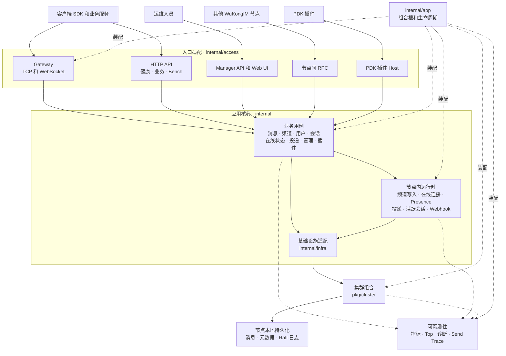
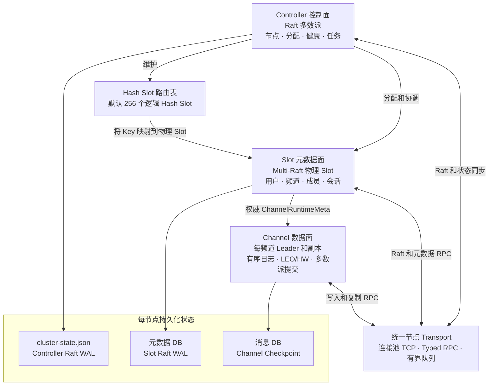
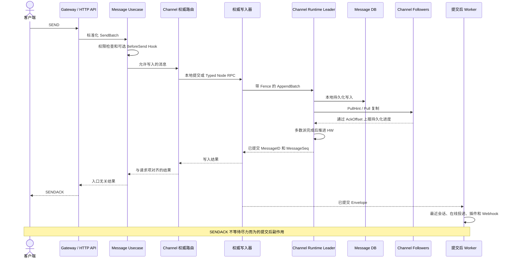

<p align="center">
  
</p>

<h1 align="center">WuKongIM v3 Beta</h1>

<p align="center">
  面向即时通讯、消息通知、物联网、直播互动、客服系统和 AI 消息的高性能分布式通讯基础设施。
</p>

<p align="center">
  <a href="./README.md">English</a> ·
  <a href="https://githubim.com">官网</a> ·
  <a href="https://docs.githubim.com">文档</a> ·
  <a href="https://github.com/WuKongIM/WuKongIM/releases">版本发布</a> ·
  <a href="https://github.com/WuKongIM/WuKongIM/issues">问题反馈</a>
</p>

<p align="center">
  <a href="https://github.com/WuKongIM/WuKongIM/actions/workflows/ci.yml"></a>
  
  
  <a href="./LICENSE"></a>
</p>

> [!WARNING]
> `main` 分支当前是 WuKongIM v3 Beta。API、配置和持久化格式仍可能调整，请在使用真实业务负载验证后再用于新部署。不要默认复用 v2 的生产数据目录：本仓库目前还没有提供完整、经过验证的 v2 → v3 迁移流程。

## WuKongIM 是什么？

WuKongIM 是一套以频道为核心的通讯服务。客户端向个人、群组、客服、社区或自定义频道发布有序消息，服务端负责持久化、复制、同步、在线状态和实时投递。

核心服务内置存储，不强制依赖外部数据库、缓存或消息队列。单节点和多节点使用完全相同的集群路径：一个节点也是**单节点集群**，不存在绕过集群语义的独立单机模式。

典型场景包括：

- 即时通讯和实时社区
- 应用内通知和消息中间件
- 客服系统和 Agent 通讯
- 物联网通讯和音视频信令
- 直播互动、流式消息和 AI 生成内容

## 为什么是 v3？

| 设计目标 | v3 的实现方式 |
| --- | --- |
| 一套部署模型 | 单节点和多节点共享 Controller、Slot、Channel、路由和存储语义。 |
| 可预期的消息持久性 | `SENDACK` 位于 Channel 提交边界之后；配置要求的本地提交或多数派提交完成前不会返回成功确认。 |
| 高基数负载 | Hash Slot 路由、多 Reactor Channel 运行时、频道内有序、有限工作池、批处理和背压，让大量用户与频道下的资源消耗保持显式。 |
| 大群投递 | 订阅者分页读取，大群状态显式维护，收件人路由和投递使用有限批次，避免一次请求产生无限扇出。 |
| 清晰的职责归属 | 入口适配、业务用例、节点内运行时、基础设施适配、分布式运行时和存储分别拥有独立边界。 |
| 可运维性 | 内置健康检查、就绪检查、Prometheus 指标、运行时压力、诊断、发送链路追踪、Raft 检查、迁移任务和管理后台。 |

## 核心能力

| 领域 | 能力 |
| --- | --- |
| 客户端接入 | WKProto TCP、支持 WKProto/JSON-RPC 的 WebSocket 多协议复用、可配置 Gateway Listener，以及有限异步帧调度。 |
| 消息 | 自定义消息、个人/群组/自定义频道、频道内有序追加、幂等查询、命令消息、流式消息事件和已提交消息同步。 |
| 频道策略 | 订阅者、黑名单、白名单、封禁/解散状态、陌生人策略、系统用户和面向大群的订阅者处理。 |
| 用户状态 | 多设备连接、分布式在线路由权威、在线状态、路由过期、连接检查和设备退出。 |
| 最近会话 | UID 所属的最近会话投影、普通/CMD 隔离、已读游标、未读状态、删除屏障和已提交末条消息填充。 |
| 在线投递 | Owner 节点投递、`RECVACK` 跟踪、有限重试、收件人权威分区和尽力而为的提交后扇出。 |
| 扩展能力 | HTTP Webhook，以及兼容 PDK 的节点内插件生命周期、发送、接收、PersistAfter 和 Host RPC Hook。 |
| 运维 | Manager API 与 Web UI、动态节点生命周期、Slot/Channel 迁移任务、Raft 日志与状态检查、`wkcli`、`wkdb` 和 `wkbench`。 |

## 架构

### 1. 系统全景


```mermaid
flowchart TB
    Client["客户端 SDK 和业务服务"]
    Operator["运维人员"]
    Plugin["PDK 插件"]
    Peer["其他 WuKongIM 节点"]

    subgraph Access["入口适配 · internal/access"]
        Gateway["Gateway<br/>TCP 和 WebSocket"]
        API["HTTP API<br/>健康 · 业务 · Bench"]
        Manager["Manager API 和 Web UI"]
        NodeRPC["节点间 RPC"]
        PluginHost["PDK 插件 Host"]
    end

    subgraph Core["应用核心 · internal"]
        Usecase["业务用例<br/>消息 · 频道 · 用户 · 会话<br/>在线状态 · 投递 · 管理 · 插件"]
        Runtime["节点内运行时<br/>频道写入 · 在线连接 · Presence<br/>投递 · 活跃会话 · Webhook"]
        Infra["基础设施适配<br/>internal/infra"]
    end

    Cluster["集群组合<br/>pkg/cluster"]
    Storage["节点本地持久化<br/>消息 · 元数据 · Raft 日志"]
    Observe["可观测性<br/>指标 · Top · 诊断 · Send Trace"]
    App["internal/app<br/>组合根和生命周期"]

    Client --> Gateway
    Client --> API
    Operator --> Manager
    Plugin --> PluginHost
    Peer --> NodeRPC
    Gateway --> Usecase
    API --> Usecase
    Manager --> Usecase
    NodeRPC --> Usecase
    PluginHost --> Usecase
    Usecase --> Runtime
    Usecase --> Infra
    Runtime --> Infra
    Infra --> Cluster
    Cluster --> Storage
    Usecase -.-> Observe
    Runtime -.-> Observe
    Cluster -.-> Observe
    App -.->|装配| Gateway
    App -.->|装配| Usecase
    App -.->|装配| Runtime
    App -.->|装配| Cluster
    App -.->|装配| Observe
```

`internal/app` 是唯一组合根。协议适配放在 `internal/access`，可复用业务编排放在 `internal/usecase`，节点内状态放在 `internal/runtime`，到具体集群与运行时的适配放在 `internal/infra`。

### 2. 分布式架构


```mermaid
flowchart TB
    Controller["Controller 控制面<br/>Raft 多数派<br/>节点 · 分配 · 健康 · 任务"]
    HashTable["Hash Slot 路由表<br/>默认 256 个逻辑 Hash Slot"]
    Slot["Slot 元数据面<br/>Multi-Raft 物理 Slot<br/>用户 · 频道 · 成员 · 会话"]
    Channel["Channel 数据面<br/>每频道 Leader 和副本<br/>有序日志 · LEO/HW · 多数派提交"]
    Transport["统一节点 Transport<br/>连接池 TCP · Typed RPC · 有界队列"]

    subgraph Durable["每节点持久化状态"]
        ControlStore["cluster-state.json<br/>Controller Raft WAL"]
        MetaStore["元数据 DB<br/>Slot Raft WAL"]
        MessageStore["消息 DB<br/>Channel Checkpoint"]
    end

    Controller -->|维护| HashTable
    Controller -->|分配和协调| Slot
    HashTable -->|将 Key 映射到物理 Slot| Slot
    Slot -->|权威 ChannelRuntimeMeta| Channel
    Controller <-->|Raft 和状态同步| Transport
    Slot <-->|Raft 和元数据 RPC| Transport
    Channel <-->|写入和复制 RPC| Transport
    Controller --> ControlStore
    Slot --> MetaStore
    Channel --> MessageStore
```

| 层级 | 负责内容 | 一致性与性能模型 |
| --- | --- | --- |
| Controller | 集群成员、节点健康、Hash Slot 表、物理 Slot 分配和运维任务 | 小规模 Raft 多数派持久化控制状态；规划并协调拓扑，但不进入普通消息热路径。 |
| Slot | 用户、频道、订阅者、最近会话投影、插件绑定和 Channel 运行时元数据 | 元数据分片到多个物理 Multi-Raft Group，通过逻辑 Hash Slot 路由。 |
| Channel | 有序消息日志、每频道领导权、副本、LEO/HW、保留边界和运行时生命周期 | 多 Reactor 状态机保持频道内有序；阻塞存储与 RPC 运行在有限工作池；多数派提交推进 HW。 |
| Transport | Controller Raft、Slot Raft、Channel 复制、写入转发和 Typed Node RPC | 共享 TCP 连接池、固定帧、服务隔离、优先级、批处理和有界队列。 |

### 3. 消息链路


```mermaid
sequenceDiagram
    actor Client as 客户端
    participant Entry as Gateway / HTTP API
    participant Message as Message Usecase
    participant Router as Channel 权威路由
    participant Writer as 权威写入器
    participant Leader as Channel Runtime Leader
    participant DB as Message DB
    participant Followers as Channel Followers
    participant Effects as 提交后 Worker

    Client->>Entry: SEND
    Entry->>Message: 标准化 SendBatch
    Message->>Message: 权限检查和可选 BeforeSend Hook
    Message->>Router: 允许写入的消息
    Router->>Writer: 本地提交或 Typed Node RPC
    Writer->>Leader: 带 Fence 的 AppendBatch
    Leader->>DB: 本地持久化写入
    Leader->>Followers: PullHint / Pull 复制
    Followers-->>Leader: 通过 AckOffset 上报持久化进度
    Leader->>Leader: 多数派完成后推进 HW
    Leader-->>Writer: 已提交 MessageID 和 MessageSeq
    Writer-->>Router: 写入结果
    Router-->>Message: 与请求项对齐的结果
    Message-->>Entry: 入口无关结果
    Entry-->>Client: SENDACK
    Writer-->>Effects: 已提交 Envelope
    Effects->>Effects: 最近会话、在线投递、插件和 Webhook
    Note over Client,Effects: SENDACK 不等待尽力而为的提交后副作用
```

前台路径刻意保持精简：校验、路由、追加、复制、提交、确认。会话活跃、在线投递、插件 `PersistAfter` 和 Webhook 通知发生在持久化决策之后，不能把一次已成功提交改写成失败的 `SENDACK`。

## 代码地图

| 领域 | 位置 | 职责 |
| --- | --- | --- |
| 产品入口 | `cmd/wukongim` | 加载 TOML 和 `WK_*` 覆盖，构建 App，处理进程信号。 |
| 组合根 | `internal/app` | 装配依赖并约束启动/停止顺序。 |
| 入口适配 | `internal/access` | Gateway、HTTP API、Manager API、节点 RPC 和插件协议适配。 |
| 业务编排 | `internal/usecase` | 入口无关的消息、频道、用户、会话、Presence、投递、管理和插件规则。 |
| 节点内运行时 | `internal/runtime` | 频道写入、Presence、在线连接、投递、会话、Hook 和 Webhook 的有限内存状态与 Worker。 |
| 运行时适配 | `internal/infra` | 将 internal Port 适配到分布式和存储运行时。 |
| Gateway 基础设施 | `pkg/gateway` | Listener、Transport、协议、Session、认证和调度。 |
| 集群组合 | `pkg/cluster` | Controller、路由、Slot Runtime、Channel Runtime、发现、Typed Node RPC、就绪和迁移。 |
| 控制面 | `pkg/controller` | Controller Raft、权威集群状态、规划、任务状态、快照和镜像同步。 |
| 元数据面 | `pkg/slot`、`pkg/hashslot` | Multi-Raft 元数据状态机、分布式代理和 Hash Slot 路由。 |
| 消息数据面 | `pkg/channel` | 多 Reactor Channel 日志、复制、写入、生命周期、保留和工作池。 |
| 存储 | `pkg/db`、`pkg/raftlog` | 基于 Pebble 的消息/元数据存储和持久化 Raft 日志/快照。 |
| 协议 | `pkg/protocol` | WKProto Frame/Codec、Channel ID 和 JSON-RPC Bridge。 |
| 工具 | `cmd/wkcli`、`cmd/wkbench`、`cmd/wkdb` | 运维、黑盒压测和节点本地只读存储检查。 |

## 快速开始

### Docker Compose：完整三节点开发环境

要求：安装 Docker 和 Compose Plugin。

```bash
git clone https://github.com/WuKongIM/WuKongIM.git
cd WuKongIM

docker compose up -d --build
docker compose ps
curl --retry 30 --retry-delay 2 --retry-all-errors --fail \
  http://127.0.0.1:15001/readyz
```

默认 Compose 会启动三个 WuKongIM 节点、Manager Web UI、Prometheus 和 Grafana。可选的 `wk-sim` 压测模拟器位于 `dev-sim` Profile 中。

| 服务 | 地址 | 开发凭据 / 说明 |
| --- | --- | --- |
| Manager Web UI | <http://127.0.0.1:18080> | `admin` / `a1234567` |
| 节点 1 API 与就绪检查 | <http://127.0.0.1:15001/readyz> | Metrics：<http://127.0.0.1:15001/metrics> |
| 节点 1 WKProto TCP | `127.0.0.1:15100` | 客户端连接地址 |
| 节点 1 WebSocket | `ws://127.0.0.1:15200` | WKProto / JSON-RPC 多协议复用 |
| Prometheus | <http://127.0.0.1:9091> | Compose 使用的外部 Prometheus |
| Grafana | <http://127.0.0.1:3000> | `admin` / `Aa12345678` |

启动可选模拟器：

```bash
docker compose --profile dev-sim up -d wk-sim
curl --retry 30 --retry-delay 2 --retry-all-errors --fail \
  http://127.0.0.1:19091/healthz
```

> [!CAUTION]
> `docker-compose.yml` 是开发环境。它启用了 Debug/Bench 接口，包含开发凭据，并使用本地目录挂载数据。生产使用前必须替换密钥、检查暴露端口、使用独立持久化存储，并明确备份、TLS、容量和可观测性策略。

### 源码运行：单节点集群

要求：Go `1.25.11`。

```bash
git clone https://github.com/WuKongIM/WuKongIM.git
cd WuKongIM

cp wukongim.toml.example wukongim.toml
GOWORK=off go run ./cmd/wukongim -config ./wukongim.toml
```

在另一个终端验证：

```bash
curl --fail http://127.0.0.1:5001/readyz
```

示例会启动一个 Controller Voter、一个物理 Slot、256 个逻辑 Hash Slot 和一个 Channel 副本，监听以下地址：

| 用途 | 地址 |
| --- | --- |
| HTTP API / Health / Metrics | `127.0.0.1:5001` |
| Manager API | `127.0.0.1:5301` |
| WKProto TCP | `127.0.0.1:5100` |
| WebSocket 多协议入口 | `ws://127.0.0.1:5200` |
| 节点 Transport | `127.0.0.1:7001` |

这条命令只启动服务端，不会启动 `web/`、外部 Prometheus 或 Grafana。

## 配置

产品配置以 TOML 为主。通过 `-config` 显式指定文件：

```bash
GOWORK=off go run ./cmd/wukongim -config ./wukongim.toml
```

不传 `-config` 时，按顺序查找：

1. `./wukongim.toml`
2. `./conf/wukongim.toml`
3. `/etc/wukongim/wukongim.toml`

环境变量统一使用 `WK_` 前缀，并覆盖 TOML。列表和对象列表使用一个 JSON 字符串进行整体覆盖：

```bash
WK_CLUSTER_NODES='[{"id":1,"addr":"node1:7000"},{"id":2,"addr":"node2:7000"}]' \
  GOWORK=off go run ./cmd/wukongim -config ./wukongim.toml
```

请从 [`wukongim.toml.example`](./wukongim.toml.example) 开始。示例覆盖节点、集群、API、Manager、Gateway、消息、Presence、会话、投递、可观测性、诊断、Webhook 和插件配置。

## 运维与工具

- **Manager Web UI 和 API**：节点/Slot/Channel 清单、生命周期操作、迁移任务、连接、消息、插件、日志、数据库检查、诊断和实时指标。
- **`wkcli`**：可扩展运维 CLI，包括节点内/多节点 `top` 运行时视图。
- **`wkbench`**：黑盒负载校验、Doctor、Coordinator/Worker 执行、Docker `dev-sim` 和报告生成，不依赖服务端内部包。
- **`wkdb`**：节点本地只读消息/元数据检查，提供 Query 和 REPL 模式。
- **Prometheus 和 Grafana**：覆盖 Gateway、Controller、Slot、Channel、存储、投递、会话、Transport 和进程压力的低基数指标。

## 开发

Go CI 工具链为 `go1.25.11`，Manager Web UI 使用 Bun `1.3.11`。

编译检查主要命令包：

```bash
GOWORK=off go build ./cmd/wukongim ./cmd/wkcli ./cmd/wkbench ./cmd/wkdb
```

运行仓库单元测试门禁：

```bash
GOWORK=off go test ./cmd/... ./internal/... ./pkg/... ./scripts/... ./docker/... -count=1
```

其他门禁：

```bash
GOWORK=off go vet ./cmd/... ./internal/... ./pkg/... ./scripts/... ./docker/...
GOWORK=off go test -tags=integration ./internal/... ./pkg/... -count=1
GOWORK=off go test -tags=e2e ./test/e2e/... -count=1
```

集成测试和端到端测试较重，不要求每次本地改动都运行。不要在仓库根目录使用 `go test ./...`：Go 会扫描 `tmp/`、`web/node_modules/` 等被忽略的本地目录，请使用上面的显式根目录。

## SDK

| 平台 | 仓库 |
| --- | --- |
| Android | [WuKongIMAndroidSDK](https://github.com/WuKongIM/WuKongIMAndroidSDK) |
| iOS | [WuKongIMiOSSDK](https://github.com/WuKongIM/WuKongIMiOSSDK) |
| JavaScript / Web | [WuKongIMJSSDK](https://github.com/WuKongIM/WuKongIMJSSDK) |
| Flutter | [WuKongIMFlutterSDK](https://github.com/WuKongIM/WuKongIMFlutterSDK) |
| UniApp | [WuKongIMUniappSDK](https://github.com/WuKongIM/WuKongIMUniappSDK) |
| HarmonyOS | [WuKongIMHarmonyOSSDK](https://github.com/WuKongIM/WuKongIMHarmonyOSSDK) |

集成方式请参考 [SDK 概览](https://docs.githubim.com/zh/sdk/overview)。

## 社区

- 官网：<https://githubim.com>
- 文档：<https://docs.githubim.com>
- 问题反馈：<https://github.com/WuKongIM/WuKongIM/issues>
- 版本发布：<https://github.com/WuKongIM/WuKongIM/releases>
- 微信：`wukongimgo`，备注加入 WuKongIM 技术交流群。

## License

WuKongIM 使用 [Apache License 2.0](./LICENSE)。
