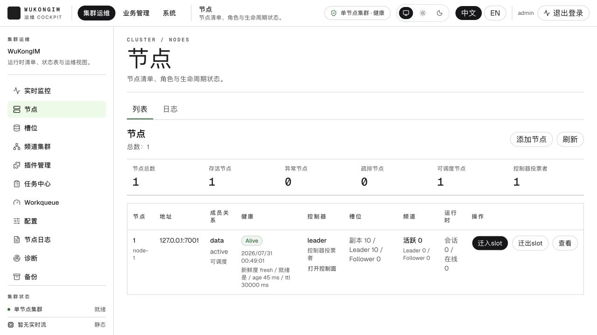
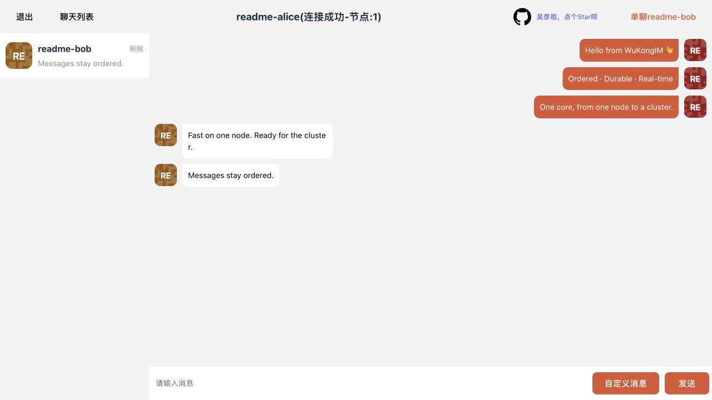
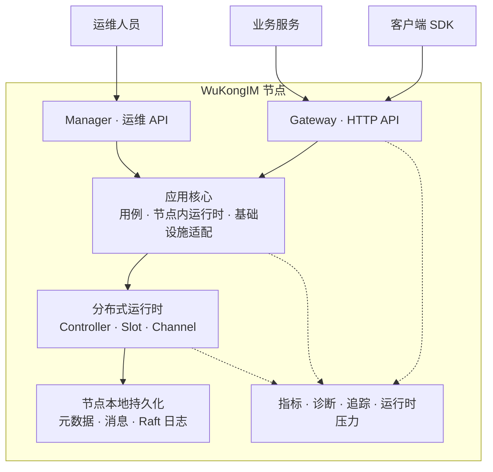
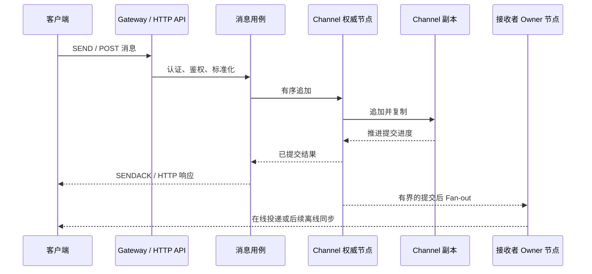

<p align="center">
  
</p>

<h1 align="center">WuKongIM</h1>

<p align="center">
  <strong>面向实时消息场景的高性能分布式通信基础设施。</strong>
</p>

<p align="center">
  在同一个频道模型核心上构建聊天、通知、客服、IoT、直播互动和 AI 消息能力。
</p>

<p align="center">
  <a href="#快速开始"><strong>快速开始</strong></a> ·
  <a href="https://docs.githubim.com/zh"><strong>文档</strong></a> ·
  <a href="https://github.com/WuKongIM/WuKongIM"><strong>GitHub</strong></a>
</p>

<p align="center">
  <a href="./README.md">English</a> ·
  <a href="https://githubim.com">官网</a> ·
  <a href="https://github.com/WuKongIM/WuKongIM/releases">版本发布</a> ·
  <a href="https://github.com/WuKongIM/WuKongIM/issues">问题反馈</a>
</p>

<p align="center">
  
  
  <a href="https://github.com/WuKongIM/WuKongIM/stargazers"></a>
  <a href="https://www.apache.org/licenses/LICENSE-2.0"></a>
</p>

<p align="center">
  
</p>

<p align="center"><sub>从单节点集群到分布式部署，始终使用同一套消息核心。</sub></p>

> [!NOTE]
> WuKongIM v3 当前处于 Beta 阶段。API、配置和持久化格式在正式版前仍可能调整；生产使用前请按实际负载完成验证。

## 为什么选择 WuKongIM？

WuKongIM 是基于频道模型的通信服务。客户端向个人、群组或自定义频道发布有序消息，WuKongIM 负责持久化、复制、同步、在线状态和在线投递。

<table>
  <tr>
    <td width="25%" align="center"><strong>🧭 统一集群模型</strong><br><sub>单节点与多节点部署共用 Controller、Slot、Channel、路由和存储路径。</sub></td>
    <td width="25%" align="center"><strong>💾 内置核心存储</strong><br><sub>内置基于 Pebble 的消息、元数据和 Raft 存储，不依赖外部数据库、缓存或消息队列。</sub></td>
    <td width="25%" align="center"><strong>⚡ 可预期的消息语义</strong><br><sub>支持频道内有序、幂等、明确提交边界、离线同步和多设备会话。</sub></td>
    <td width="25%" align="center"><strong>🔭 面向真实运维</strong><br><sub>提供就绪检查、指标、追踪、诊断、压力视图、Manager 和专用运维工具。</sub></td>
  </tr>
</table>

### 适用场景

| 💬 消息产品 | 📣 实时互动 | 🔌 通信基础设施 |
| --- | --- | --- |
| 即时通讯、群聊、实时社区 | 应用通知、客服、直播互动 | IoT、音视频信令、消息中间件 |
| 多设备会话与离线同步 | AI 助手和生成式消息工作流 | 自定义频道模型和插件集成 |

## 快速开始

### 从源码启动单节点集群

环境要求：Git、Go `1.25.11`。

```bash
git clone https://github.com/WuKongIM/WuKongIM.git
cd WuKongIM

cp wukongim.toml.example wukongim.toml
GOWORK=off go run ./cmd/wukongim -config ./wukongim.toml
```

在另一个终端检查就绪状态：

```bash
curl --fail http://127.0.0.1:5001/readyz
```

该示例在一个节点上启动完整集群路径，并内嵌两个浏览器应用：

| 打开 | 地址 |
| --- | --- |
| Chat Demo | <http://127.0.0.1:5001/demo/> |
| Manager | <http://127.0.0.1:5301> — `admin` / `a1234567` |
| API 与指标 | `http://127.0.0.1:5001` |

打开 Chat Demo，输入一个唯一测试 UID 即可开始发送消息，无需单独启动前端进程。

### 体验三节点集群

环境要求：安装带 Compose 插件的 Docker。

```bash
docker compose up -d --build
curl --retry 30 --retry-delay 2 --retry-all-errors --fail \
  http://127.0.0.1:15001/readyz
```

开发环境会启动三个 WuKongIM 节点、Prometheus 和 Grafana。打开 [Manager](http://127.0.0.1:18080) 或 [Chat Demo](http://127.0.0.1:15001/demo/)，体验结束后执行 `docker compose down`。

> [!CAUTION]
> Compose 环境暴露了开发凭据和本地 Benchmark 接口，请勿将这些默认设置用于生产。

## 实际运行效果

### 运维集群

<p align="center">
  
</p>

<p align="center"><sub>v3 Manager 将集群健康、节点生命周期、Slot、Channel、诊断、备份和运行时压力收敛到同一个运维 Cockpit。</sub></p>

### 实时收发消息

<p align="center">
  
</p>

<p align="center"><sub>内嵌 Chat Demo 使用与客户端集成相同的 API、Gateway、频道有序写入、持久化与投递路径。</sub></p>

## 架构


```mermaid
flowchart TB
    Clients["客户端 SDK"] --> Access
    Services["业务服务"] --> Access
    Operators["运维人员"] --> Manager

    subgraph Node["WuKongIM 节点"]
        Access["Gateway · HTTP API"]
        Manager["Manager · 运维 API"]
        Core["应用核心<br/>用例 · 节点内运行时 · 基础设施适配"]
        Cluster["分布式运行时<br/>Controller · Slot · Channel"]
        Storage["节点本地持久化<br/>元数据 · 消息 · Raft 日志"]
        Observe["指标 · 诊断 · 追踪 · 运行时压力"]

        Access --> Core
        Manager --> Core
        Core --> Cluster
        Cluster --> Storage
        Access -.-> Observe
        Core -.-> Observe
        Cluster -.-> Observe
    end
```

- **Controller** 维护权威的成员关系、节点健康、物理哈希槽表、逻辑 Slot 放置和运维任务。
- **Slot** Raft Group 对用户、频道、成员关系、会话、插件绑定和 Channel 运行时元数据进行分片。稳定路由默认先使用 256 个物理哈希槽，再把这些 fence 映射到逻辑 Slot Group。
- **Channel** 维护有序消息日志、副本、提交进度、保留边界和运行时生命周期。

一个节点的部署也是**单节点集群**，不存在绕开集群语义的独立单机路径。深入设计请阅读[服务端架构指南](https://docs.githubim.com/zh/server/architecture)。

### 消息生命周期


```mermaid
sequenceDiagram
    participant Client as 客户端
    participant Access as Gateway / HTTP API
    participant Core as 消息用例
    participant Channel as Channel 权威节点
    participant Replicas as Channel 副本
    participant Owners as 接收者 Owner 节点

    Client->>Access: SEND / POST 消息
    Access->>Core: 认证、鉴权、标准化
    Core->>Channel: 有序追加
    Channel->>Replicas: 追加并复制
    Replicas-->>Channel: 推进提交进度
    Channel-->>Core: 已提交结果
    Core-->>Client: SENDACK / HTTP 响应
    Channel-->>Owners: 有界的提交后 Fan-out
    Owners-->>Client: 在线投递或后续离线同步
```

## 核心能力

| 领域 | 内置能力 |
| --- | --- |
| 客户端接入 | TCP 上的 WKProto、WKProto/JSON-RPC WebSocket 多路复用、可插拔 Listener、有界异步分发 |
| 消息 | 个人/群组/自定义频道、有序追加、幂等、自定义 Payload、命令消息、流式事件 |
| 频道策略 | 订阅者、黑名单、白名单、封禁/解散、陌生人策略、系统用户、大群感知访问 |
| 用户状态 | 分布式 Presence、多设备会话、在线状态、最近会话、已读游标、未读状态 |
| 投递 | Owner 节点路由、`RECVACK` 跟踪、有界重试、接收者分区、提交后尽力 Fan-out |
| 扩展能力 | HTTP Webhook，以及支持生命周期、消息 Hook 和 Host RPC 的节点内 PDK 兼容插件 |

## 可验证的性能

WuKongIM 不提供脱离上下文的“最大 QPS”数字。硬件、存储、频道模型、副本数、在线 Fan-out 和延迟目标都会改变结果。

- 使用 [`wkbench`](./cmd/wkbench/README.md) 搜索稳定入口吞吐、压测热点频道并观察尾延迟。
- 按照[性能排查手册](./docs/development/PERF_TRIAGE.md)一致地采集指标和 Profile。
- 查看仓库中的[性能报告](./docs/superpowers/reports/)，并复现最接近实际负载的场景。

## SDK

| 平台 | 仓库 |
| --- | --- |
| Android | [WuKongIMAndroidSDK](https://github.com/WuKongIM/WuKongIMAndroidSDK) |
| iOS | [WuKongIMiOSSDK](https://github.com/WuKongIM/WuKongIMiOSSDK) |
| JavaScript / Web | [WuKongIMJSSDK](https://github.com/WuKongIM/WuKongIMJSSDK) |
| Flutter | [WuKongIMFlutterSDK](https://github.com/WuKongIM/WuKongIMFlutterSDK) |
| UniApp | [WuKongIMUniappSDK](https://github.com/WuKongIM/WuKongIMUniappSDK) |
| HarmonyOS | [WuKongIMHarmonyOSSDK](https://github.com/WuKongIM/WuKongIMHarmonyOSSDK) |

请通过 [SDK 概览](https://docs.githubim.com/zh/sdk/overview)选择合适的集成方式。

## 运维工具箱

| 工具 | 用途 |
| --- | --- |
| Manager | 用于集群状态、连接、消息、插件、迁移、诊断、备份和指标的浏览器运维 Cockpit |
| [`wkcli`](./cmd/wkcli/README.md) | 提供命令行 Context、节点操作、运行时 `top`、模拟和轻量发送检查 |
| [`wkbench`](./cmd/wkbench/README.md) | 提供黑盒负载验证、容量搜索、开发模拟和报告 |
| [`wkdb`](./cmd/wkdb/README.md) | 提供节点本地离线检查，以及显式导出、导入和 Diff 流程 |
| Prometheus 与 Grafana | 覆盖 Gateway、集群、存储、投递、Transport 和进程压力的可观测性 |

配置以 TOML 为主，`WK_` 环境变量覆盖文件值。请从 [`wukongim.toml.example`](./wukongim.toml.example)开始。

## 生产使用前

- 替换所有示例账号、JWT Secret、Join Token 和内部 Capability。
- 为客户端与管理流量配置合适的 TLS 和网络访问策略。
- 将节点数据放在独立持久化存储上，并定义容量与数据保留边界。
- 在依赖恢复能力前完成[备份与恢复](./docs/development/BACKUP_AND_RESTORE.md)演练。
- 使用实际负载验证预期流量、大群、故障转移和尾延迟。
- 仅向可信网络开放 Manager、指标、诊断、Debug 和 Benchmark 接口。

## 开发

仓库使用 Go `1.25.11`，Manager 使用 Bun `1.3.11`。

```bash
GOWORK=off go build ./cmd/wukongim ./cmd/wkcli ./cmd/wkbench ./cmd/wkdb
GOWORK=off go test ./cmd/... ./internal/... ./pkg/... ./scripts/... ./docker/... -count=1
```

仓库约定请阅读 [`AGENTS.md`](./AGENTS.md)，验证矩阵请阅读 [CI](./docs/development/CI.md)。

## 社区

- 官网：<https://githubim.com>
- 文档：<https://docs.githubim.com/zh>
- 问题反馈：<https://github.com/WuKongIM/WuKongIM/issues>
- 版本发布：<https://github.com/WuKongIM/WuKongIM/releases>
- 微信：`wukongimgo`，备注加入 WuKongIM 技术交流群。

## License

WuKongIM 使用 [Apache License 2.0](https://www.apache.org/licenses/LICENSE-2.0)。
