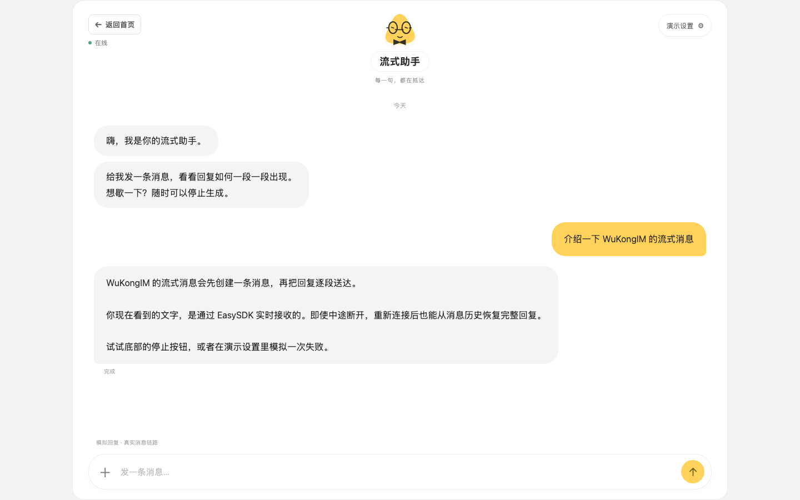
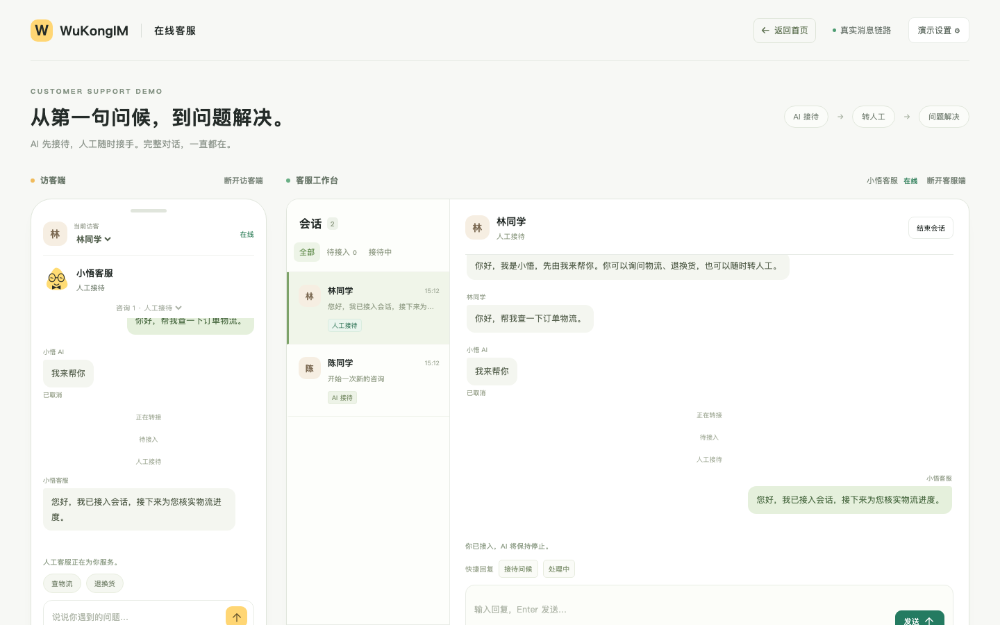
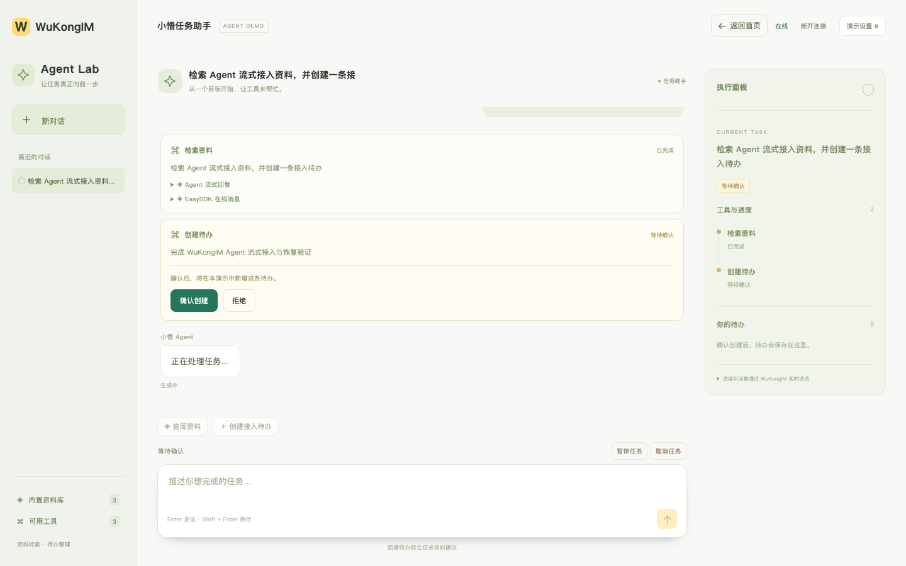
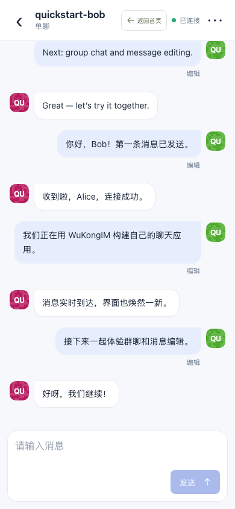
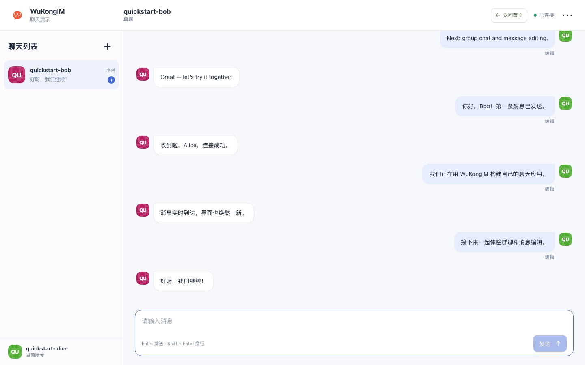
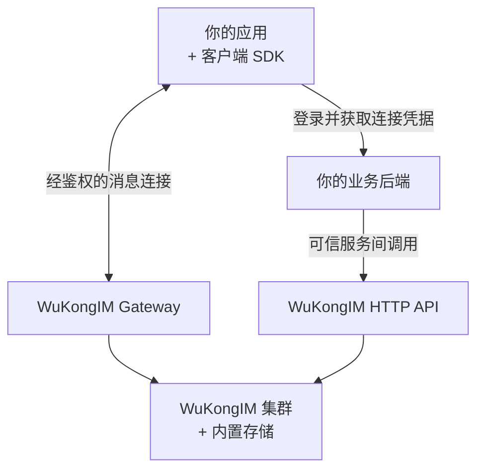
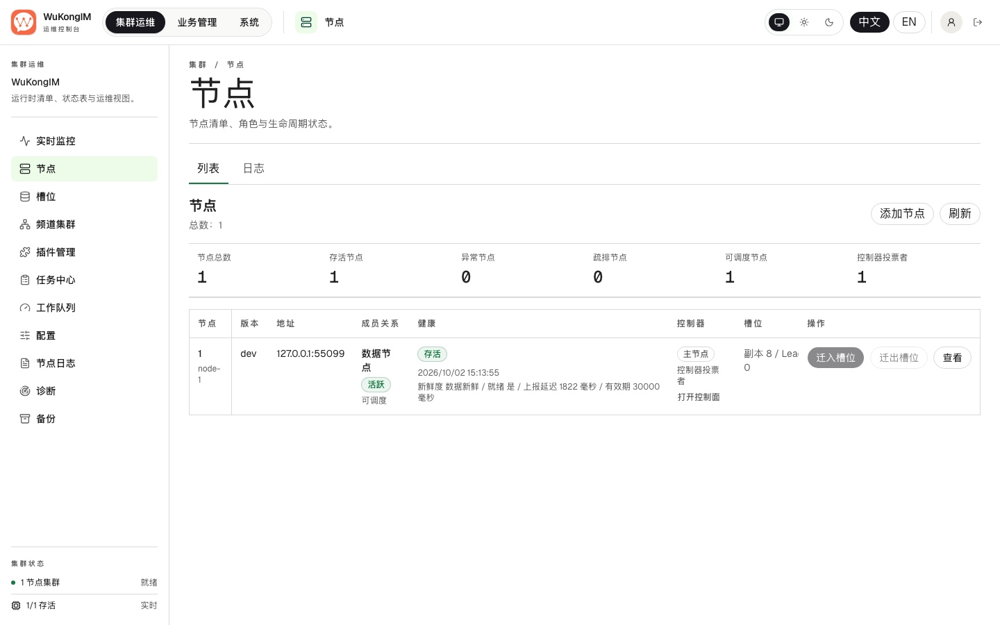

<p align="center">
  
</p>

<h1 align="center">WuKongIM</h1>

<p align="center">
  <strong>让消息实时流动，让产品掌握在你手中。</strong><br>
  自托管的开源即时通信，连接聊天、通知与 AI 对话。<br>
  内置存储与集群能力，通信核心无需外部数据库、缓存或消息队列。
</p>

<p align="center">
  <a href="#快速开始">快速开始</a> ·
  <a href="https://demo.githubim.com/">在线体验</a> ·
  <a href="#应用案例">应用案例</a> ·
  <a href="https://docs.githubim.com/zh/">文档</a> ·
  <a href="./README.md">English</a>
</p>

<p align="center">
  <a href="https://github.com/WuKongIM/WuKongIM/releases"></a>
  <a href="./go.mod"></a>
  <a href="./LICENSE"></a>
</p>

<p align="center">
  
</p>

WuKongIM 负责连接、消息存储、同步、在线状态与在线投递。你可以在此基础上构建单聊群聊、在线客服、应用通知或 AI 流式回复；产品界面、账号体系和业务规则由你的应用掌握。

## 为什么选择 WuKongIM？

| 能力 | 带来的价值 |
| --- | --- |
| **自带存储的通信核心** | 消息、元数据和复制日志存储内置，减少部署与运维所需的外部服务。 |
| **统一的集群模型** | 从单节点集群起步，多节点部署沿用相同的消息模型，默认采用 256 个 Hash Slot。 |
| **完整的消息基础能力** | 频道内有序消息、离线同步、多设备会话，以及个人、群组和自定义频道。 |
| **开箱可用的工具** | 四个可运行的 Demo，以及内嵌 Manager、指标、诊断和备份工具。 |

> [!NOTE]
> **v3 目前处于 beta 阶段。** API、配置和持久化格式仍可能变化。更换版本前请阅读[升级指南](https://docs.githubim.com/zh/server/operations/upgrade-and-migration/)，安装软件包后使用 `wukongim version` 确认版本。

## 应用案例

### 唐僧叨叨 · TangSengDaoDao

**基于 WuKongIM 构建、支持私有化部署的开源即时通讯产品。** 唐僧叨叨提供 iOS、Android、Web、Windows、macOS 和 Ubuntu Linux 客户端，帮助企业拥有自己的即时通讯服务。

WuKongIM 为其提供长连接维护、消息投递与消息存储能力；唐僧叨叨在此基础上实现聊天界面、好友关系、群组等产品功能，展示了如何以 WuKongIM 为通信核心构建完整的即时通讯应用。

[产品官网](https://tsdaodao.com/) · [开源代码与架构说明](https://github.com/TangSengDaoDao/TangSengDaoDaoServer)

## 快速开始

### 1. 在自己的电脑上启动 Demo

需要 **Go 1.25+**、**Node.js 22.12+ 或 20.19+** 和 **npm**。首次使用：

```bash
git clone https://github.com/WuKongIM/WuKongIM.git
cd WuKongIM
node demo/start.mjs
```

已经克隆仓库？直接在仓库根目录执行 `node demo/start.mjs`。

启动器会构建服务端、准备 Demo 后端，并在就绪后自动打开 Demo 首页。它启动一个采用 **256 个 Hash Slot** 的单节点集群，所有服务只监听回环地址。默认使用模拟模型，**无需模型 API Key**；首次运行会下载 Go 与 npm 依赖。

| Demo | 可以体验 | 源码与指南 |
| --- | --- | --- |
| **即时聊天** | 单聊、群聊、消息编辑与历史恢复 | [聊天 Demo](./demo/chatdemo/README.md) |
| **流式回复** | 逐段回复、模型接入、取消与失败处理 | [流式 Demo](./demo/streamdemo/README.md) |
| **在线客服** | AI 接待、人工接管与多访客会话 | [客服 Demo](./demo/supportdemo/README.md) |
| **Agent** | 工具调用、任务确认、暂停与取消 | [Agent Demo](./demo/agentdemo/README.md) |

<details>
<summary><strong>预览当前 Demo 界面</strong>：流式回复、在线客服、Agent 与手机聊天</summary>

以下截图于 2026 年 10 月 2 日从实际运行的仓库 Demo 截取。点击图片可查看原图。

<p><strong>流式回复</strong>：模拟模型的完整回复，通过真实消息服务逐段送达。</p>
<p align="center">
  <a href="./resources/readme/stream-demo.webp"></a>
</p>

<p><strong>在线客服</strong>：访客转人工，客服从工作台接入并回复。</p>
<p align="center">
  <a href="./resources/readme/support-demo.webp"></a>
</p>

<p><strong>Agent</strong>：资料检索已完成，创建测试待办前等待确认。</p>
<p align="center">
  <a href="./resources/readme/agent-demo.webp"></a>
</p>

<p><strong>手机聊天</strong>：同一会话在手机尺寸的界面中同步恢复历史消息。</p>
<p align="center">
  <a href="./resources/readme/chat-demo-mobile-cn.webp"></a>
</p>

</details>

体验时保持启动器运行，按 **Ctrl+C** 关闭本次启动的进程。每次运行的配置、日志、数据与 `run.json` 保存在 `demo/.runs/`，下次启动会创建新的运行目录。只输出地址、不打开浏览器时，使用 `node demo/start.mjs --no-open`。更多选项见[启动器指南](./demo/README.md)。

### 2. 完成第一次双向收发

从 Demo 首页打开**即时聊天**，使用两个独立的浏览器会话，例如普通窗口与无痕窗口。保留页面提供的 **API 地址**，填写以下测试凭据：

| 会话 | 账号（UID） | Token |
| --- | --- | --- |
| Alice | `quickstart-alice` | `alice-local-token` |
| Bob | `quickstart-bob` | `bob-local-token` |

1. 在两个页面均勾选**创建或更新演示凭据（仅测试账号）**，点击**登录**，等待双方均显示**已连接**。
2. 在 Alice 页面打开右上角 **`⋯` 演示工具** → **开始聊天** → **单聊**，填写 `quickstart-bob` 并确认。在 Bob 页面以相同方式选择 `quickstart-alice`。
3. 发送 `hello from alice`，确认消息出现在 Bob 页面；再回复 `hello from bob`，确认 Alice 收到。

至此，你已验证连接、发送与在线投递的双向链路。演示凭据直接通过 `/user/token` 注册；正式接入时，身份验证与 Token 签发必须由可信业务后端负责。

<p align="center">
  <a href="./resources/readme/chat-demo.jpg"></a>
</p>

### 希望直接部署到服务器？

| 部署方式 | 从这里开始 |
| --- | --- |
| **Linux 软件包** | [APT / RPM 安装](https://docs.githubim.com/zh/server/deployment/linux/)：systemd 服务、配置初始化与就绪检查 |
| **Docker** | [Docker 部署](https://docs.githubim.com/zh/server/deployment/docker/)：在容器中运行单节点集群 |
| **多节点集群** | [多节点部署](https://docs.githubim.com/zh/server/deployment/multi-node/)：集群配置与网络接入 |

<details>
<summary><strong>Linux 软件包快速开始</strong>：安装、初始化并打开聊天 Demo</summary>

Preview 软件源支持 **amd64/x86_64**：Ubuntu 24.04、Debian 13、Rocky Linux 9、AlmaLinux 9 和 RHEL 9。需要 systemd、sudo 和 curl，无需安装 Go。

在 **Linux 服务器上**，选择自己的包管理器安装：

```bash
# Ubuntu / Debian
curl -fsSL https://packages.githubim.com/repo | sudo sh
sudo apt update
sudo apt install -y wukongim
```

```bash
# Rocky Linux / AlmaLinux / RHEL 9
curl -fsSL https://packages.githubim.com/repo | sudo sh
sudo dnf -y --disablerepo='*' --enablerepo=wukongim-preview makecache --refresh
sudo dnf install -y wukongim
```

初始化配置，保存仅输出一次的 Manager 管理员密码，然后启动服务：

```bash
wukongim version
sudo wukongim init
sudo wukongim config validate --config /etc/wukongim/wukongim.toml
sudo systemctl enable --now wukongim
curl --retry 30 --retry-delay 2 --retry-all-errors --max-time 5 --fail \
  http://127.0.0.1:5001/readyz
```

等待返回 `{"ready":true}`。生成的配置只监听回环地址；使用远程服务器时，在**自己的电脑上**执行以下命令，将 `user@server-ip` 替换为实际 SSH 登录信息，并保持终端开启：

```bash
ssh -N \
  -L 127.0.0.1:5001:127.0.0.1:5001 \
  -L 127.0.0.1:5200:127.0.0.1:5200 \
  -L 127.0.0.1:5301:127.0.0.1:5301 \
  user@server-ip
```

浏览器就在服务器上运行时，可以跳过隧道。

| 应用 | 地址 | 登录方式 |
| --- | --- | --- |
| 聊天 Demo | <http://127.0.0.1:5001/demo/?lang=zh> | 按上方双用户步骤体验；API 地址使用 `http://127.0.0.1:5001` |
| Manager | <http://127.0.0.1:5301> | `admin` / 初始化时保存的密码 |

较旧软件包的 Demo 界面可能不同。就绪检查或连接失败时，查看 `sudo journalctl -u wukongim -n 100 --no-pager`，并确认 SSH 隧道转发了端口 `5200`。

使用 `sudo systemctl stop wukongim` 停止服务，使用 `sudo systemctl start wukongim` 恢复。软件包数据保留在 `/var/lib/wukongim`。

</details>

## 接入自己的应用

从 [JavaScript / Web 快速接入](https://docs.githubim.com/zh/sdk/javascript/quickstart/)开始。可运行示例包含开发用后端、两个客户端会话与离线恢复；跑通后，用自己的身份认证与业务后端替换示例后端。


```mermaid
flowchart TB
    Client["你的应用<br/>+ 客户端 SDK"] -->|"登录并获取连接凭据"| Backend["你的业务后端"]
    Client <-->|"经鉴权的消息连接"| Gateway["WuKongIM Gateway"]
    Backend -->|"可信服务间调用"| API["WuKongIM HTTP API"]
    Gateway --> Core["WuKongIM 集群<br/>+ 内置存储"]
    API --> Core
```

| WuKongIM 提供 | 你的应用负责 |
| --- | --- |
| 连接、频道消息存储、复制与在线投递 | 账号登录、Token 签发与 WuKongIM HTTP API 访问控制 |
| 频道、订阅者与同步 API | 业务权限、好友/群组流程与 SDK 同步 Provider |
| 客户端 SDK、Webhook 与插件接口 | 产品界面、媒体存储与具体业务逻辑 |

**请将 WuKongIM HTTP API 放在可信业务后端或带认证的 API 网关之后：** 它没有内置的业务调用方认证，Manager 登录仅保护 Manager。发送成功表示服务端返回发送结果；接收方收到和处理消息是不同阶段，离线恢复需要客户端发起同步。

### 选择 SDK

| SDK | 适用需求 | 平台 |
| --- | --- | --- |
| [**WuKongIMSDK**](https://docs.githubim.com/zh/sdk/wukongim/) | 聊天状态、会话列表、未读数与离线恢复 | Android、iOS、JavaScript/Web、Flutter、HarmonyOS |
| [**WuKongEasySDK**](https://docs.githubim.com/zh/sdk/easy/) | 轻量在线连接、消息收发与事件 | Android、iOS、JavaScript/Web、Flutter、Rust、C#、C++、Python |

维护中的版本与平台教程见 [SDK 选型](https://docs.githubim.com/zh/sdk/)。旧的独立 UniApp SDK 已停止维护，请参照 [JavaScript / UniApp 迁移指南](https://docs.githubim.com/zh/sdk/javascript/advanced/offline-and-uniapp/)。

## 看得见的运维

内嵌 **Manager** 将集群状态、连接、频道、消息、诊断与备份集中在一个界面中。

<p align="center">
  <a href="./resources/readme/manager-nodes-cn.jpg"></a>
</p>

| 任务 | 指南 |
| --- | --- |
| 配置凭据与网络访问 | [安全与访问控制](https://docs.githubim.com/zh/server/configuration/security/) |
| 保护数据并演练恢复 | [备份与恢复](https://docs.githubim.com/zh/server/operations/backup-and-restore/) |
| 理解集群与工具 | [架构说明](https://docs.githubim.com/zh/server/architecture/) · [运维工具](https://docs.githubim.com/zh/server/tools/) |
| 测量自己的业务负载 | [`wkcli bench`](./cmd/wkcli/internal/benchmark/README.md) · [性能排查手册](./docs/development/PERF_TRIAGE.md) |

已公开的测量结果见[会话与消息性能报告](./docs/superpowers/reports/2026-08-06-membership-conversation-performance-acceptance.md)。结果对应报告记录的历史版本与单台主机、三个进程的环境，请针对自己的版本、硬件与负载重新测量。

## 开发与贡献

仓库固定使用 **Go 1.25.11**。源码开发参照[配置与启动指南](https://docs.githubim.com/zh/server/configuration/)。

```bash
GOWORK=off go build ./cmd/wukongim ./cmd/wkcli
GOWORK=off go test ./cmd/... ./internal/... ./pkg/... ./scripts/... ./docker/... -count=1
```

阅读[仓库约定](./AGENTS.md)与 [CI 指南](./docs/development/CI.md)。前端开发请参照 [Manager](./web/README.md) 和[聊天 Demo](./demo/chatdemo/README.md) 的构建指南；生成资源会嵌入 Go 二进制，变更后需重新构建并提交。

[反馈问题](https://github.com/WuKongIM/WuKongIM/issues) · [查看版本](https://github.com/WuKongIM/WuKongIM/releases) · [更新日志](./CHANGELOG.md)

加入社区交流群：微信添加 **`wukongimgo`**，请注明 WuKongIM。

<p align="center">
  <a href="https://githubim.com">官网</a> ·
  <a href="https://docs.githubim.com/zh/">文档</a> ·
  <a href="./README.md">English</a><br>
  采用 <a href="./LICENSE">Apache License 2.0</a> 开源许可证。
</p>
