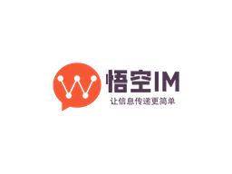
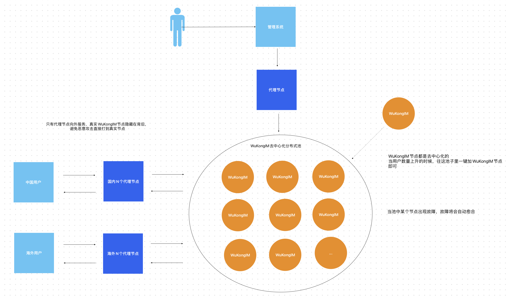
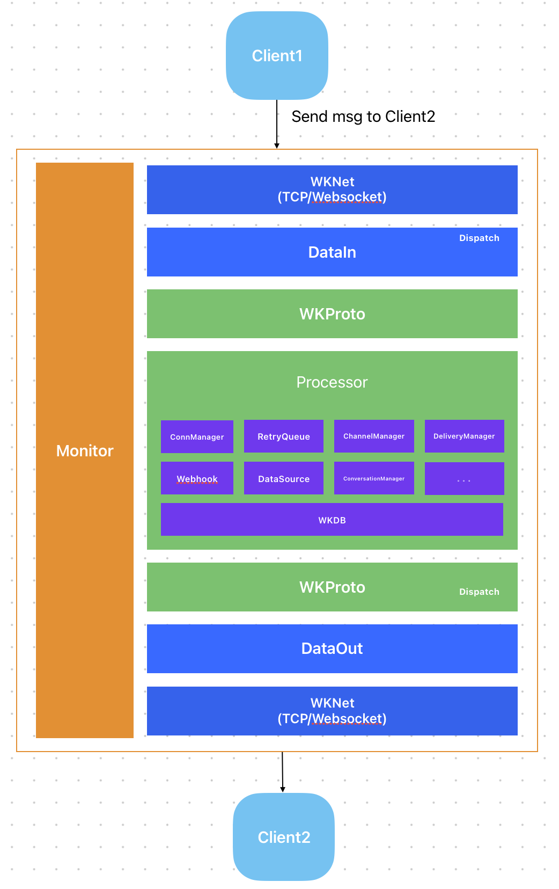
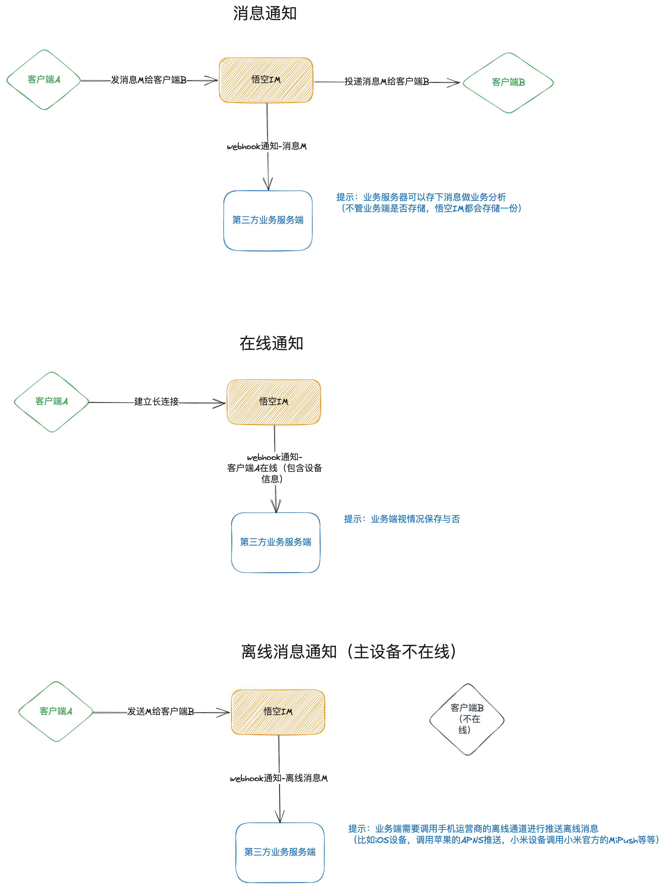
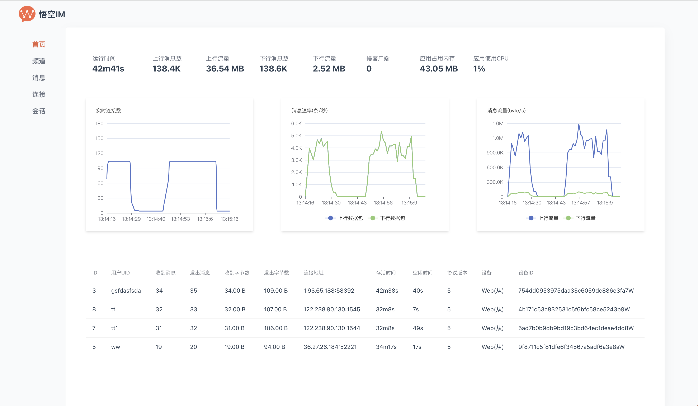
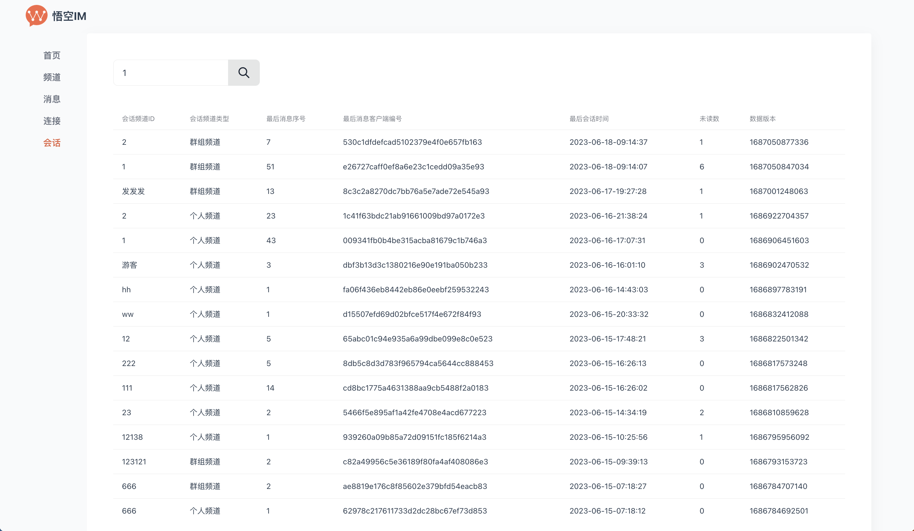
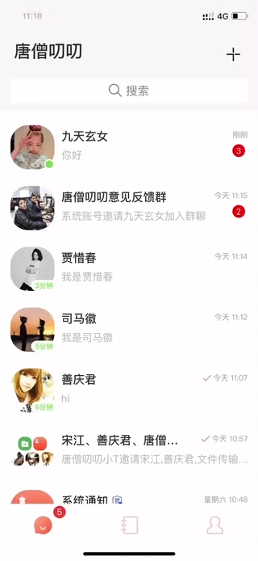
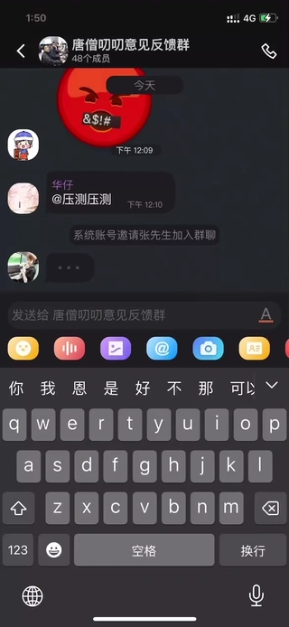
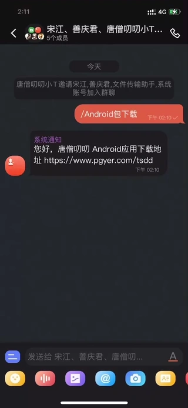
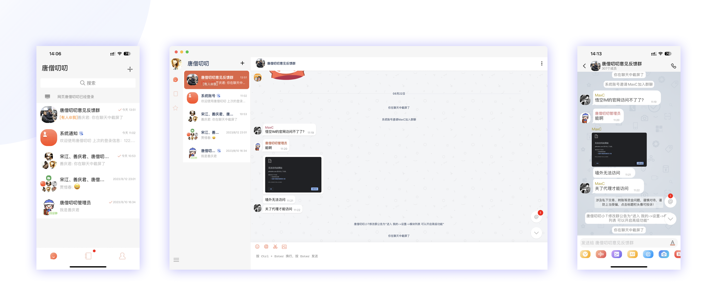

## WuKongIM (Make information transfer easier)

9 years of accumulation, precipitated a high-performance universal communication service, supporting instant messaging, in-site/system messages, message center, IoT communication, audio and video signaling, live broadcast barrage, customer service system, AI communication, instant community and other scenarios.

`This project needs to be compiled in a go1.20.0 or higher environment.`

Distributed IM important features: automatic failover, decentralized design, data mutual backup between nodes, support for rapid automatic cluster expansion, proxy node mechanism.


[中文文档](./README.md)

<p align="center">

<ul>
<!-- <li><strong>QQ group</strong>: <a href="#">496193831</a></li> -->
<li><strong>Website</strong>: https://githubim.com</li>
<li><strong>Protocol</strong>: <a href="https://githubim.com/server/advance/proto.html">WuKongIM Protocol</a></li>
<li><strong>Issues</strong>: https://github.com/WuKongIM/WuKongIM/issues</li>
<li><strong>Docs</strong>: https://githubim.com</li>
</ul>
</p>

[](./LICENSE)
[](https://github.com/WuKongIM/WuKongIM)
[](https://goreportcard.com/report/github.com/WuKongIM/WuKongIM)
<a href="https://join.slack.com/t/wukongim/shared_invite/zt-22o7we8on-2iKNUmgigB9ERdF9XUivmw"></a>


Architecture Diagram
--------



Demo
--------

**Chat Demo**

Web chat scenario demo: http://imdemo.githubim.com

Backend monitoring demo: http://monitor.githubim.com/web

Features
--------

🎦**Uniqueness**

No limit on group members, easily supports 100,000 people group chat, messages can be stored permanently.

📚**Low Resource Consumption**

Self-developed binary protocol, heartbeat packet is only 1 byte, saving traffic, saving power, and faster transmission.

🔐**Security**

Message channels and message content are encrypted throughout, preventing man-in-the-middle attacks and message tampering, with real-time backup of server data to prevent data loss.

🚀 **Performance**

Based on the pebble kv database, a unique distributed database for IM services was developed, avoiding the performance loss caused by other databases' generality. Faster storage means faster messages.

🔥**High Availability**

Through a modified raft distributed protocol, automatic disaster recovery is achieved. If one machine fails, another machine automatically takes over without external perception.

Decentralized, no single point, no central node, each node is independent and equal, all can provide services.

Easy expansion, just add machines, no need to shut down, no need to migrate data, automatic data allocation according to strategy.

0⃣️ **Ease of Use**

Does not rely on any third-party middleware, simple deployment, can be started with one command.

Adopts the design concept of channel subscription and publishing, easy to understand, easy to use.

As simple as Redis, as high-performance as Kafka, as reliable as MySQL.

🌲**Technical Support**

Official team provides technical support, technical documentation, technical exchange group, and issue feedback.

TODO
---------------

- [x] Supports custom messages
- [x] Supports publish/subscribe model
- [x] Supports personal/group chat/customer service/community news channels
- [x] Supports channel blacklist
- [x] Supports channel whitelist
- [x] Supports permanent message roaming, no message loss when switching devices
- [x] Supports online status, multiple devices online simultaneously with the same account
- [x] Supports real-time message synchronization across multiple devices
- [x] Supports server-side maintenance of user's recent conversation list
- [x] Supports command messages
- [x] Supports offline command interface
- [x] Supports Webhook, easily integrate with your own business system
- [x] Supports Datasource, seamlessly integrate with your own business system data source
- [x] Supports Websocket connection
- [x] Supports TLS 1.3
- [x] Supports Prometheus monitoring
- [x] Monitoring system development
- [x] Supports Windows system (for development use only)
- [x] Supports streaming messages, similar to ChatGPT's result output stream
- [x] Supports distributed
    - [x] Decentralized design, any node failure, cluster auto-recovery
    - [x] Data mutual backup between cluster nodes, any node damage does not affect data integrity
    - [x] Supports rapid automatic cluster expansion
    - [ ] Supports long connection CDN, solving the problem of unstable long connections across countries and regions


Quick Start
---------------

```shell
git clone https://github.com/WuKongIM/WuKongIM.git

cd WuKongIM/docker/cluster

sudo docker compose up -d
```

Backend Management System: http://127.0.0.1:15300/web

Chat Demo Address: http://127.0.0.1:15172/login


Source Code Development
---------------

### Single Machine

```shell


go run main.go

(go run main.go --config config/wk.yaml)

```

### Cluster
    
```yaml

# Start the first node
go run main.go --config  ./exampleconfig/cluster1.yaml

# Start the second node
go run main.go --config  ./exampleconfig/cluster2.yaml

# Start the third node
go run main.go --config  ./exampleconfig/cluster3.yaml

```

### Access

Backend Management System: http://127.0.0.1:5300/web

Chat Demo Address: http://127.0.0.1:5172/chatdemo


Formal Deployment

---------------

Docs[Docs](https://githubim.com/install)


SDK source code and demos
---------------

| Project Name | Github Address | Example | Documentation | Description |
| ---- | ---------- | --------- | ---- |  ---- |
|   WuKongIM   |   [Github](https://github.com/WuKongIM/WuKongIM)         |     无  |  [Documentation](https://githubim.com/sdk/android.html)  &nbsp;&nbsp;&nbsp;&nbsp;       |    WuKongIM communication end, responsible for long connection maintenance, message delivery, etc. |
|   WuKongIMAndroidSDK   |   [Github](https://github.com/WuKongIM/WuKongIMAndroidSDK)         |     [Example](https://github.com/WuKongIM/WuKongIMAndroidSDK/tree/master/app) | [Documentation](https://githubim.com/sdk/android.html)    |    WuKongIM's Android SDK  |
|   WuKongIMiOSSDK   |   [Github](https://github.com/WuKongIM/WuKongIMiOSSDK)         |     [Example](https://github.com/WuKongIM/WuKongIMiOSSDK/tree/main/Example)  | [Documentation](https://githubim.com/sdk/ios.html)     |    WuKongIM's iOS SDK  |
|   WuKongIMUniappSDK   |   [Github](https://github.com/WuKongIM/WuKongIMUniappSDK)         |     [Example](https://github.com/WuKongIM/WuKongIMUniappSDK/tree/main/examples)  | [Documentation](https://githubim.com/sdk/uniapp.html)      |    WuKongIM's Uniapp SDK  |
|   WuKongIMJSSDK   |   [Github](https://github.com/WuKongIM/WuKongIMJSSDK)         |     [Example](https://github.com/WuKongIM/WuKongIMJSSDK/tree/main/examples)   | [Documentation](https://githubim.com/sdk/javascript.html)     |    WuKongIM's JS SDK  |
|   WuKongIMFlutterSDK   |    [Github](https://github.com/WuKongIM/WuKongIMFlutterSDK)        |    [Example](https://github.com/WuKongIM/WuKongIMFlutterSDK/tree/master/example)   |[Documentation](https://githubim.com/sdk/flutter.html)    |    WuKongIM's Flutter SDK |
|   WuKongIMReactNativeDemo   |   [Github](https://github.com/wengqianshan/WuKongIMReactNative)         |     None  |  None  |    WuKongIM's React Native Demo (provided by contributor [wengqianshan](https://github.com/wengqianshan))  |


Illustration
---------------

Architecture




Business System Integration


Webhook




Applicable Scenarios
---------------

#### Instant Messaging

* Supports group channels
* Supports personal channels
* Supports permanent message storage
* Supports offline message push
* Supports recent conversation maintenance

#### Message Push/Site Message

* Supports group channels
* Supports personal channels
* Supports offline message push

#### IoT Communication

* Supports MQTT protocol (to be developed)
* Supports publish and subscribe

#### Audio and Video Signaling Server

* Supports temporary command message delivery

#### Live Broadcast Bullet Screens

* Supports temporary message delivery
* Supports temporary subscriber support

#### Customer Service System

* Supports customer service channels
* Messages can be delivered to third-party servers
* Third-party servers can decide to allocate designated subscribers to deliver messages in groups

#### Real-time AI Feedback

* Supports pushing messages sent by clients to third-party servers, and the results returned by AI after being fed back by third-party servers are pushed back to clients

#### Instant Community

* Supports community channels
* Supports message delivery in topic mode


Monitor
---------------






Star
------------

Our team has been committed to the research and development of instant messaging. We need your encouragement. If you find this project helpful, please give it a star. Your support is our greatest motivation.


Case
---------------

**Project**

TangSengDaoDao

**Github**

https://github.com/TangSengDaoDao/TangSengDaoDaoServer

**Screenshot**

||||
|:---:|:---:|:--:|
||||


|||          |
|:---:|:---:|:-------------------:|




Wechat
---------------

If necessary, add me and I will invite you to the group. My WeChat ID is wukongimgo.


License
---------------

WuKongIM is licensed under the [Apache License 2.0](./LICENSE).
