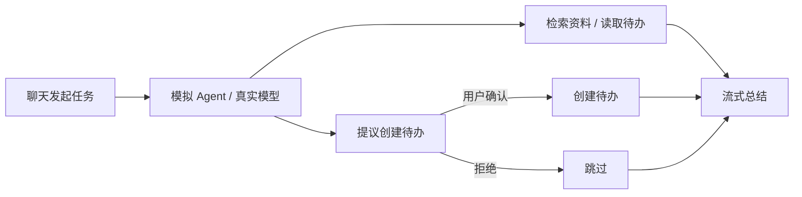
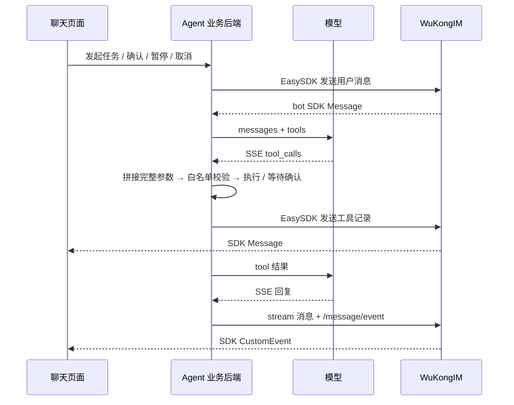

# Agent Demo



| 体验 | 功能 |
| --- | --- |
| 聊天 | 多对话、草稿保留、实时流式回复 |
| 工具卡片 | 输入、结果、执行状态；新增待办需点击确认 |
| 执行面板 | 当前任务、工具进度、已创建待办 |
| 任务控制 | 暂停、继续、取消；取消后不再执行待确认工具 |
| 演示设置 | 模拟工具失败、真实模型、断线恢复、事件日志 |
| 手机 | 聊天／执行面板标签切换 |

## 运行

先启动支持流式 EVENT 的 WuKongIM 单节点集群或多节点集群：

```bash
cd demo/agentdemo
npm ci
npm run build
WK_DEMO_API_URL=http://127.0.0.1:5001 npm start
```

打开 **http://127.0.0.1:5178/agentdemo/**，点击“开始演示”。
可用 `WK_DEMO_PORT` 修改业务服务端口。

Go 二进制内嵌 `/agentdemo/` 只读界面；其“演示设置”填写上述 Node 业务服务 URL
即可连接。工具与模型调用由 Node 进程负责，业务服务只监听本机。

## 真实模型

| 设置 | 填写 |
| --- | --- |
| 回复来源 | 真实模型 |
| 模型 URL | 支持工具调用的 Chat Completions 基础地址或完整地址 |
| API Key | 服务商 Key；仅保留在 Node 内存，不进入消息或浏览器存储 |
| 模型名称 | 可选；留空从 `/models` 选择聊天模型 |

模型须支持流式 `tool_calls`。
保存配置后清空 Key 输入框，任务进行中不能修改配置。
默认模拟 Agent 无需模型账号；工具执行和消息链路仍是真实的。

## 开发接入



| 文件 | 责任 |
| --- | --- |
| `agent.mjs` | 任务循环、审批、串行写入与取消边界 |
| `model.mjs` | 有界 SSE 解析、拼接 tool_calls、回传 tool 结果 |
| `tools.mjs` | 三个工具的 schema、参数校验、内置资料 |
| `server.mjs` | 本机 HTTP 边界与静态资源 |
| `src/main.ts` | SDK 接收、聊天、工具卡片与历史恢复 |

| 约束 | 实现 |
| --- | --- |
| 在线 | 固定 `easyjssdk@2.0.5`，实时 `Message` / `CustomEvent`；不轮询 |
| 离线与重连 | `/channel/messagesync` + `event_summary_mode:full`；按事件 ID 去重、UTF-8 偏移合并 |
| 工具授权 | 完整参数校验后执行；仅允许检索内置资料、读取待办、创建待办 |
| 暂停／取消 | 每任务串行边界；中止上游，唤醒确认等待，保存终态快照 |
| 重试 | 同一次业务操作复用 `requestId`，同一消息复用 `clientMsgNo` |
| 结果不确定 | 当前会话停止写入，保留记录，不自动重发任务 |
| 执行上限 | 4 个并发任务、6 轮模型调用、8 次工具调用、5 分钟截止 |
| 会话上限 | 8 个演示，每演示 12 个对话、48 个任务、24 条待办；历史最多 100 条消息 |

资料检索使用三条内置资料；待办保存在演示进程内存。
刷新页面、SDK 重连可恢复；重启业务进程需新建演示。闲置一小时回收。
接入实际工具时，在业务后端加入身份与业务权限校验。

[工具调用协议](https://developers.openai.com/api/docs/guides/function-calling) ·
[流式回复教程](../../docs-site/content/docs/sdk/easy/agent-streaming.mdx)

## 验证

```bash
# 仓库根目录
GOWORK=off go build -o /tmp/wukongim-agent-demo ./cmd/wukongim
cd demo/agentdemo
WK_DEMO_SERVER_BIN=/tmp/wukongim-agent-demo npm run test:integration
```

启动真实 **256 hash slots 单节点集群**、Node 后端与 SSE 模型夹具，验证审批、
幂等、暂停取消、工具失败、模型工具循环和离线恢复。不调用付费模型。
证据目录含 `report.json`、历史快照和日志。

构建输出 `internal/access/api/demoui/agentdist`，需随源码提交。
