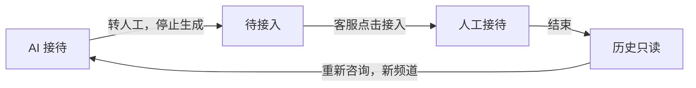
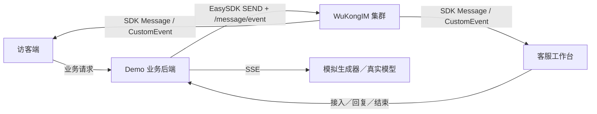

# 在线客服 Demo



| 界面 | 操作 |
| --- | --- |
| 访客端 | 切换林同学／陈同学；咨询、转人工、查看旧会话、重新咨询 |
| 客服工作台 | 多会话列表；筛选待接入／接待中；接入、回复、结束 |
| 手机 | 顶部标签切换访客端与客服工作台 |
| 演示设置 | 模拟内容或真实模型；断线／重连；请求与 SDK 事件日志 |

## 运行

先启动支持流式 EVENT 的 WuKongIM 单节点集群或多节点集群，再运行：

```bash
cd demo/supportdemo
npm ci
npm run build
WK_DEMO_API_URL=http://127.0.0.1:5001 npm start
```

打开 **http://127.0.0.1:5177/supportdemo/**，点击“开始演示”。
`WK_DEMO_PORT` 可修改此本机业务服务的端口。

服务端二进制也内嵌 `/supportdemo/` 的只读界面；在其“演示设置”填写业务服务 URL
即可接入上述 Node 进程。业务服务允许自己的页面与配置的 WuKongIM API 同源页面访问。
Go 二进制不负责运行客服业务或调用模型。

## 真实模型

| 字段 | 填写 |
| --- | --- |
| 回复来源 | 真实模型 |
| 模型 URL | 兼容 Chat Completions 的基础地址或完整 `/chat/completions` 地址 |
| API Key | 服务商 Key；只保留在此演示业务进程的内存中 |
| 模型名称 | 可选；留空从 `/models` 自动选择聊天模型 |

正在生成时不能修改配置。保存后清空页面的 Key 输入框；Key 不进入日志、
消息、URL 或浏览器存储。默认模拟回复无需模型账号或付费请求。

## 接入结构



| 约束 | 实现 |
| --- | --- |
| 每位访客独立 | 每次咨询新建普通群频道，成员为访客、AI、客服 |
| 接管互斥 | 每会话串行写入；撤销生成版本 → 中止上游 → 保存取消快照 → 待接入 |
| 在线消息 | 固定 `easyjssdk@2.0.5`，实时 `Message` 与 `CustomEvent` |
| 历史与重连 | 通过业务后端读取一次 `/channel/messagesync` 完整快照，不轮询增量 |
| 重试 | 同一次业务操作复用 `requestId`；消息使用相同 `clientMsgNo` |
| 结束后 | 后端拒绝双方继续发送；旧频道与历史保留 |

后端复用 `streamdemo/src/model.ts` 的有界 SSE 解析器，构建时编译到 `.runtime/`。

Demo 会话状态保存在 Node 进程内存：刷新页面和 SDK 重连可恢复，重启业务进程需
新建演示。每进程最多 8 个演示，每演示最多 16 个会话，模型最多 4 个并发；
闲置一小时回收连接与内存配置。历史界面每会话最多 100 条消息。

业务权限由 Demo 后端管理；真实部署需接入业务身份、保护 Product HTTP API，
并校验终端发送权限。浏览器 SDK 在本 Demo 中只接收消息。

## 验证

```bash
# 仓库根目录构建最新内嵌资源
GOWORK=off go build -o /tmp/wukongim-support-demo ./cmd/wukongim
cd demo/supportdemo
WK_DEMO_SERVER_BIN=/tmp/wukongim-support-demo npm run test:integration
```

进程级验收启动真实 **256 hash slots 的单节点集群**、Demo 后端与 SSE 模型夹具，
使用真实 EasySDK 验证正常回复、接管、迟到增量、发送幂等、多访客隔离、
结束只读、新会话、模型自动选择／上下文／失败／断流／中止和离线历史。
不调用付费模型。输出包含 `report.json`、历史快照和日志的证据目录。

生产构建输出 `internal/access/api/demoui/supportdist`，需完整随源码提交。
