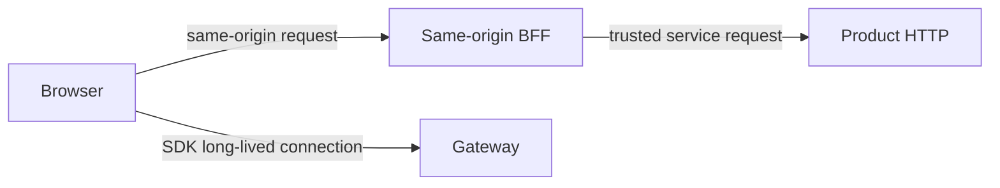

Product HTTP is for trusted backends. Browsers connect to Gateway through the SDK or request server capabilities through a same-origin BFF.

## Trust boundaries

The browser should receive only the UID, temporary token, and WebSocket address needed for its current connection. It must not receive the Product HTTP address or a server credential.

<Callout type="error" title="Storing a token is not CONNECT authentication">
  `POST /user/token` only stores device-token metadata. The default Gateway does not automatically validate a later CONNECT against that record; production must add explicit token validation and rejection policy.
</Callout>

## Production requirements

| Capability | Owner |
| --- | --- |
| Account, tenant, UID, and device policy | Product identity service and backend |
| Token generation, expiry, revocation, and secure storage | Product backend |
| CONNECT token validation | Gateway |
| Product HTTP authentication, authorization, limits, and audit | API Gateway, service mesh, or product backend |
| TLS, key rotation, and alerts | Production platform |

Protocol encryption does not replace TLS, account authentication, or HTTP service authorization. Tokens must not appear in URLs, logs, or screenshots.

<Callout type="warn" title="The sample BFF is for local development only">
  Bind the sample BFF to loopback and validate Host/Origin. Do not deploy it to the public internet, shared test environments, or real-user traffic.
</Callout>

Related references: [`/user/token`](/en/api/product-http/users), [Error Responses](/en/api/product-http/errors), and [Integration Architecture](/en/guide/integration/architecture).
