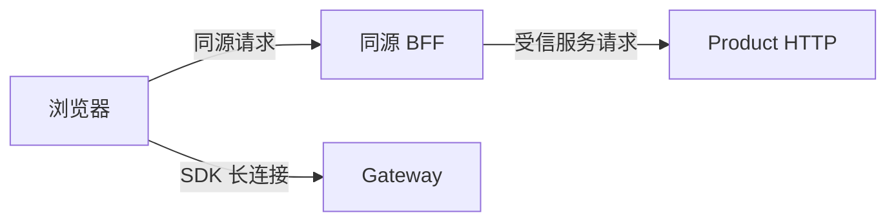

Product HTTP 面向受信后端；浏览器通过 SDK 连接 Gateway，或通过同源 BFF 请求服务端能力。

## 信任边界

浏览器只应获得当前连接所需的 UID、临时 Token 和 WebSocket 地址，不应获得 Product HTTP 地址或服务端凭据。

<Callout type="warn" title="默认 Gateway 会精确匹配已存 Token">
  `gateway.token_auth_on` 默认为 `true`。`POST /user/token` 保存设备 Token 后，相同 UID 与 `device_flag` 的后续 CONNECT 必须携带完全匹配的值。这个内置检查不提供过期时间或重放策略，生产环境仍必须保护 Token 管理接口并负责签发、轮换和撤销。
</Callout>

## 生产要求

| 能力 | 责任方 |
| --- | --- |
| 账号、租户、UID 与设备策略 | 业务身份服务和业务后端 |
| Token 生成、过期、撤销与安全存储 | 业务后端 |
| CONNECT Token 校验 | Gateway |
| Product HTTP 鉴权、授权、限流与审计 | API Gateway、服务网格或业务后端 |
| TLS、密钥轮换与告警 | 生产平台 |

协议加密不能替代 TLS、账号认证或 HTTP 服务鉴权。Token 不得出现在 URL、日志或截图中。

<Callout type="warn" title="示例 BFF 仅用于本地开发">
  示例 BFF 必须绑定 loopback 并校验 Host/Origin；不要部署到公网、共享测试环境或真实用户流量。
</Callout>

相关参考：[`/user/token`](/zh/api/product-http/users)、[错误响应](/zh/api/product-http/errors)和[集成架构](/zh/guide/integration/architecture)。
