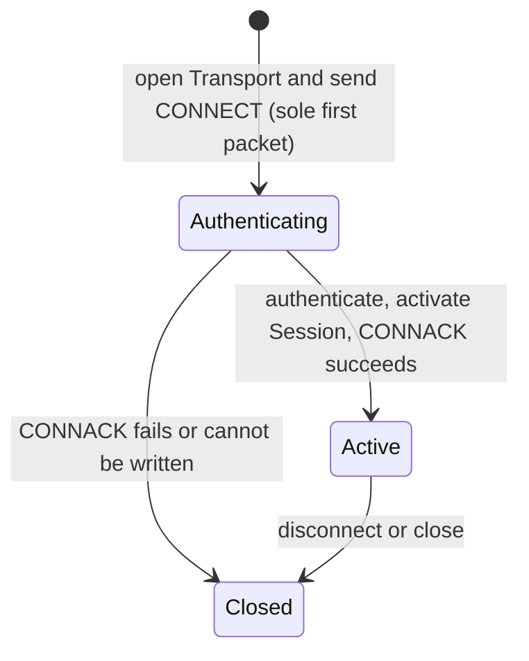

## Establish a connection

- `CONNECT` must be the sole first packet. A batch tail or another packet while authentication is pending closes the connection.
- The server negotiates the protocol version (currently v6; client values `0` or above v6 select v6), stores UID and device state plus encryption Session state when enabled, then activates online Presence.
- A non-success `CONNACK` is written before close. If a successful `CONNACK` cannot be written, completed activation is rolled back.

<Callout type="error" title="CONNACK success is not product ready">
  Success proves only that the protocol Session exists. Recover durable messages and merge local state before ordinary product sends are enabled.
</Callout>

## Active session

| Direction | Exchange | Completion boundary |
| --- | --- | --- |
| Client → Server | `PING` → `PONG` | Heartbeat response only |
| Client → Server | `SEND` → `SENDACK` | Protocol send result; not peer receipt or product execution |
| Server → Client | `RECV` → `RECVACK` | Session receive feedback; not end-user read state |

The default read-idle timeout is three minutes. Only inbound activity refreshes it; server outbound traffic does not. Proxy and load-balancer idle policies must accommodate the effective heartbeat.

## Close and recover

- `ReasonAuthFail` or `ReasonBan`: stop automatic reconnect and repair credentials or policy state.
- `ReasonClientKeyIsEmpty` or `ReasonProtocolUpgradeRequired`: fix client configuration or version first.
- `ReasonRateLimit`, `ReasonSystemError`, or transport loss: use only bounded backoff with jitter; rediscover Gateway ingress when needed.
- Any other failure: preserve the raw Reason Code and fail closed; do not guess that it is retryable.

After close, stop new sends. Reuse a stable `client_msg_no` for the same product send and distinct `client_seq` values for concurrent wire attempts. Return to ready only after CONNACK succeeds and durable-message recovery completes.

The current default composition enables Session payload encryption and stored device-token validation. CONNECT without `client_key` returns `ReasonClientKeyIsEmpty`; an empty token, missing device record, or mismatch returns `ReasonAuthFail`. Exact token matching does not replace TLS, account login, credential-expiry or replay policy, or Product HTTP protection.

Continue with [Packet Types](/en/api/client-protocols/packet-types) and [Reason Codes](/en/api/dictionaries/reason-codes).
