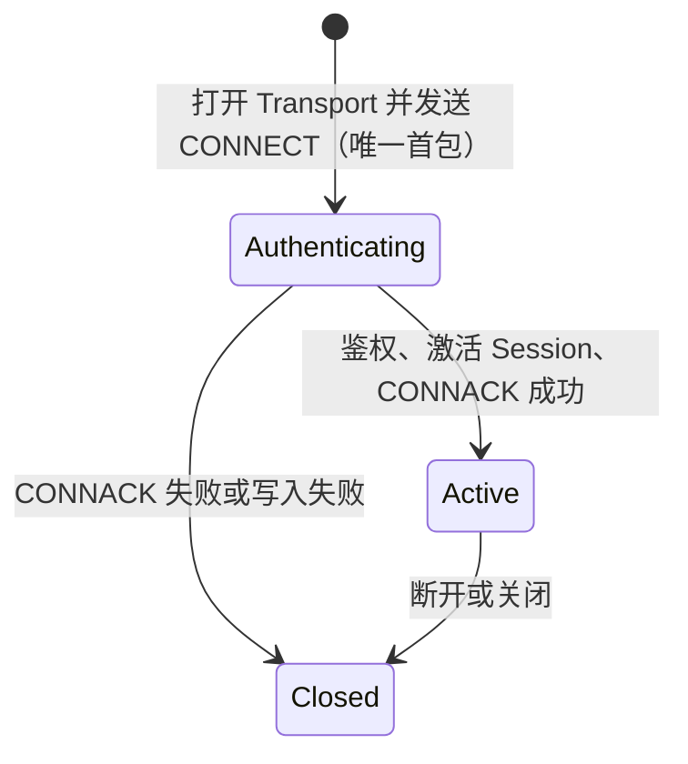

## 建立连接

- `CONNECT` 必须是唯一首包；同批携带其他包或鉴权等待期间再发包都会关闭连接。
- 服务端协商协议版本（当前最新 v6；客户端传 `0` 或高于 v6 时采用 v6），写入 UID、设备以及启用时的加密 Session 状态，再激活在线 Presence。
- 非成功 `CONNACK` 写回后连接关闭。成功 `CONNACK` 写失败时，已完成的 activation 会回滚。

<Callout type="error" title="CONNACK 成功不等于业务 ready">
  成功只证明协议 Session 已建立。客户端仍需恢复持久消息、合并本地状态，再开放普通业务发送。
</Callout>

## 活跃会话

| 方向 | 交互 | 完成边界 |
| --- | --- | --- |
| 客户端 → 服务端 | `PING` → `PONG` | 仅心跳响应 |
| 客户端 → 服务端 | `SEND` → `SENDACK` | 协议发送结果；不等于对端收到或业务执行 |
| 服务端 → 客户端 | `RECV` → `RECVACK` | Session 接收反馈；不等于最终用户已读 |

默认读空闲超时是 3 分钟，只有入站活动刷新期限；服务端出站流量不会刷新。代理或负载均衡器的空闲策略必须容纳有效心跳。

## 关闭与恢复

- `ReasonAuthFail` 或 `ReasonBan`：停止自动重连，先修复凭据或策略状态。
- `ReasonClientKeyIsEmpty` 或 `ReasonProtocolUpgradeRequired`：先修复客户端配置或版本。
- `ReasonRateLimit`、`ReasonSystemError` 或传输中断：仅使用有界退避与抖动，必要时重新发现 Gateway。
- 其他失败：保留原始 Reason Code 并 fail closed，不猜测为可重试。

关闭后停止新发送。恢复同一业务发送时复用稳定的 `client_msg_no`，并发 Wire 尝试使用不同 `client_seq`；只有 CONNACK 成功且持久消息恢复完成后才重新进入 ready。

当前默认组合启用 Session Payload 加密与已存设备 Token 校验；CONNECT 缺少 `client_key` 会返回 `ReasonClientKeyIsEmpty`，Token 为空、设备记录不存在或不匹配会返回 `ReasonAuthFail`。精确 Token 比对不替代 TLS、账号登录、凭据过期/重放策略或 Product HTTP 防护。

下一步查看[数据包类型](/zh/api/client-protocols/packet-types)和 [Reason Code](/zh/api/dictionaries/reason-codes)。
