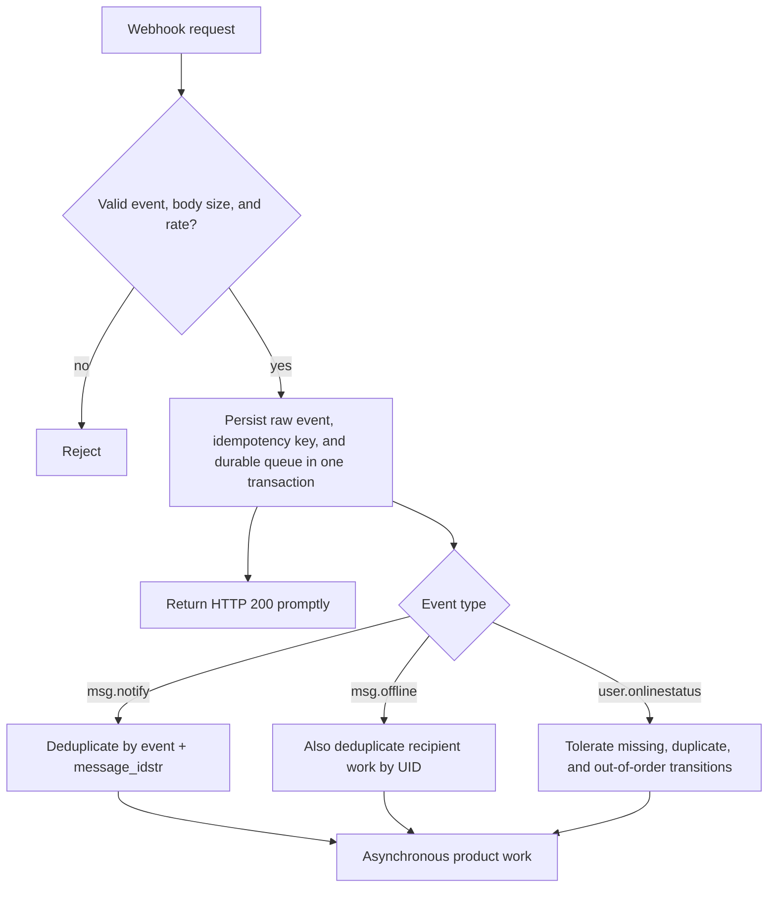

## Delivery semantics

Only HTTP `200` is success. Every other status, connection error, or timeout fails the attempt. The response body is drained and discarded; it has no protocol meaning.

| Setting | Default | Scope |
| --- | ---: | --- |
| `queue_size` | 1024 | in-memory waiting capacity per event class |
| `workers` | 16 | concurrent senders per event class |
| `msg_notify_batch_max_items` / wait | 100 / 500ms | `msg.notify` batch |
| `online_status_batch_max_items` / wait | 512 / 2s | `user.onlinestatus` batch |
| `offline_uid_batch_size` | 512 | offline UID chunk and compression threshold |
| `request_timeout` | 5s | each HTTP attempt |
| `retry_max_attempts` | 3 | total attempts, including the first |

Retries run immediately inside the admitted job, with **no backoff or delay**. A continuously failing request is dropped after three attempts.

<Callout type="warn" title="Not a reliable queue">
  Queues are bounded and node-memory only. Queue saturation, process failure, cancellation, timeout, or exhausted retries can lose an event; shutdown drains only until its Context expires. A lost response can produce a duplicate, and workers/batches provide no public global ordering. Webhook failure does not roll back durable commit or a successful SENDACK.
</Callout>

## Receiver contract

Critical product state must remain reconstructable from the product database or message history.

## Security boundary

The sender adds only `Content-Type: application/json`. It adds **no signature, shared-secret, or Authorization header**. Do not place long-lived secrets in the webhook URL where logs may capture them.

Production controls must establish trust outside this protocol:

- use HTTPS only; prefer a private network, service mesh, or fixed egress proxy;
- enforce mTLS, fixed egress identity, or controlled credentials at a reverse proxy;
- limit source IPs, rate, and body size;
- avoid logging complete Payloads or personal data;
- never expose the callback as an anonymous public write endpoint.
