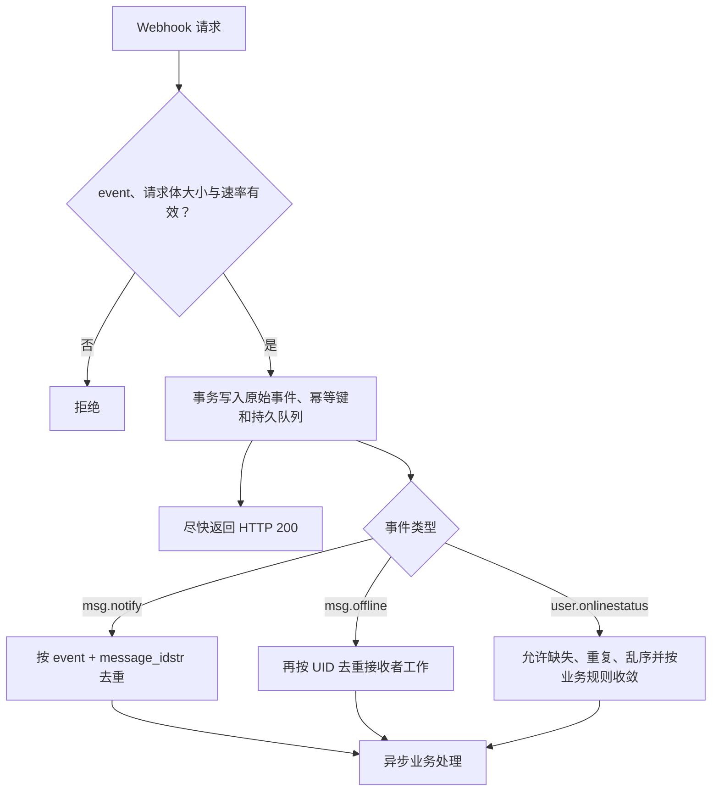

## 投递语义

只有 HTTP `200` 表示成功；其他状态码、连接错误与超时均失败。响应体会被读取后丢弃，不参与协议。

| 设置 | 默认值 | 作用域 |
| --- | ---: | --- |
| `queue_size` | 1024 | 每类事件的内存等待容量 |
| `workers` | 16 | 每类事件的并发 Sender 数 |
| `msg_notify_batch_max_items` / wait | 100 / 500ms | `msg.notify` 批次 |
| `online_status_batch_max_items` / wait | 512 / 2s | `user.onlinestatus` 批次 |
| `offline_uid_batch_size` | 512 | 离线 UID 分块与压缩阈值 |
| `request_timeout` | 5s | 每次 HTTP 尝试 |
| `retry_max_attempts` | 3 | 总尝试次数，包含首次 |

重试在当前任务内立即进行，**没有退避或延迟**。连续失败在 3 次尝试后丢弃。

<Callout type="warn" title="不是可靠队列">
  队列有界且只在节点内存中。队列满、进程崩溃、取消、超时或重试耗尽都可能丢事件；关停只在给定 Context 内排空。响应丢失会产生重复，多个 Worker/批次之间没有公共全局顺序。Webhook 失败不会回滚持久提交或成功 SENDACK。
</Callout>

## 接收端合同

关键业务状态必须能从业务数据库或消息历史重建。

## 安全边界

当前 Sender 只添加 `Content-Type: application/json`，**没有签名、共享密钥或 Authorization Header**。Webhook URL 本身也不应携带会进入日志的长期秘密。

生产环境必须在协议外建立信任：

- 仅使用 HTTPS；优先私网、服务网格或固定出口代理；
- 在反向代理层使用 mTLS、固定出口身份或受控凭据；
- 对来源 IP、速率和请求体大小设限；
- 避免记录完整 Payload 与个人数据；
- 不把回调暴露为匿名公网写入口。
