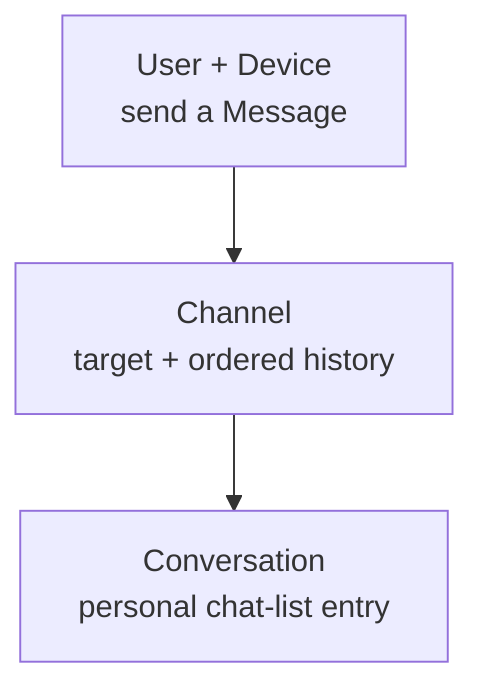
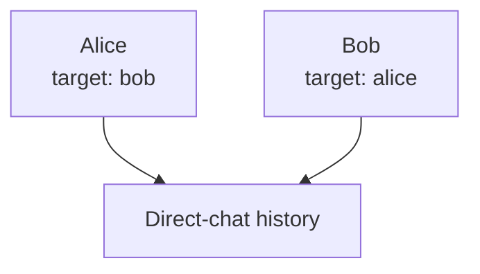

A Channel is a message “address.” Its complete identity is **`channel_id + channel_type`**. The same ID with a different type identifies a different Channel.

## Why Channels matter

Choose a Channel before sending. It defines the recipient scope and numbers, orders, and recovers its ordinary persistent messages. Notifications, support, live interaction, and Agents can reuse this entry point.

## Relationship to other concepts

A Device does not change Channel identity. Users can have different unread and visibility state in their Conversations.

## Direct chat: send to the peer UID

Callers always use the **peer UID**. WuKongIM normalizes both viewpoints internally. Do not construct the internal Channel ID or write it back as a contact ID.

## Group chat: send to a stable group ID

| Task | Owner |
| --- | --- |
| Choose the Channel ID | The product supplies a stable group ID |
| Create, invite, or leave | The product decides; a trusted backend synchronizes membership and policy |
| Persist, order, and deliver messages | WuKongIM |

**Knowing the group ID does not grant send permission.** Channel Type is not authorization. The product owns membership, roles, deny/allow lists, and content policy.

  
Group metadata, specialized types, and large groups

The product owns group names, avatars, announcements, roles, tenant isolation, and moderation. WuKongIM stores synchronized membership and policy and provides message persistence, realtime delivery, and offline recovery.

The product also owns contact, stranger, and send policy for direct chats. Use specialized community, feed, live, visitor, or Agent types only when the server, selected SDK, and product flow support them. Values are listed in [Channel Types](/en/api/dictionaries/channel-types).

For 100,000-member groups, bound membership updates and online delivery work and use paging. See [Large Groups](/en/guide/tutorials/large-groups).

Continue with [User](/en/guide/core-concepts/users) and [Conversation](/en/guide/core-concepts/conversations). For replicas, commit, and migration, see the [Channel Messaging Layer](/en/server/architecture/channels).
