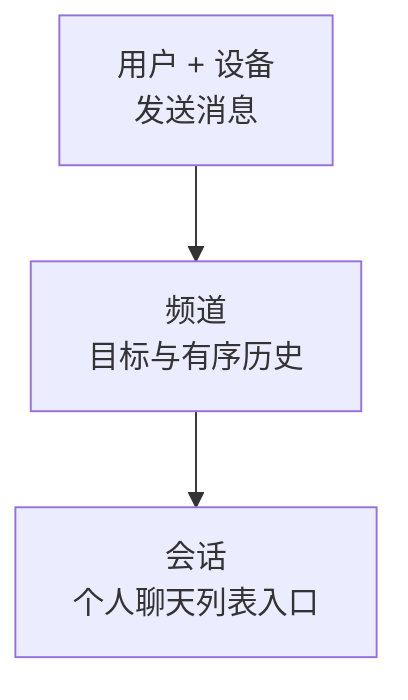
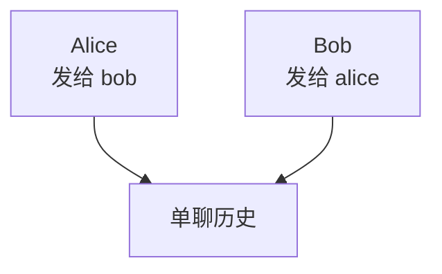

频道（Channel）是消息的“地址”。完整身份是 **`channel_id + channel_type`**；同一个 ID 搭配不同类型，属于不同频道。

## 为什么频道重要

发送消息先选频道。它确定接收范围，普通持久消息在各自频道内编号、排序和恢复。通知、客服、直播和 Agent 也可以复用这个入口。

## 与其他概念的关系

设备不改变频道身份；不同用户看到的会话未读和可见状态可以不同。

## 单聊：发给对方的 UID

调用方始终使用**对方 UID**。WuKongIM 在内部归一双方视角；应用不需要构造内部频道 ID，也不要把它回写为好友 ID。

## 群聊：发给稳定的群 ID

| 你要做什么 | 谁负责 |
| --- | --- |
| 选择频道 ID | 业务系统提供稳定的群 ID |
| 创建群、邀请或退群 | 业务系统决定，再由受信后端同步成员与策略 |
| 保存、排序和投递消息 | WuKongIM |

**知道群 ID 不代表有发送权限。** Channel Type 也不是权限；成员、角色、黑白名单和内容策略仍由业务系统定义。

  
群资料、其他频道类型与大群处理

群名称、头像、公告、角色、租户隔离和审核归业务系统管理。WuKongIM 保存同步后的频道成员与策略，提供消息持久化、实时投递和离线恢复。

单聊的好友、陌生人和发送策略也由业务系统维护。社区、资讯、直播、访客、Agent 等专用类型，只有在服务端、所选 SDK 与业务流程都支持时才使用，取值见 [Channel Type](/zh/api/dictionaries/channel-types)。

十万成员群需要分页与有界的成员变更、在线投递，见[大群教程](/zh/guide/tutorials/large-groups)。

继续阅读[用户](/zh/guide/core-concepts/users)和[会话](/zh/guide/core-concepts/conversations)。频道副本、提交与迁移见 [Channel 消息层](/zh/server/architecture/channels)。
