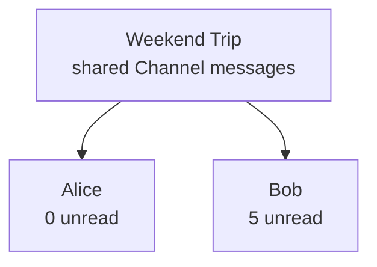

A Conversation is **one row in one user's chat list**. It points to a Channel and shows the latest message, unread count, and personal state. Messages are stored in the Channel.

## Why conversations matter

Conversations help users find chats, spot new messages, hide a chat, or clear unread. During offline recovery, clients first sync the conversation list, then fetch missing messages for each Channel.

## Relationship to other concepts

These are example states for two members: **one Channel, different personal read positions and visibility ranges**. Devices sharing a UID sync conversation state while retaining their own local UI state.

## Distinguish Channel and Conversation

| Channel | Conversation |
| --- | --- |
| Shared communication space and ordered history | The current user's personal view of a Channel |
| Identified by `channel_id + channel_type` | Also requires the current UID |
| Stores committed messages | Refers to the latest message and presents unread and visibility state |

## Common actions

| Action | Result |
| --- | --- |
| Clear unread | Advances the current UID's unread baseline; sends no peer-read receipt |
| Hide or delete | Hides your current view; does not leave the group or delete others' messages. A later message above the hidden range can make it appear again |
| Leave or remove a member | Changes Channel membership |
| Sync devices | Other devices with the same UID can see conversation and unread updates on their next sync |

The client owns pinning, drafts, grouping, and final UI ordering.

  
Integration: list fields, ordering, and sync cursors

A Conversation normally includes Channel ID and type, latest message, unread count, and read and visibility boundaries. These determine which chat opens, which preview appears, and the unread baseline.

The server orders the active conversation directory by `activated_at`: the time of explicit Channel activation, **not latest-message time**. An inactive empty Channel with no visible messages is omitted. The client chooses final ordering after receiving latest-message data.

**The conversation list and each Channel's message list have separate sync positions.** One cursor cannot replace both. WuKongIM builds the view from the user's Channel relationship, committed messages, and personal visibility state.

Continue with [Message](/en/guide/core-concepts/messages), then choose a [full SDK platform](/en/sdk/wukongim) for conversation APIs. For server construction and paging, see [message-flow architecture](/en/server/architecture/message-flow).
