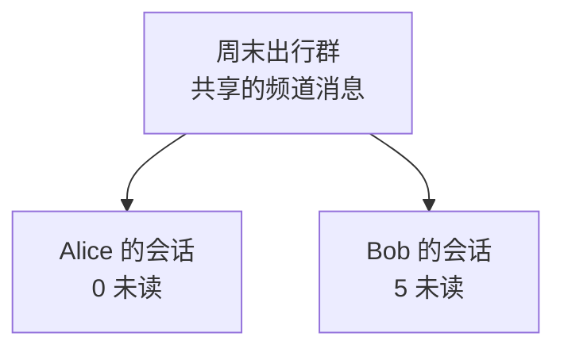

会话（Conversation）是**某个用户聊天列表中的一行**：指向频道，展示最近消息、未读数和个人状态。消息保存在频道中。

## 为什么会话重要

用户通过会话找到聊天、看到新消息提示，也能隐藏聊天或清除未读。离线恢复时，客户端先同步会话列表，再分别补齐各频道的消息。

## 与其他概念的关系

这是两位成员的示例状态：**同一频道，个人已读位置和可见范围不同**。同一 UID 的设备同步会话状态，各自保留本地 UI 状态。

## 频道与会话怎么区分

| 频道 | 会话 |
| --- | --- |
| 参与者共享的通信空间与有序历史 | 当前用户对频道的个人视图 |
| 身份是 `channel_id + channel_type` | 还要结合当前 UID |
| 保存已提交消息 | 引用最近消息，呈现未读和可见状态 |

## 常见操作

| 操作 | 结果 |
| --- | --- |
| 清除未读 | 推进当前 UID 的未读基线；不等于向对方发送已读回执 |
| 隐藏或删除会话 | 隐藏自己的当前视图；不退群、不删除其他成员的消息。更高序号的新消息可让会话再次出现 |
| 退出或被移除 | 改变频道成员关系 |
| 多设备同步 | 同一 UID 的会话和未读更新，在其他设备下一次同步时可见 |

置顶、草稿、分组和最终 UI 排序由客户端维护。

  
接入时：列表字段、排序与同步游标

会话通常包含频道 ID 与类型、最近消息、未读数、已读和可见边界。客户端用它们决定打开哪个聊天、显示什么摘要和从哪里计算未读。

服务端按 `activated_at` 排列活动会话目录。这是用户显式激活频道的时间，**不是最新消息时间**。未激活且没有可见消息的空频道不出现在列表中；客户端拿到最近消息后决定最终展示顺序。

**会话列表和每个频道的消息列表有各自的同步进度**，不能共用一个游标。WuKongIM 根据用户的频道关系、已提交消息和个人可见状态构建会话视图。

继续阅读[消息](/zh/guide/core-concepts/messages)，再选择[完整版 SDK 平台](/zh/sdk/wukongim)查看会话 API。服务端构建与分页见[消息流转架构](/zh/server/architecture/message-flow)。
