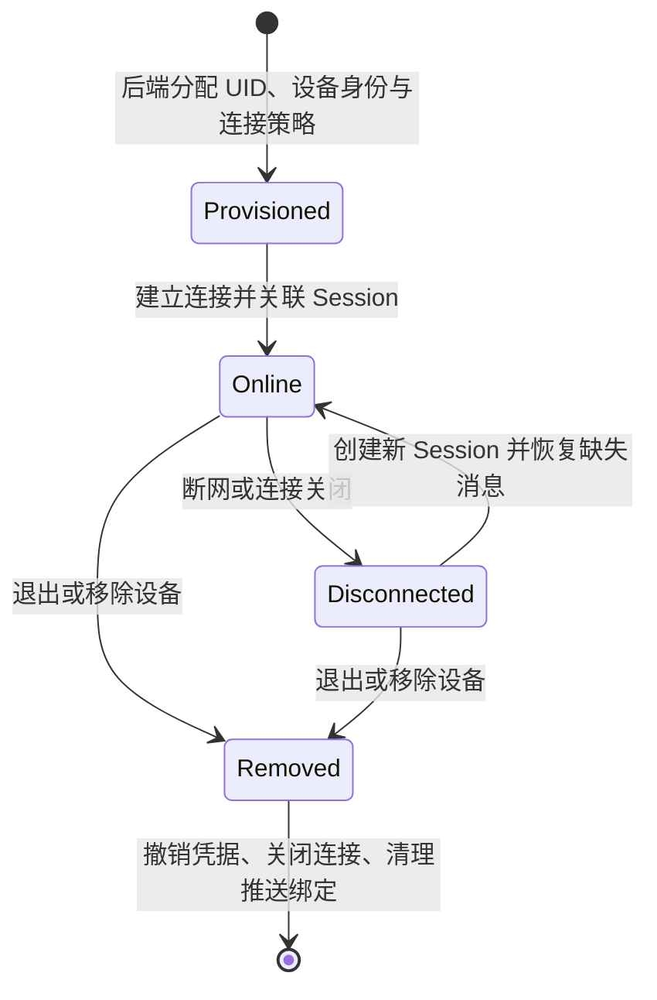

设备（Device）是用户接入 WuKongIM 的具体客户端端点，例如手机 App、浏览器或桌面应用。同一个用户可以拥有多个设备，也可以在多个设备上同时使用消息服务。

设备不是用户本身，也不等于一次网络连接。网络切换或重连会产生新的连接，但用户和设备身份通常保持不变。

## 为什么设备重要

- **支持多端使用**：一个 UID 可以同时在手机、Web 和 PC 上收发消息。
- **区分同步范围**：普通持久消息和会话通常按 UID 共享，草稿、下载进度和推送 Token 则属于具体设备。
- **控制在线策略**：业务可以决定同类设备允许多端共存，还是新连接替换旧连接。
- **处理退出与撤销**：移除设备不仅要断开当前连接，还要撤销凭据和清理业务侧设备记录。

## 与其他概念的关系

- **用户**可以拥有多个设备，所有设备共享同一个 UID。
- 普通持久**消息**从一个具体连接发出，并可由用户的其他活动设备接收或稍后同步。
- **频道**和持久消息历史不属于某台设备，更换设备后仍可按权限恢复。
- **会话**通常按 UID 共享，但最终展示和本地缓存由各设备维护。

## 四个容易混淆的名词

| 名词 | 表示什么 | 示例 |
| --- | --- | --- |
| UID | 业务用户身份 | `alice_123` |
| Device Flag | 客户端类别 | APP、WEB、PC |
| Device ID | 某个具体安装或端点 | `alice_iphone_01` |
| Connection / Session | 当前的一次 TCP 或 WebSocket 连接 | 断网重连后会变化 |

Device Level 用于描述同一 UID、同一设备类别下的连接冲突策略，例如允许多个 Web 端共存或保持单活。它不是管理员、会员或群角色等业务权限。

完整取值和当前生效边界见 [Device Flag](/zh/api/dictionaries/device-flags)。

## 哪些状态会跨设备共享

| 通常按 UID 共享 | 通常由具体设备保存 |
| --- | --- |
| 普通持久频道消息和消息顺序 | 本地草稿、滚动位置和下载进度 |
| 会话、未读基线和隐藏范围 | 厂商推送 Token、通知权限和后台限制 |
| 业务后端决定的账号与群关系 | 本地缓存、加密材料和设备风险信息 |

一个设备清除未读后，其他设备下一次同步可能看到新的未读状态。普通持久消息也可以投递到多个活动连接；每个设备仍需独立处理接收、去重和本地存储。

## 设备的一次典型使用过程

<Callout type="warn" title="多端策略由受信后端控制">
  客户端不能自行选择更高的 Device Level。当前 v3 Beta 的默认 Gateway 也不会自动把已保存的 Token 与 Device Level 变成完整校验链路；请把这项策略纳入[上线检查](/zh/guide/integration/acceptance)。
</Callout>

继续阅读[会话](/zh/guide/core-concepts/conversations)和[认证与安全](/zh/guide/integration/authentication)。
