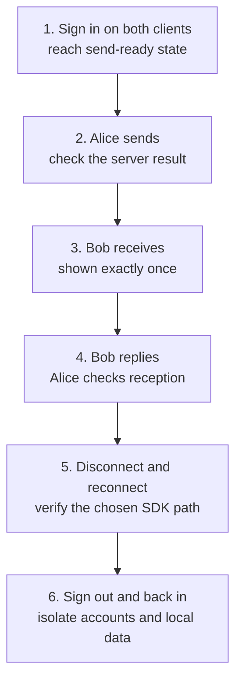

Goal: prove the production messaging loop and recovery from critical failures with real clients, server configuration, and application APIs.

## 1. Freeze the versions

Record exact SDK versions and lockfiles, the server version and configuration, and client/device/network coverage. Include login, token, history, conversation, and media APIs plus data changes and rollback. Release dependencies, configuration, and lockfiles as one change unit.

## 2. Run the six-step messaging loop

Use Alice and Bob in independent clients. Retain screenshots or redacted results, with expected and actual outcomes for each step.

Sending, live reception, and offline synchronization are **different events**. Verify each separately.

## 3. Verify the SDK's recovery path

| Integration | Step 5 acceptance |
| --- | --- |
| Full SDK | Disconnect Bob, send another message from Alice, then reconnect and restore persistent messages; verify order, deduplication, conversations, and unread |
| EasySDK online path | Verify disconnect/reconnect/error callbacks, listener removal, and instance destruction; do not assume automatic offline sync |
| EasySDK with product history | Also verify your backend's history fetch, deduplication, conversations, and unread; promise these only after implementing them |

Ordinary and command-style NoPersist have no persistent history and cannot prove offline recovery.

## 4. Meet the release criteria

| Required check | Passing condition |
| --- | --- |
| Identity and network | Invalid, revoked, and wrong-UID tokens rejected; product expiry enforced; TLS/WSS and no client management credentials |
| Messaging and connection | Correct results and UI for sending, failure, timeout, retry, duplicates, network changes, and restart |
| Capacity and diagnosis | Target online users, message rate, and group size reached; queues/retries/degradation bounded; metrics and redacted logs support diagnosis |
| Data and rollback | Account isolation, upgrades, and recovery rehearsed; rollback uses compatible data or a complete previous-generation backup |

  
Additional checks for product features

| Feature in use | Verify |
| --- | --- |
| Multiple devices and conversations | Latest message, unread, deletion, and multi-device convergence; clear UI for foreground/background, kick-out, and token invalidation |
| Media | Upload failure, cancellation, timeout, URL permissions, and file cleanup |
| Local persistence | Backup, encryption, logout cleanup, and upgrade migration |
| Operations APIs | WuKongIM HTTP API, Manager, and diagnostics behind protected management boundaries, without direct public exposure |

Your backend rotates or revokes expired tokens. CONNECT does not automatically inspect expiry inside the token string. Test the mechanism you actually deploy, beyond a client-side timer.

<Callout type="warn" title="Stop release on these failures">
  Incomplete identity or network boundaries, tokens/full messages in logs, unrecoverable critical failures, missed capacity targets or absent rate-limit/degradation policy, or irreversible data changes without a reviewed forward-repair plan.
</Callout>

Start with a small rollout. Observe connection success, send failures, latency, sync errors, queue levels, and storage errors before expanding traffic.

Next: [Health & Monitoring](/en/server/operations/health-and-monitoring) and [Upgrade & Migration](/en/server/operations/upgrade-and-migration). See [Authentication & Security](/en/api/authentication) for security boundaries.
