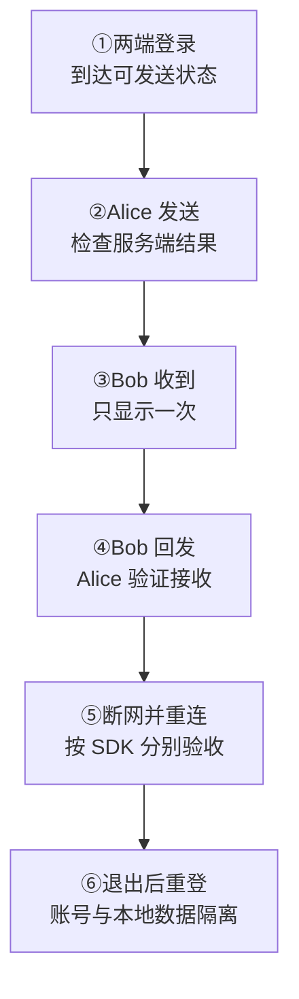

目标：用真实客户端、服务端配置和业务接口，证明上线后的消息闭环可用，关键失败场景能恢复。

## 1. 固定本次版本

记录 SDK 精确版本与锁文件、服务端版本和配置、客户端设备与网络范围。登录、Token、历史、会话、媒体接口，以及数据变化与回滚方式一并记录；依赖、配置和锁文件作为同一变更单元发布。

## 2. 跑通六步消息闭环

使用 Alice、Bob 两个测试账号和独立客户端。保存各步骤的截图或脱敏结果，记录预期与实际值。

发送结果、在线接收和离线同步是**不同事件**，分别检查，不能用发送成功代替后两者。

## 3. 按 SDK 验证断网恢复

| 接入方式 | 第 ⑤ 步验收 |
| --- | --- |
| 完整版 SDK | Bob 断网后 Alice 再发一条；恢复后补齐持久消息，核对顺序、去重、会话与未读 |
| EasySDK 在线接入 | 验证断开、重连与错误回调，以及监听解绑、实例销毁；不把它当作自动离线同步 |
| EasySDK + 业务历史能力 | 额外验证业务后端的历史补拉、去重、会话与未读，业务未实现时不能承诺这些能力 |

普通与命令式 NoPersist 没有持久历史，不用于离线恢复验收。

## 4. 满足发布条件

| 必查项 | 合格标准 |
| --- | --- |
| 身份与网络 | 无效、撤销和错误 UID Token 被拒绝；业务过期策略有效；使用 TLS/WSS，客户端没有管理凭据 |
| 消息与连接 | 发送、失败、超时、重试、重复、切网和重启都有正确结果与 UI 状态 |
| 容量与诊断 | 达到目标在线数、消息速率和群规模；队列、重试与降级有上限，指标和脱敏日志可定位问题 |
| 数据与回滚 | 账号隔离、升级与恢复已演练；回滚使用兼容数据或完整旧代备份 |

  
按业务功能补充检查

| 已使用的功能 | 检查内容 |
| --- | --- |
| 多端与会话 | 最近消息、未读、删除和多设备状态收敛；前后台、被踢、Token 失效有明确状态 |
| 媒体 | 上传失败、取消、超时、URL 权限和文件清理 |
| 本地持久化 | 备份、加密、退出清理和升级迁移 |
| 运维接口 | Product HTTP、Manager、诊断接口位于受保护的管理边界，不直接暴露公网 |

Token 过期需业务后端轮换或撤销；当前 CONNECT 不会自动检查 Token 字符串里的有效期。验证你实际部署的机制，而不是只检查客户端计时。

<Callout type="warn" title="出现这些情况，停止发布">
  身份或网络边界未完成，日志暴露 Token / 完整消息，关键失败不能恢复，容量未达标或缺少限流降级，数据不可回滚且没有评审后的前滚修复方案。
</Callout>

通过后先小流量发布，观察连接成功率、发送失败率、延迟、同步错误、队列与存储错误，再扩大范围。

下一步：[健康与监控](/zh/server/operations/health-and-monitoring)与[升级迁移](/zh/server/operations/upgrade-and-migration)。安全边界见[认证与安全](/zh/api/authentication)。
