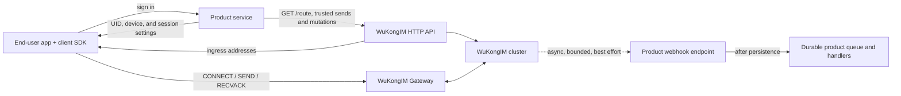
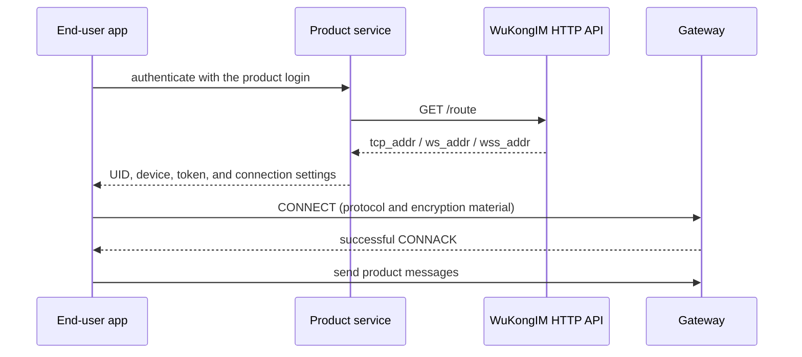

A reliable integration separates the product control plane from the messaging data plane. The product service decides who may do what; the WuKongIM cluster moves and stores messages in real time and in channel order.

## Responsibility split

| Component | Owns | Does not own |
| --- | --- | --- |
| End-user app | User experience, SDK lifecycle, local state, message display | Trusted identity issuance or server authorization |
| Client SDK | Routing, connection, protocol frames, reconnect, send, receive, acknowledgements | Product accounts, group policy, or moderation |
| Product service | Login, UIDs, tokens, relationships, membership, content policy, webhook side effects | Long-lived connections or channel-log replication |
| WuKongIM cluster | Gateway, channel ordering, persistence, routing, online delivery, cluster failover | Product databases or final business rules |

Every deployment is a cluster. A one-node deployment is a single-node cluster; it does not bypass Controller, Slot, Channel, or routing semantics.

## Session bootstrap

Connection state is not product authorization state.

<Callout type="info" title="Route discovery is not authentication">
  The current `/route` endpoint returns configured ingress addresses and does not validate the UID's product permissions. The ability to discover a route is not proof of authorization.
</Callout>

## Two message entry paths

- **Client path:** an SDK sends over a long-lived connection and receives SENDACK, RECV, and connection-state events.
- **Server path:** a trusted product service calls `/message/send` for system-originated or product-triggered messages.

Both paths converge on the same message use case and channel append path. A product service must not write node-local storage directly or bypass cluster routing because a deployment currently has one node.

## Failure boundaries

- For a default persistent message, a successful SENDACK means the channel authority made a successful durable-append decision.
- Plain non-command `NoPersist` returns compatibility success without delivery; only command-style `NoPersist` enters transient online delivery. Neither has a durable sequence or recovery guarantee; see [Message Flags](/en/api/dictionaries/message-flags).
- Online delivery, webhooks, and plugins are independent post-commit effects; conversation construction happens later during membership sync.
- A webhook failure does not turn an already-successful SENDACK into a failure.
- Client disconnect recovery uses SDK reconnect and message synchronization, not webhook replay.

For the internal commit and delivery boundaries, read [Server Architecture](/en/server/architecture) and [Message Flow](/en/server/architecture/message-flow). Continue with [Authentication](/en/guide/integration/authentication) to tighten the trust boundary before implementing messaging.
