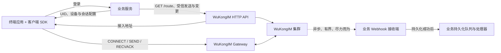
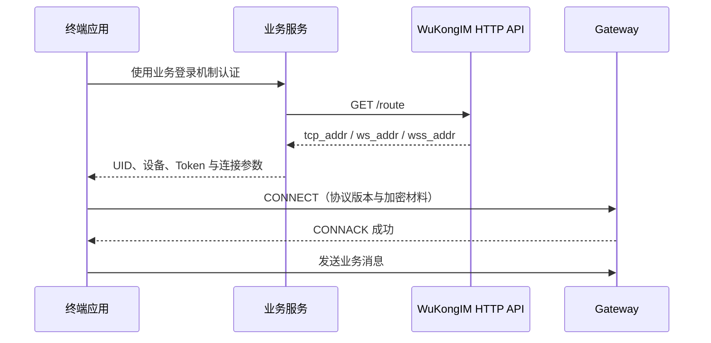

一个可靠的接入把业务控制面与消息数据面分开：业务服务决定“谁可以做什么”，WuKongIM 集群负责“消息如何实时、有序地传递和保存”。

## 职责划分

| 组件 | 负责 | 不负责 |
| --- | --- | --- |
| 终端应用 | 用户交互、SDK 生命周期、本地状态、消息展示 | 签发可信身份、决定服务端权限 |
| 客户端 SDK | 路由、连接、协议帧、重连、收发与确认 | 业务账号、群权限、内容审核 |
| 业务服务 | 登录、UID、Token、关系、群成员、内容策略、Webhook 副作用 | 长连接和频道日志复制 |
| WuKongIM 集群 | Gateway、频道顺序、持久化、路由、在线投递、集群故障转移 | 业务数据库和最终业务规则 |

所有部署都是集群。单节点部署只是只有一个节点的单节点集群，不存在绕过 Controller、Slot、Channel 或路由语义的独立路径。

## 会话启动顺序

连接状态不能替代业务授权状态。

<Callout type="info" title="路由发现不是鉴权">
  当前 `/route` 返回配置好的接入地址，不会校验 UID 的业务权限。不要把能够获取路由解释为用户已被授权。
</Callout>

## 两条消息入口

- **客户端入口**：SDK 通过长连接发送消息，接收 SENDACK、RECV 和连接状态事件。
- **服务端入口**：受信业务服务调用 `/message/send` 发送系统消息或代表业务触发消息。

两条入口最终进入同一个消息用例和频道写入路径。业务服务不应直接写节点本地存储，也不应根据“单节点”假设绕过集群路由。

## 故障边界

- 对默认持久化消息，SENDACK 成功表示频道权威写入已作出持久化成功决定。
- 普通非命令 `NoPersist` 只返回兼容成功而不投递；只有命令式 `NoPersist` 才进入瞬时在线投递。两者都不具备持久 sequence 或恢复保证，详见 [Message Flags](/zh/api/dictionaries/message-flags)。
- 在线投递、会话活跃投影、Webhook 和插件属于提交后的独立副作用。
- Webhook 失败不会把已经成功的 SENDACK 改成失败。
- 客户端断线恢复依赖 SDK 的重连与消息同步，不依赖 Webhook 重放。

需要理解服务端内部的提交与投递边界时，阅读[服务端架构](/zh/server/architecture)和[消息发送链路](/zh/server/architecture/message-flow)。下一步阅读[身份认证](/zh/guide/integration/authentication)，先收紧信任边界，再实现消息收发。
