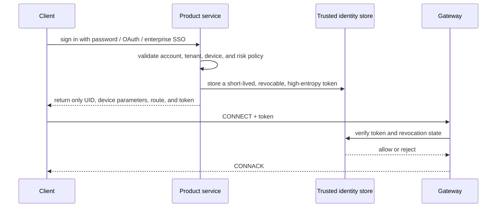

WuKongIM identifies users by UID, platform classes by `device_flag`, and concrete endpoints by `device_id`. Product accounts, login credentials, and permissions remain owned by your product service.

## Identity fields

| Field | Recommendation |
| --- | --- |
| `uid` | Use a stable, non-recycled product user identifier, never a display name |
| `device_flag` | Represent an App, Web, or other platform class consistently |
| `device_id` | Represent a concrete installation or endpoint; define reinstall behavior |
| `token` | Use high entropy, short lifetimes, and protected delivery |
| `device_level` | Define master/slave policy server-side; do not let clients self-promote |

## Current v3 Beta behavior

`POST /user/token` accepts this compatible request and passes device-token metadata to the user use case for storage:

```json
{
  "uid": "u1001",
  "token": "replace-with-a-random-secret",
  "device_flag": 0,
  "device_level": 1
}
```

Successful response:

```json
{"status": 200}
```

<Callout type="error" title="The default connection does not yet verify this token">
  The current app composition creates the Gateway authenticator without enabling `TokenAuthOn` or injecting the stored-token verifier. A successful `/user/token` call therefore does not mean a later CONNECT validates that token. Do not treat the default v3 Beta build as a complete production identity boundary.
</Callout>

The Gateway still:

- requires WKProto connections to begin with CONNECT;
- stores the UID, device identity, and negotiated protocol version;
- negotiates session encryption material by default;
- activates the online route after connection success.

Session encryption protects protocol payloads, but it does not replace product authentication, TLS ingress governance, or HTTP API access control.

## Recommended production flow



Only trusted product services may access user-token management routes. Add end-to-end rejection tests before production release.

## Revocation and logout

`POST /user/device_quit` clears the stored token for the selected device class and schedules matching owner-local sessions for closure:

```json
{
  "uid": "u1001",
  "device_flag": 0
}
```

While default token verification remains disabled, this operation alone cannot guarantee that a client is unable to CONNECT again. Production revocation must invalidate the credential, close existing sessions, and prove that reconnect is rejected.

## HTTP boundary

Current product HTTP routes provide browser-compatible CORS handling but no general product-authentication middleware. A production environment should at least:

- expose product APIs only through a private network or service mesh;
- authenticate service identity at an API Gateway or reverse proxy;
- separate permissions for token, message-send, and membership mutations;
- audit caller, request ID, and result without logging plaintext tokens;
- rate-limit credential routes and require TLS.

After tightening identity boundaries, continue with [Messaging](/en/guide/integration/messaging).
