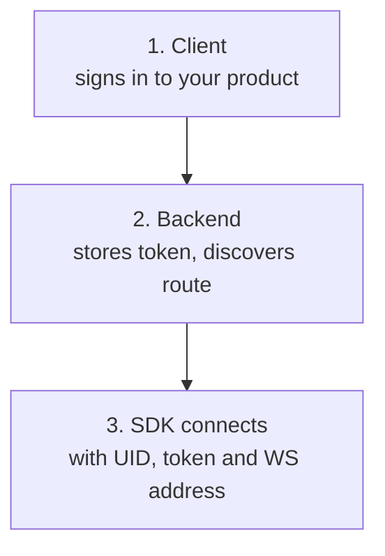

Goal: after product login, the SDK connects to WuKongIM using connection material from your backend.

## 1. Sign in to your product

Your backend validates the account, tenant, device, and risk policy. Use a stable, non-recycled UID, never a display name.

## 2. Prepare credentials on the backend

Generate a high-entropy token, store it through protected WuKongIM HTTP API, and discover the route. Return only the current user's `uid`, device parameters, token, and WebSocket address.

<div className="tutorial-diagram">


```mermaid
flowchart TD
  login["1. Client<br/>signs in to your product"] --> backend["2. Backend<br/>stores token, discovers route"]
  backend --> connect["3. SDK connects<br/>with UID, token and WS address"]
```

</div>

**Only trusted backends call token-management and routing APIs.** WuKongIM HTTP API has no general product-authentication middleware. CORS permits browser access; it does not grant authorization.

<details>
  <summary>Store a token: request and response</summary>

Call [`POST /user/token`](/en/api/product-http/users/setQuickstartUserToken) from your backend:

```json
{
  "uid": "u1001",
  "token": "replace-with-a-random-secret",
  "device_flag": 0,
  "device_level": 1
}
```

A successful `{"status": 200}` means the token was stored, not that old connections have closed.

</details>

## 3. Connect the SDK to Gateway

CONNECT uses the same UID, `device_flag`, and token. With the default `gateway.token_auth_on=true`, empty tokens, missing device records, or mismatches are rejected with `ReasonAuthFail`.

Use HTTPS/WSS in production. Keep tokens out of URLs, logs, analytics, and unprotected client storage.

**Your backend owns token expiry.** The current API has no expiry field and CONNECT checks the stored token. Rotate or revoke it at expiry; a client-side timer is insufficient.

<details>
  <summary>Device fields and connection boundaries</summary>

| Field | Usage |
| --- | --- |
| `device_flag` | Platform class: APP `0`, WEB `1`, PC `2`; backend storage and SDK connection must agree |
| `device_id` | Concrete installation or endpoint; the product defines reinstall behavior |
| `device_level` | The backend owns master/slave policy; clients cannot self-promote |

WKProto starts with CONNECT. Gateway retains identity and the negotiated protocol version, then activates online routing after success. Default session encryption does not replace product authentication or TLS. Use `gateway.token_auth_on=false` only for controlled compatibility migration.

Keep WuKongIM HTTP API on a private network or service mesh behind service-identity verification. Authorize token, send, and membership operations separately. Rate-limit credential routes, use TLS, and audit callers, request IDs, and outcomes without plaintext tokens.

</details>

<details>
  <summary>Logout, revocation, and rotation</summary>

Destroy the client connection on logout. Your backend calls [`POST /user/device_quit`](/en/api/product-http/users/quitUserDevice):

```json
{
  "uid": "u1001",
  "device_flag": 0
}
```

This clears the stored token for the selected device class, rejects later CONNECT attempts, and schedules matching connections on the handling node for closure. Verify closure and reconnect rejection in production and synchronize product revocation, rotation, and audit state.

Tokens are exact-match credentials. A JWT `exp` inside the string does not expire it automatically. Test invalid, revoked, wrong-UID tokens and your backend's expiry policy before release.

</details>

Next: [Messaging](/en/guide/integration/messaging).
