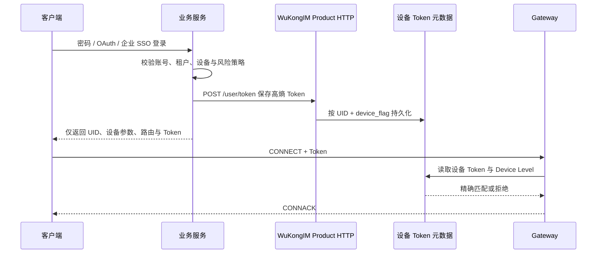

WuKongIM 使用 UID 标识用户，使用 `device_flag` 区分平台类别，使用 `device_id` 区分具体终端。业务账号、登录凭据和权限仍由你的业务服务管理。

## 身份字段

| 字段 | 建议 |
| --- | --- |
| `uid` | 使用稳定、不可复用的业务用户标识；不要使用昵称 |
| `device_flag` | 表示 App、Web 等设备类别，同一平台保持一致 |
| `device_id` | 表示一次具体安装或终端，重装策略由业务决定 |
| `token` | 高熵、短生命周期、只通过受保护通道返回 |
| `device_level` | 明确主设备与从设备策略，不由客户端随意提升 |

## 当前 v3 Beta 行为

`POST /user/token` 接受以下兼容请求，并把设备 Token 元数据交给用户用例保存：

```json
{
  "uid": "u1001",
  "token": "replace-with-a-random-secret",
  "device_flag": 0,
  "device_level": 1
}
```

成功响应：

```json
{"status": 200}
```

<Callout type="warn" title="默认连接会校验这个 Token">
  `gateway.token_auth_on` 默认为 `true`，当前应用组合会注入已存设备 Token 校验器。后续相同 UID 与 `device_flag` 的 CONNECT 必须携带完全匹配的 Token；空 Token、缺少设备记录或不匹配都会返回 `ReasonAuthFail`。设置为 `false` 只应用于受控兼容迁移。
</Callout>

Gateway 当前仍会：

- 要求 WKProto 连接先发送 CONNECT；
- 保存 UID、设备和协商后的协议版本；
- 默认协商会话加密材料；
- 在连接成功后激活在线路由。

会话加密保护协议负载，但不能替代业务身份验证、TLS 入口治理或 HTTP API 访问控制。

## 推荐的生产流程



只有受信业务服务可以访问用户 Token 管理接口；发布生产版本前还必须添加端到端拒绝测试。

## 撤销与退出

`POST /user/device_quit` 会清除所选设备类别的已存 Token，并安排关闭匹配的 owner-local 会话：

```json
{
  "uid": "u1001",
  "device_flag": 0
}
```

默认 Token 校验开启时，清空持久化 Token 会使后续 CONNECT 失败，同时关闭现有匹配会话。生产环境仍应验证关闭与重连拒绝，并在业务身份系统中同步撤销、轮换和审计状态。

## HTTP 边界

当前产品 HTTP 路由具有浏览器 CORS 兼容处理，但没有通用业务鉴权中间件。生产环境至少应：

- 仅在内网或服务网格中暴露产品 API；
- 由 API Gateway 或反向代理验证服务身份；
- 对 Token、消息发送和成员变更使用不同权限；
- 记录调用方、请求 ID 和审计结果，但不记录明文 Token；
- 对凭据接口限流，并使用 TLS。

身份边界收紧后，继续实现[消息收发](/zh/guide/integration/messaging)。
