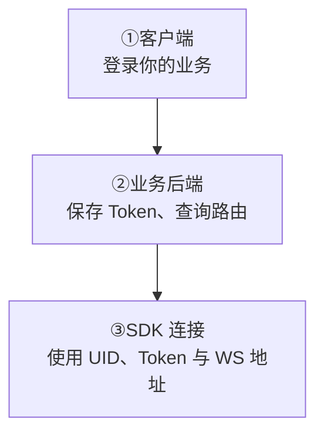

目标：用户登录你的业务后，SDK 使用业务后端提供的连接材料接入 WuKongIM。

## 1. 先登录你的业务

业务后端验证账号、租户、设备与风险策略。UID 使用稳定、不可复用的用户标识；昵称不能作为 UID。

## 2. 后端准备连接材料

后端生成高熵 Token，通过受保护的 WuKongIM HTTP API 保存，再查询路由。只向当前用户返回 `uid`、设备参数、Token 和 WebSocket 地址。

<div className="tutorial-diagram">


```mermaid
flowchart TD
  login["①客户端<br/>登录你的业务"] --> backend["②业务后端<br/>保存 Token、查询路由"]
  backend --> connect["③SDK 连接<br/>使用 UID、Token 与 WS 地址"]
```

</div>

**只有受信后端调用 Token 管理与路由接口。** WuKongIM HTTP API 没有通用业务鉴权；CORS 允许浏览器访问，不代表获得授权。

<details>
  <summary>保存 Token：请求与响应</summary>

后端调用 [`POST /user/token`](/zh/api/product-http/users/setQuickstartUserToken)：

```json
{
  "uid": "u1001",
  "token": "replace-with-a-random-secret",
  "device_flag": 0,
  "device_level": 1
}
```

成功响应 `{"status": 200}` 表示 Token 已保存，不代表旧连接已关闭。

</details>

## 3. SDK 连接 Gateway

SDK 使用同一 UID、`device_flag` 和 Token 发起 CONNECT。默认 `gateway.token_auth_on=true`：空 Token、缺失设备记录或 Token 不匹配都会被拒绝，返回 `ReasonAuthFail`。

生产入口使用 HTTPS/WSS。Token 不进入 URL、日志、分析事件或不受保护的客户端存储。

**Token 有效期由业务后端管理。** 当前接口没有过期时间字段，CONNECT 校验保存的 Token；到期时需轮换或撤销，不能只依赖客户端计时。

<details>
  <summary>设备字段与连接边界</summary>

| 字段 | 用法 |
| --- | --- |
| `device_flag` | 平台类别：APP `0`、WEB `1`、PC `2`；后端保存与 SDK 连接保持一致 |
| `device_id` | 具体安装或终端；重装策略由业务决定 |
| `device_level` | 主设备 / 从设备策略由后端决定，客户端不能自行提升 |

WKProto 连接先发送 CONNECT，Gateway 保存身份和协商的协议版本，成功后激活在线路由。默认会话加密不替代业务鉴权或 TLS；`gateway.token_auth_on=false` 仅用于受控兼容迁移。

WuKongIM HTTP API 放在私网或服务网格，由代理验证服务身份。Token、发送、成员变更分别授权；凭据接口限流、启用 TLS，审计调用方、请求 ID 和结果，不记录明文 Token。

</details>

<details>
  <summary>退出、撤销与轮换</summary>

退出时客户端销毁连接，业务后端调用 [`POST /user/device_quit`](/zh/api/product-http/users/quitUserDevice)：

```json
{
  "uid": "u1001",
  "device_flag": 0
}
```

此操作清除对应设备类别的持久 Token，后续 CONNECT 会失败，并安排处理请求的节点关闭匹配连接。生产需实测连接关闭与重连拒绝，并同步业务身份系统的撤销、轮换和审计状态。

Token 是精确匹配的凭据，不会因为字符串里包含 JWT `exp` 就自动过期。上线前验证无效、撤销、错误 UID 与业务过期策略。

</details>

下一步：[消息收发](/zh/guide/integration/messaging)。
