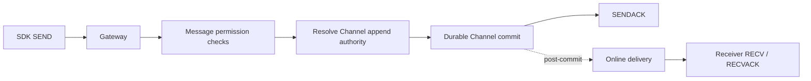
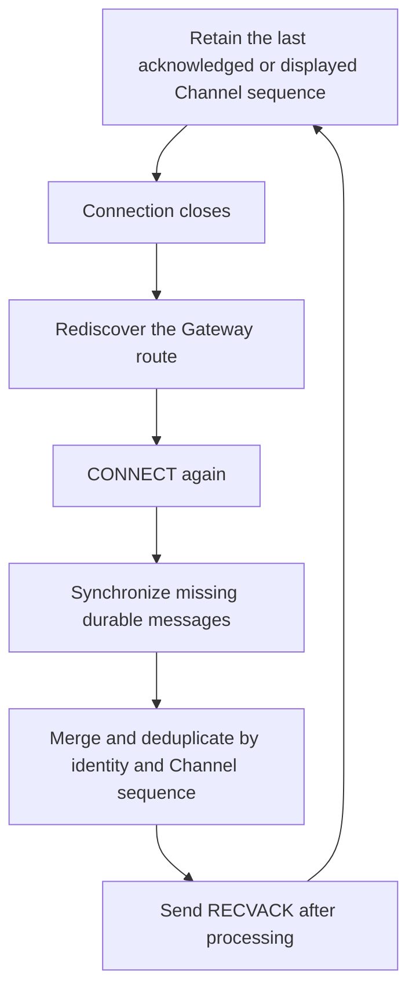

Most product systems use both a long-lived client connection and a trusted server-side HTTP entry. Both converge on the same message use case and channel-authority append path.

## Client message path



Important semantics:

- `message_seq` is a position within one channel, not a global order.
- `message_id` is assigned by the server.
- The sender generates and retains `client_msg_no` for request correlation and retry tracking.
- The sender must inspect the SENDACK or HTTP `reason`; transport success alone is insufficient.
- For default persistent messages, online delivery and other post-commit effects do not extend an already-completed durable acknowledgement.
- Plain non-command `NoPersist` returns compatibility success without delivery; only command-style `NoPersist` enters transient online delivery. Neither can recover from durable history; see [Message Flags](/en/api/dictionaries/message-flags).

## Server-side send

A trusted product service can call [`POST /message/send`](/en/api/product-http/message-send/sendChannelMessage). `payload` must be Base64:

```bash
curl -sS http://127.0.0.1:5001/message/send \
  -H 'Content-Type: application/json' \
  -d '{
    "from_uid": "system",
    "channel_id": "u1001",
    "channel_type": 1,
    "client_msg_no": "order-20260730-0001",
    "payload": "eyJ0eXBlIjoib3JkZXJfdXBkYXRlIiwidGV4dCI6IlNoaXBwZWQifQ=="
  }'
```

Example compatible response for an accepted commit:

```json
{
  "message_id": 123456789,
  "message_seq": 42,
  "reason": 1
}
```

<Callout type="warn" title="HTTP 200 is not the business result">
  `reason` is a protocol Reason Code. Callers must distinguish success, retryable outcomes, rejection, and route changes; use the complete [Reason Code dictionary](/en/api/dictionaries/reason-codes).
</Callout>

Do not let browsers or mobile apps call this server route directly. Current product HTTP routes have no product-authentication middleware and must be called by a trusted service through a private network or protected proxy.

## Payload contract

WuKongIM transports payload bytes; it does not define your product schema. Prefer a versioned envelope:

```json
{
  "version": 1,
  "type": "order_update",
  "body": {
    "order_id": "o-10001",
    "status": "shipped"
  }
}
```

Receivers should ignore unknown fields and safely degrade on unknown `type` values. Never put server secrets, access tokens, or unnecessary personal data in message payloads.

## Acknowledgement and side-effect boundary

After a successful SENDACK for a persistent message, these activities may still run independently:

- online-recipient delivery;
- membership-backed conversation construction during client sync;
- webhook admission and delivery;
- enabled plugin post-commit hooks.

A failure in these effects does not undo the durable message. Business actions that require stronger consistency must be orchestrated by the product service using its own database and idempotency keys; do not assume webhook delivery and SENDACK are one transaction.

## Reconnect and offline recovery

The client SDK should own connection state, backoff, and message synchronization:



Next, configure [Webhooks](/en/guide/integration/webhooks) to move asynchronous product events into a durable business-processing path.
