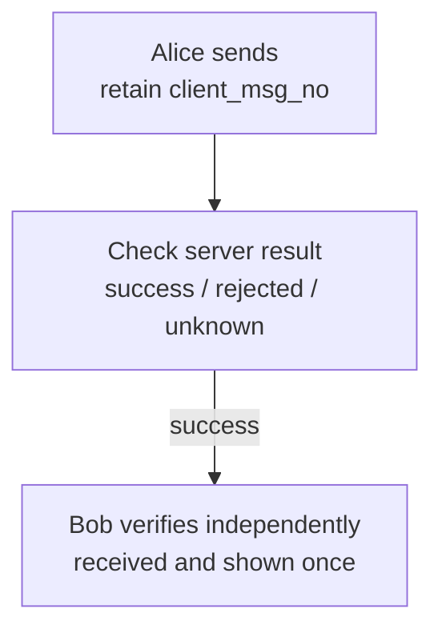

Goal: Alice sends, checks the server result, and verifies reception in Bob's independent client.

## 1. Confirm the target

Both clients must be connected. A direct chat targets the **peer UID**. Groups use a stable group ID and the correct Channel Type; your backend owns membership and send permissions.

## 2. Check sending and reception separately

<div className="tutorial-diagram">


```mermaid
flowchart TD
  send["Alice sends<br/>retain client_msg_no"] --> result["Check server result<br/>success / rejected / unknown"]
  result -->|success| receive["Bob verifies independently<br/>received and shown once"]
```

</div>

| Observation | What it proves |
| --- | --- |
| Successful SENDACK for a default persistent message | The server committed it durably |
| Bob receives the message | Online delivery to Bob |
| Bob read or processed it | Requires your product's receipt or business result |

**SENDACK is not a read receipt; HTTP 200 is not protocol success.** Check SENDACK or HTTP `reason`. With EasySDK, handle the selected version's send result as shown in its [platform tutorial](/en/sdk/easy).

<TutorialScreenshot
  src="/tutorials/first-message/exchange-en.jpg"
  alt="Bob's local-main Chat Demo receives hello from alice and replies hello from bob"
  width={1280}
  height={280}
  marks={[{ x: 42, y: 57 }, { x: 81, y: 82 }]}
>
  ① Bob receives Alice's message. ② Bob replies. This capture verifies bidirectional exchange, without proving a peer-read receipt.
</TutorialScreenshot>

## 3. Handle failure and recovery

| Outcome | Action |
| --- | --- |
| Explicit rejection | Use [Reason Codes](/en/api/dictionaries/reason-codes) to correct identity, permissions, or inputs |
| Timeout or unknown outcome | Retain the original identity, check the outcome, and use the SDK's supported retry method |
| Network loss or reconnect | Full SDKs sync missing persistent messages; EasySDK history and conversation recovery require product implementation |

`message_id` is the server-assigned identity. `message_seq` orders messages **within one Channel**, not globally. The sender generates and retains `client_msg_no` for correlation and retries.

<details>
  <summary>Backend send: HTTP example</summary>

Only a trusted backend calls [`POST /message/send`](/en/api/product-http/message-send/sendChannelMessage). Do not expose it directly to browsers or mobile clients. Product HTTP has no general product authentication; use a private network or protected proxy. Encode `payload` as Base64.

```bash
curl -sS http://127.0.0.1:5001/message/send \
  -H 'Content-Type: application/json' \
  -d '{
    "from_uid": "system",
    "channel_id": "u1001",
    "channel_type": 1,
    "client_msg_no": "order-20260730-0001",
    "payload": "eyJ0eXBlIjoib3JkZXJfdXBkYXRlIiwidGV4dCI6IlNoaXBwZWQifQ=="
  }'
```

Example accepted-commit response:

```json
{
  "message_id": 123456789,
  "message_seq": 42,
  "reason": 1
}
```

Inspect `reason` even with HTTP 200 and distinguish success, retries, rejection, and route changes.

</details>

<details>
  <summary>Payload: versions and safe fallback</summary>

WuKongIM transports bytes; your product owns the message schema. Use a versioned envelope:

```json
{
  "version": 1,
  "type": "order_update",
  "body": {
    "order_id": "o-10001",
    "status": "shipped"
  }
}
```

Ignore unknown fields and safely degrade on unknown `type` values. Exclude server secrets, access tokens, and unnecessary personal data.

</details>

<details>
  <summary>Persistence, side effects, and NoPersist</summary>

Client connections and server HTTP share the message use case and Channel append path. After a durable commit, online delivery, conversation-related work, webhook admission/delivery, and plugin hooks can run independently. Failure does not undo the message or extend an already-completed acknowledgement.

Your backend orchestrates stronger consistency with its own database and idempotency keys. Webhooks and SENDACK are not one transaction.

Ordinary and command-style `NoPersist` use transient online delivery: a message ID, sequence zero, and no durable history or offline recovery. See [Message Flags](/en/api/dictionaries/message-flags).

</details>

<details>
  <summary>Full-SDK recovery checks</summary>

Retain Channel sync progress. After disconnection, rediscover the route, CONNECT, sync missing persistent messages, merge/deduplicate by identity and Channel sequence, and handle RECVACK correctly. Conversation-directory and Channel-message cursors are separate. See [full SDKs](/en/sdk/wukongim) for connection state, backoff, and sync APIs.

EasySDK does not automatically supply this history, conversation, and unread recovery. Implement it through your own backend when required.

</details>

Configure [Webhooks](/en/guide/integration/webhooks), then complete [release checks](/en/guide/integration/acceptance).
