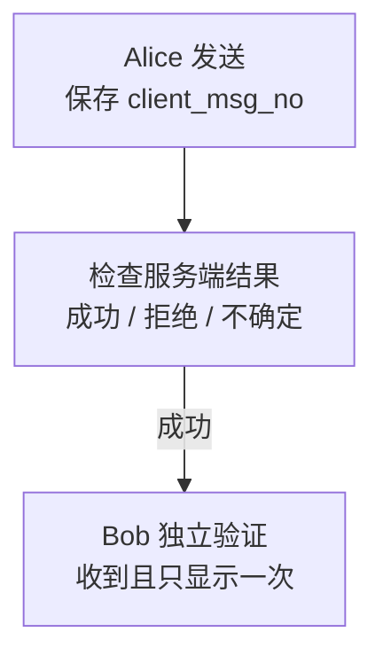

目标：Alice 发出消息，确认服务端结果，再在 Bob 的独立客户端验证接收。

## 1. 发送前确认目标

两端都已连接。单聊目标是**对方 UID**；群聊使用稳定群 ID 和正确 Channel Type，成员与发送权限由业务后端维护。

## 2. 分别核对发送与接收

<div className="tutorial-diagram">



</div>

| 观察到什么 | 能证明什么 |
| --- | --- |
| 默认持久消息的 SENDACK 成功 | 服务端已经持久化提交 |
| Bob 收到消息 | 在线投递到 Bob |
| Bob 已读或处理 | 需要产品自己的回执或业务结果 |

**SENDACK 不代表对方已读，HTTP 200 也不代表协议成功。** 检查 SENDACK 或 HTTP 的 `reason`；EasySDK 按所选版本的发送结果处理，接口见[各平台教程](/zh/sdk/easy)。

<TutorialScreenshot
  src="/tutorials/first-message/exchange.jpg"
  alt="本地 main 聊天 Demo 的 Bob 页面收到 hello from alice，并回复 hello from bob"
  width={1280}
  height={280}
  marks={[{ x: 42, y: 57 }, { x: 81, y: 82 }]}
>
  ① Bob 收到 Alice 的消息。② Bob 回发。截图验证实际双向收发，不提供对方已读证明。
</TutorialScreenshot>

## 3. 处理失败与恢复

| 情况 | 做法 |
| --- | --- |
| 明确拒绝 | 按 [Reason Code](/zh/api/dictionaries/reason-codes)修正身份、权限或参数 |
| 超时或结果不确定 | 保留原消息标识，先核对结果，再按 SDK 支持的重试方式处理 |
| 断网或重连 | 完整版 SDK 同步缺失的持久消息；EasySDK 的历史与会话补齐需业务另行实现 |

`message_id` 是服务端消息标识，`message_seq` 只表示**一个频道内的顺序**，不是全局顺序。`client_msg_no` 由发送方生成并保存，用于关联请求和重试。

<details>
  <summary>业务后端发送：HTTP 示例</summary>

仅受信后端调用 [`POST /message/send`](/zh/api/product-http/message-send/sendChannelMessage)，不把此接口直接交给浏览器或移动端。Product HTTP 没有通用业务鉴权，应通过私网或受保护代理访问；`payload` 使用 Base64。

```bash
curl -sS http://127.0.0.1:5001/message/send \
  -H 'Content-Type: application/json' \
  -d '{
    "from_uid": "system",
    "channel_id": "u1001",
    "channel_type": 1,
    "client_msg_no": "order-20260730-0001",
    "payload": "eyJ0eXBlIjoib3JkZXJfdXBkYXRlIiwidGV4dCI6IlNoaXBwZWQifQ=="
  }'
```

成功提交的响应示例：

```json
{
  "message_id": 123456789,
  "message_seq": 42,
  "reason": 1
}
```

HTTP 200 时仍检查 `reason`，区分成功、可重试、拒绝与路由变化。

</details>

<details>
  <summary>Payload：版本与安全降级</summary>

WuKongIM 传递字节，业务系统定义消息结构。使用带版本的信封：

```json
{
  "version": 1,
  "type": "order_update",
  "body": {
    "order_id": "o-10001",
    "status": "shipped"
  }
}
```

忽略未知字段，为未知 `type` 提供安全降级；不要放入服务端密钥、访问 Token 或不必要的个人数据。

</details>

<details>
  <summary>持久化、副作用与 NoPersist</summary>

客户端长连接和服务端 HTTP 都进入同一个消息用例与频道写入路径。默认持久消息提交后，在线投递、会话相关更新、Webhook 入队与发送、插件 Hook 可以独立执行；失败不会撤销已持久化的消息，也不延长已完成的确认。

强业务一致性由业务服务用自己的数据库和幂等键编排；Webhook 与 SENDACK 不是同一事务。

普通与命令式 `NoPersist` 都是瞬时在线投递：有消息 ID，序号为零，没有持久历史与离线恢复，见 [Message Flags](/zh/api/dictionaries/message-flags)。

</details>

<details>
  <summary>完整版 SDK 的恢复检查</summary>

保存频道同步进度，断线后重新发现路由并 CONNECT，补齐缺失持久消息，按消息标识与频道序号合并去重，并正确处理 RECVACK。会话目录与频道消息使用不同游标。具体连接状态、退避和同步 API 见[完整版 SDK](/zh/sdk/wukongim)。

EasySDK 不自动提供这套历史、会话与未读恢复；业务需要时通过自己的后端补齐。

</details>

继续配置 [Webhook](/zh/guide/integration/webhooks)，最后完成[上线检查](/zh/guide/integration/acceptance)。
