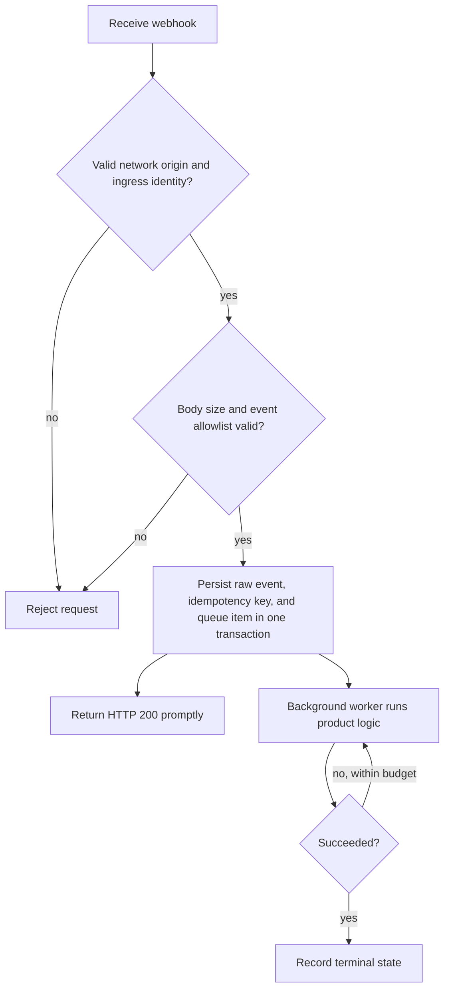

Webhooks send committed messages, offline recipients, and online-status changes to one product HTTP endpoint. They are suitable for asynchronous business work, not client message synchronization.

## Enable webhooks

Configure `wukongim.toml`:

```toml
[webhook]
http_addr = "https://events.example.com/wukongim"
focus_events = ["msg.notify", "msg.offline", "user.onlinestatus"]
queue_size = 1024
workers = 16
request_timeout = "5s"
retry_max_attempts = 3
```

The server puts the event name in the query string:

```text
POST https://events.example.com/wukongim?event=msg.notify
Content-Type: application/json
```

Only HTTP 200 is success. Connection errors, timeouts, and other status codes receive a finite number of attempts within the current in-memory job.

## Supported events

| Event | Request body | Typical use |
| --- | --- | --- |
| `msg.notify` | Array of committed messages | Audit, search indexing, asynchronous notification |
| `msg.offline` | One message and a bounded batch of offline UIDs | Offline-push candidate calculation |
| `user.onlinestatus` | Array of compatibility status strings | UID-owner-local, best-effort session hint |

Representative `msg.notify` request:

```json
[
  {
    "header": {"no_persist": 0, "red_dot": 1, "sync_once": 0},
    "setting": 0,
    "expire": 0,
    "message_id": 123456789,
    "message_idstr": "123456789",
    "client_msg_no": "order-20260730-0001",
    "message_seq": 42,
    "from_uid": "system",
    "channel_id": "u1001",
    "channel_type": 1,
    "timestamp": 1785398400,
    "payload": "eyJ2ZXJzaW9uIjoxLCJ0eXBlIjoib3JkZXJfdXBkYXRlIn0="
  }
]
```

JSON encodes `payload` as Base64. For small recipient sets, `msg.offline` uses `to_uids`. At the compression threshold it may instead use `compress: "gzip"` with Base64-encoded `compress_to_uids`; receivers must support both forms.

Each `user.onlinestatus` item has this form:

```text
{uid}-{device_flag}-{online:0|1}-{session_id}-{device_online_count}-{total_online_count}
```

The counts cover active sessions on the UID owner's current node only. They are not cluster-global presence and the event stream is neither complete nor ordered. A UID may contain `-`; parse the final five numeric fields from the right and treat the remaining prefix as the UID.

## Reliability boundary

<Callout type="warn" title="Webhook delivery is bounded and best effort">
  Queue saturation, process exit, request cancellation, or retry exhaustion can lose an event. The current runtime has no disk-backed webhook outbox or crash replay. A webhook failure does not change an already-successful SENDACK or durable append.
</Callout>

Recommended receiver flow:



Suggested idempotency keys:

- `msg.notify`: `event + message_id`;
- `msg.offline`: `event + message_id + uid`, deduplicated per recipient;
- `user.onlinestatus`: deduplicate the complete string and treat it only as a local-session hint, never global online truth.

## Security

The current HTTP sender sets only `Content-Type: application/json`; it **does not add a signature or shared-secret header**. Build a trusted boundary around it in production:

- use HTTPS;
- prefer a private network, service mesh, or egress proxy;
- enforce mTLS, fixed egress identity, or controlled credentials at the reverse proxy;
- restrict source IPs and request rates;
- never expose the callback as an anonymous public write endpoint;
- avoid logging complete sensitive payloads.

## Capacity and failure handling

- `queue_size` is the bounded in-memory capacity for each event queue.
- `workers` controls concurrent sends per event queue.
- `msg_notify_batch_max_items` and its wait setting control message batches.
- `offline_uid_batch_size` controls offline UID chunking and compression.
- `retry_max_attempts` is the total number of attempts, not additional retries after the first.

If the receiver fails continuously, repair or isolate it instead of growing WuKongIM's memory queues without bound. Critical product state must remain reconstructable from the product database or message history.
