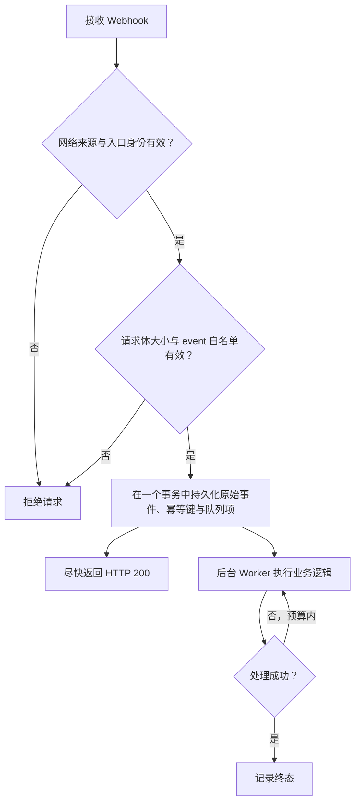

Webhook 把已提交消息、离线接收者和在线状态变化发送到一个业务 HTTP 端点。它适合触发业务异步处理，不是客户端消息同步机制。

## 启用

在 `wukongim.toml` 中配置：

```toml
[webhook]
http_addr = "https://events.example.com/wukongim"
focus_events = ["msg.notify", "msg.offline", "user.onlinestatus"]
queue_size = 1024
workers = 16
request_timeout = "5s"
retry_max_attempts = 3
```

服务端会把事件名放在查询参数中：

```text
POST https://events.example.com/wukongim?event=msg.notify
Content-Type: application/json
```

只有 HTTP 200 被视为成功。连接错误、超时或其他状态码会在本次内存任务中有限重试。

## 支持的事件

| 事件 | 请求体 | 用途 |
| --- | --- | --- |
| `msg.notify` | 已提交消息数组 | 业务审计、搜索索引、异步通知 |
| `msg.offline` | 一条消息及一批离线 UID | 离线推送候选计算 |
| `user.onlinestatus` | 兼容在线状态字符串数组 | UID Owner 本地、尽力而为的会话提示 |

`msg.notify` 的代表性请求：

```json
[
  {
    "header": {"no_persist": 0, "red_dot": 1, "sync_once": 0},
    "setting": 0,
    "expire": 0,
    "message_id": 123456789,
    "message_idstr": "123456789",
    "client_msg_no": "order-20260730-0001",
    "message_seq": 42,
    "from_uid": "system",
    "channel_id": "u1001",
    "channel_type": 1,
    "timestamp": 1785398400,
    "payload": "eyJ2ZXJzaW9uIjoxLCJ0eXBlIjoib3JkZXJfdXBkYXRlIn0="
  }
]
```

JSON 中的 `payload` 是 Base64。`msg.offline` 在 UID 数量较小时使用 `to_uids`；达到压缩阈值时可能改为 `compress: "gzip"` 与 Base64 编码的 `compress_to_uids`，接收端必须支持两种形式。

`user.onlinestatus` 的每项是：

```text
{uid}-{device_flag}-{online:0|1}-{session_id}-{device_online_count}-{total_online_count}
```

这些计数只来自 UID Owner 当前节点上的活跃 Session，不是集群全局 Presence，也不保证事件完整或有序。UID 可以含 `-`；需要解析时从右侧取最后五个数字段，其余前缀才是 UID。

## 可靠性边界

<Callout type="warn" title="Webhook 是有界、尽力而为的">
  队列满、进程退出、请求取消或重试耗尽都可能丢失事件。当前运行时没有磁盘级 Webhook Outbox 或崩溃重放。Webhook 失败不会影响已经成功的 SENDACK 和消息持久化。
</Callout>

推荐的接收端流程：



建议幂等键：

- `msg.notify`：`event + message_id`；
- `msg.offline`：`event + message_id + uid`，逐个接收者去重；
- `user.onlinestatus`：按完整字符串去重，仅作为本地会话提示；不要据此构建全局在线真值。

## 安全

当前 HTTP Sender 只设置 `Content-Type: application/json`，**不会添加签名或共享密钥 Header**。生产环境必须在它之外建立可信边界：

- 使用 HTTPS；
- 优先使用私网、服务网格或出口代理；
- 在反向代理层使用 mTLS、固定出口身份或受控凭据；
- 对来源 IP 和请求速率做限制；
- 不把回调端点暴露为匿名公网写入口；
- 不在日志中记录完整敏感 Payload。

## 容量与失败处理

- `queue_size` 是每类事件内存队列的有界容量。
- `workers` 控制每类队列并发发送数。
- `msg_notify_batch_max_items` 和等待时间控制消息批次。
- `offline_uid_batch_size` 同时控制离线 UID 分块/压缩边界。
- `retry_max_attempts` 是总尝试次数，不是首次之后的额外次数。

接收端持续失败时，应先修复或隔离接收端，而不是无限增大 WuKongIM 内存队列。关键业务数据应能从业务数据库或消息历史重新构建。
