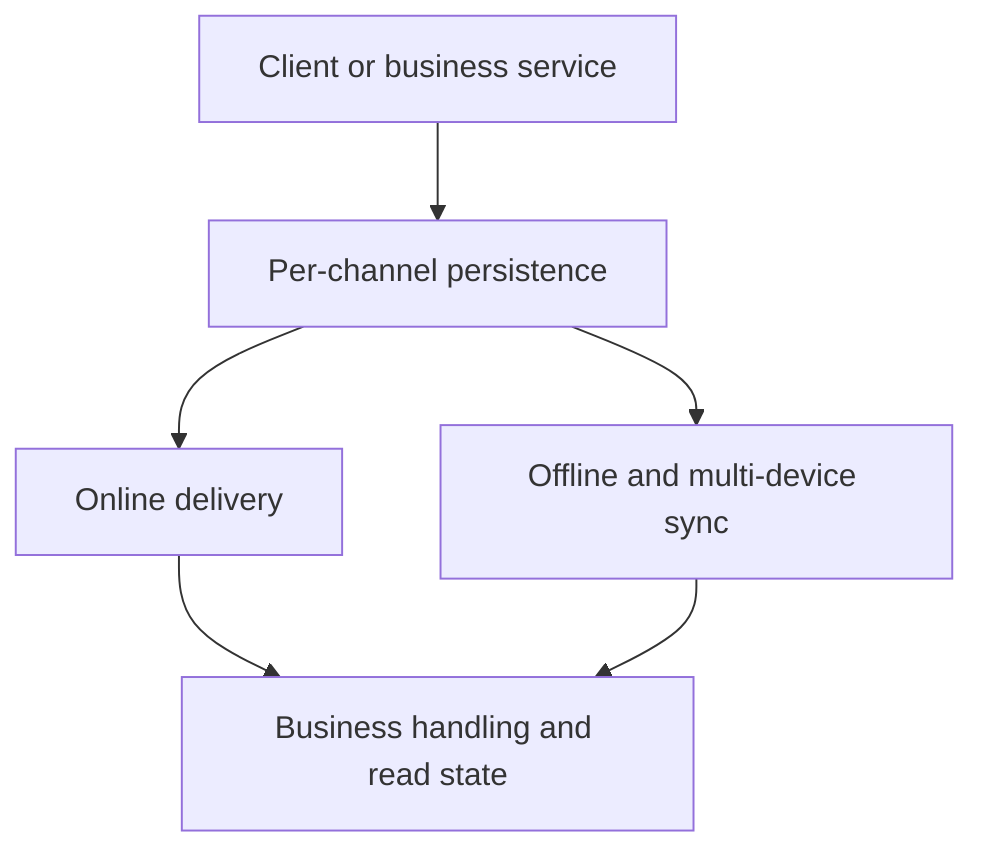

WuKongIM combines real-time connections, message persistence, offline recovery, and multi-device synchronization in one cluster. Applications organize messages for people, groups, or product-specific topics through channels, while the application backend retains control of identity, relationships, and product rules.

<Callout type="info" title="Capacity must be validated">
  WuKongIM is designed for large-scale connection and messaging workloads, but there is no useful capacity number without hardware, storage, replica, and workload assumptions. Validate throughput, latency, and resource headroom with representative traffic.
</Callout>

## Capability map

| Capability | Outcome and boundary |
| --- | --- |
| Real-time access | Supports TCP WKProto, WebSocket, connection lifecycle, and bounded asynchronous processing. Boundary: A trusted application backend still establishes production identity, tokens, and product permissions. |
| Reliable messaging | Provides ordered messages for personal, group, and custom channels, with durable replication, retry deduplication, and offline synchronization. Boundary: Ordering is per channel; a successful write does not prove receipt, read, or business completion. |
| Multi-device state | Provides device sessions, presence, recent conversations, read positions, and unread state. Boundary: Application accounts and relationship data remain authoritative in the application backend. |
| Clustering and scale | Uses the same model for single-node and multi-node clusters, with 256 physical hash slots for routing, replicas, and failover. Boundary: Scale depends on channel distribution, hotspots, storage, and representative workload. |
| Extensions and operations | Provides webhooks, plugins, readiness, Prometheus, diagnostics, Manager, and command-line tools. Boundary: Webhooks and post-commit extensions are not durable queues; operational changes must respect safety boundaries. |

## Understanding message outcomes

A default durable message is acknowledged after it reaches the corresponding durable commit boundary. Online delivery, offline synchronization, business processing, and read state happen later; none of those later outcomes can be inferred from "send succeeded" alone.

An integration should define separate tests for sent, delivered, read, and business-complete outcomes. See [Messaging Integration](/en/guide/integration/messaging) and [Message Flags](/en/api/dictionaries/message-flags) for precise acknowledgement, retry, and non-persistent behavior.

## Principles for scale

- Ordering is scoped to a channel, so unrelated channels do not share one global ordering bottleneck.
- Connections, message processing, and delivery use bounded queues and backpressure. Overload becomes visible as backlog or rejection instead of unbounded memory growth.
- Large groups, hot channels, and reconnect spikes need separate workload models; average QPS does not describe worst-case latency or recovery.
- Capacity results should record throughput, P99, error rate, queues, CPU, memory, disk, and network together. See [`wkbench`](/en/server/tools/wkbench) for the measurement workflow.

## What the application must provide

WuKongIM does not replace account login, friendship or group rules, product authorization, content moderation, mobile push, the business database, or analytics. A trusted application backend issues credentials, maintains product relationships, calls protected server APIs, and interprets asynchronous events according to its own business outcomes.

<Cards>
  <Card title="Try it" description="Start a single-node cluster and send the first message." href="/en/guide/quick-start" />
  <Card title="Use Cases" description="See how these capabilities fit chat, notifications, customer service, and extended scenarios." href="/en/guide/product-overview/use-cases" />
  <Card title="System Architecture" description="Explore cluster authority, routing, and the internal message path." href="/en/server/architecture" />
</Cards>
