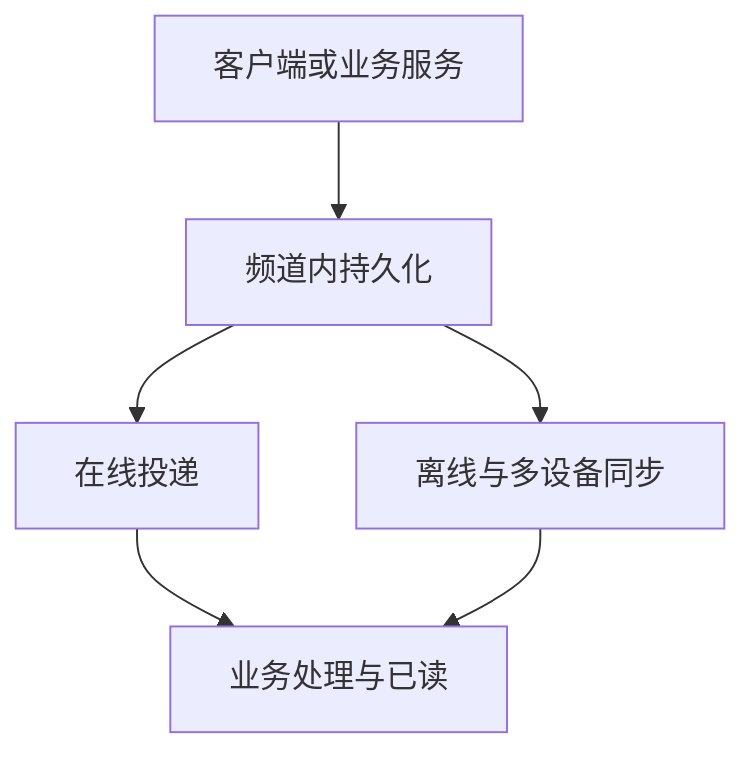

WuKongIM 把实时连接、消息持久化、离线恢复和多设备同步放在同一个集群中。应用通过频道组织个人、群组或自定义主题的消息，业务系统继续掌握身份、关系和产品规则。

<Callout type="info" title="容量需要验证">
  WuKongIM 面向大规模连接与消息负载设计，但不提供脱离硬件、存储、副本和业务模型的统一容量数字。请使用真实负载验证吞吐、延迟和资源余量。
</Callout>

## 能力地图

| 能力 | 提供的结果与边界 |
| --- | --- |
| 实时接入 | 支持 TCP WKProto、WebSocket、连接生命周期和有界异步处理。边界：生产身份、Token 和产品权限仍由受信任的业务后端建立。 |
| 可靠消息 | 支持个人、群组和自定义频道内的有序消息、持久化复制、重试去重和离线同步。边界：顺序以单个频道为单位；写入成功不等于接收、已读或业务处理完成。 |
| 多设备状态 | 提供设备会话、在线状态、最近会话、已读位置和未读状态。边界：业务账号和关系数据仍以业务系统为准。 |
| 集群与伸缩 | 单节点集群与多节点集群使用同一模型，通过 256 个物理哈希槽组织路由，并支持副本和故障转移。边界：扩容能力取决于频道分布、热点、存储和真实负载。 |
| 扩展与运维 | 提供 Webhook、插件、就绪检查、Prometheus、诊断、Manager 和命令行工具。边界：Webhook 和提交后扩展不是可靠消息队列，运维变更必须遵守安全边界。 |

## 如何理解消息结果

默认持久消息被服务器确认后，表示消息已经完成对应的持久化提交。在线投递、离线同步、业务消费和已读发生在后续阶段；任何一个后续结果都不能只从“发送成功”推断。

集成时应分别定义发送、送达、已读和业务完成的判断方式。更精确的确认边界、重试方式和非持久消息行为见[消息集成](/zh/guide/integration/messaging)与[消息标志](/zh/api/dictionaries/message-flags)。

## 面向规模的原则

- 顺序以频道为边界，不让无关频道共享一个全局顺序瓶颈。
- 连接、消息处理和投递使用有界队列与背压，过载时能够暴露积压或拒绝，而不是无限占用内存。
- 大群、热点频道和重连高峰需要分别建模；平均 QPS 不能代表最坏延迟或恢复能力。
- 容量结论应同时记录吞吐、P99、错误率、队列和 CPU、内存、磁盘、网络。具体方法见 [`wkbench`](/zh/server/tools/wkbench)。

## 需要业务系统提供什么

WuKongIM 不替代账号登录、好友或群业务规则、产品权限、内容审核、移动系统推送、业务数据库和分析平台。典型集成由受信任的业务后端签发身份凭据、维护业务关系、调用受保护的服务端接口，并按自己的业务结果处理异步事件。

<Cards>
  <Card title="快速验证" description="启动单节点集群并发送第一条消息。" href="/zh/guide/quick-start" />
  <Card title="适用场景" description="判断这些能力如何用于聊天、通知、客服及扩展场景。" href="/zh/guide/product-overview/use-cases" />
  <Card title="系统架构" description="深入了解集群内部的权威、路由和消息链路。" href="/zh/server/architecture" />
</Cards>
