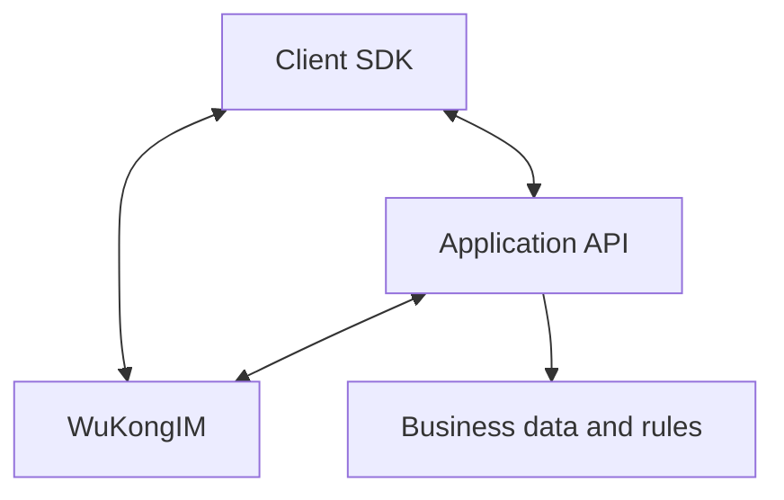

WuKongIM is best suited to products that need real-time connections, per-channel message order, durable history, reconnect recovery, or multi-device synchronization. It provides messaging infrastructure while the application retains identity, relationships, permissions, and complete business workflows.

## Core scenarios

| Scenario | Capability and responsibility boundary |
| --- | --- |
| Direct chat, group chat, and communities | WuKongIM: Personal and group channels, durable messages, online delivery, offline recovery, and multi-device synchronization. Application: Accounts, friend or group relationships, membership lifecycle, content governance, and mobile push. |
| Notifications and system messages | WuKongIM: System identities, durable messages, online delivery, and offline recovery. Application: Preferences, templates, rate limits, business receipts, and mobile push such as APNs or FCM. |
| Customer service | WuKongIM: Messages between visitors and agents, plus webhook or plugin extension points. Application: Waiting queues, assignment, tickets, quality controls, and sensitive-data governance. |

## Extended scenarios

| Scenario | Capability and responsibility boundary |
| --- | --- |
| Live interaction | WuKongIM: Custom channels, real-time messages, and workload-validated online delivery. Application: Room lifecycle, gifts and abuse controls, degradation policy, and hotspot management. |
| IoT and signaling | WuKongIM: Stable user or device identities, bidirectional messaging, and reconnect recovery. Application: Device registry, command authorization, state shadow, timeout, and compensation. |
| AI messaging workflows | WuKongIM: Durable base messages, message events, and server-side extension points. Application: Model calls, flow control, content safety, cost, and durable final results. |

## Two common integration shapes

### Client messaging product

The client SDK connects to WuKongIM, receives real-time messages, and restores offline messages. The application API manages accounts, relationships, permissions, and mobile push. Protected server APIs should not be exposed directly to untrusted clients.

### Server events and device communication

A trusted service sends an event to a channel, and clients or devices consume it through long-lived connections and synchronization. Command authorization, timeouts, business results, and compensation remain application concerns; a successful message write does not mean that the business action completed.

## When to choose another system

| Requirement | Usually a better fit |
| --- | --- |
| Low-frequency background work or scheduled jobs | Task queue |
| General cross-domain event streams and offline processing | Message queue or stream-processing platform |
| Long-term aggregation, search, and analytics | Analytical database or data platform |

These systems can complement WuKongIM. The distinction is that WuKongIM centers on users, devices, and channels that stay connected and exchange real-time messages.

## How to validate

Start with the [Quick Start](/en/guide/quick-start) to run a single-node cluster and send the first message. During integration, read [Messaging Integration](/en/guide/integration/messaging). Before launch, complete [Integration Acceptance](/en/guide/integration/acceptance), then use [`wkbench`](/en/server/tools/wkbench) to validate capacity with a representative workload.

<Cards>
  <Card title="Try it" description="Start a single-node cluster and send the first message." href="/en/guide/quick-start" />
  <Card title="Integration Architecture" description="Design the boundaries between clients, the application backend, and WuKongIM." href="/en/guide/integration/architecture" />
</Cards>
