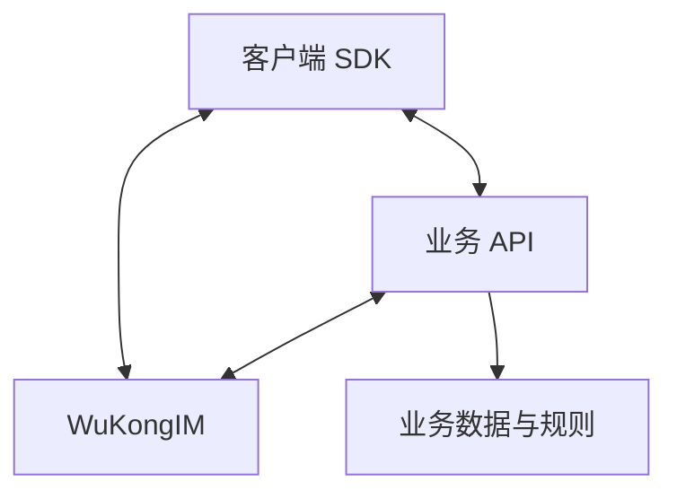

WuKongIM 最适合需要实时连接、频道内有序消息、持久记录、断线恢复或多设备同步的产品。它提供消息基础设施，业务系统继续负责身份、关系、权限和完整业务流程。

## 核心场景

| 场景 | 能力与职责边界 |
| --- | --- |
| 单聊、群聊与社区 | WuKongIM：个人和群组频道、持久消息、在线投递、离线恢复和多设备同步。 业务系统：账号、好友或群关系、成员生命周期、内容治理和移动推送。 |
| 通知与系统消息 | WuKongIM：系统身份、持久消息、在线投递和离线补偿。 业务系统：通知偏好、模板、频控、业务回执，以及 APNs/FCM 等移动推送。 |
| 客服与坐席 | WuKongIM：访客与坐席之间的频道消息、Webhook 或插件扩展。 业务系统：排队、分配、工单、服务质量和敏感数据治理。 |

## 扩展场景

| 场景 | 能力与职责边界 |
| --- | --- |
| 直播互动 | WuKongIM：自定义频道、实时消息和按负载验证的在线投递。 业务系统：房间生命周期、礼物与风控、降级策略和热点治理。 |
| IoT 与信令 | WuKongIM：稳定的用户或设备标识、双向消息和断线恢复。 业务系统：设备注册、命令授权、状态影子、超时和补偿。 |
| AI 消息工作流 | WuKongIM：持久基础消息、消息事件和服务端扩展入口。 业务系统：模型调用、流控、内容安全、成本和最终结果持久化。 |

## 两种常见集成方式

### 客户端消息产品

客户端 SDK 连接 WuKongIM、接收实时消息并恢复离线消息；业务 API 管理账号、关系、权限和移动推送。受保护的服务端接口不应直接暴露给不可信客户端。

### 服务端事件与设备通信

受信任的业务服务把事件发送到频道，客户端或设备通过长连接和同步能力消费消息。命令授权、超时、业务结果和补偿仍由业务系统定义；消息写入成功不等于业务动作已经完成。

## 什么时候选择其他系统

| 需求 | 更合适的选择 |
| --- | --- |
| 低频后台任务或定时作业 | 任务队列 |
| 跨业务的通用事件流与离线处理 | 消息队列或流处理平台 |
| 长期聚合、检索和分析 | 分析数据库或数据平台 |

这些系统可以与 WuKongIM 配合使用；区别在于 WuKongIM 的核心对象是保持连接并收发实时消息的用户、设备和频道。

## 如何验证

先通过[快速开始](/zh/guide/quick-start)运行单节点集群并发送第一条消息。进入集成阶段后，阅读[消息集成](/zh/guide/integration/messaging)；上线前完成[集成验收](/zh/guide/integration/acceptance)，再使用 [`wkbench`](/zh/server/tools/wkbench)按真实负载验证容量。

<Cards>
  <Card title="快速验证" description="启动单节点集群并发送第一条消息。" href="/zh/guide/quick-start" />
  <Card title="集成架构" description="设计客户端、业务后端与 WuKongIM 的边界。" href="/zh/guide/integration/architecture" />
</Cards>
