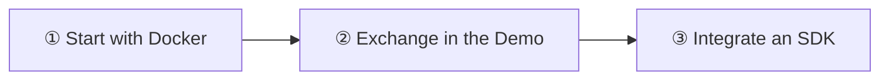

Exchange messages between Alice and Bob on your computer. You need Docker and a browser; allow 5–10 minutes, excluding downloads.

<Cards>
  <Card title="1. Start the cluster" description="Create the configuration, run Docker, and check /readyz." href="/en/server/deployment/docker" />
  <Card title="2. Send the first message" description="Follow the screenshots to connect two test users and exchange messages." href="/en/guide/quick-start/first-message" />
  <Card title="3. Integrate your app" description="Choose an SDK for your needs, then open the platform tutorial." href="/en/sdk" />
</Cards>

To try the latest streaming, customer support, and Agent scenarios, [launch all four Demos from source](/en/guide/quick-start/chat-demo).

## Success checklist

- `/readyz` returns `{"ready":true}`.
- Both Alice and Bob show a successful connection.
- Each receives the other user's `hello from alice` or `hello from bob`.

<Callout type="warn" title="For learning and development only">
  These examples use test credentials. Before production, replace credentials and configure TLS, application authentication, backups, and recovery. See [Security & Access](/en/server/configuration/security).
</Callout>

Need to prepare Docker? See [Prerequisites](/en/guide/quick-start/prerequisites). Prefer installing directly on a Linux host? Follow the [Linux installation path](/en/guide/quick-start/single-node-cluster).
