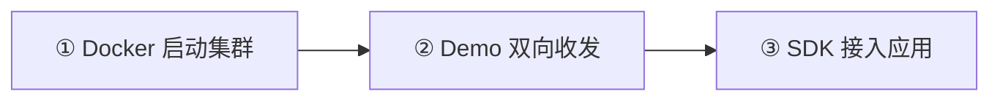

先在自己的电脑上跑通 Alice 与 Bob 的双向消息。需要 Docker 和浏览器，预计 5～10 分钟，不含下载时间。

<Cards>
  <Card title="1. 启动集群" description="创建配置，运行 Docker，检查 /readyz。" href="/zh/server/deployment/docker" />
  <Card title="2. 发送第一条消息" description="跟着截图登录两个测试用户，互发一条消息。" href="/zh/guide/quick-start/first-message" />
  <Card title="3. 接入自己的应用" description="按所需能力选择 SDK，再进入目标平台教程。" href="/zh/sdk" />
</Cards>

想体验最新版的流式回复、在线客服和 Agent？查看[四个 Demo 的源码一键启动](/zh/guide/quick-start/chat-demo)。

## 完成标准

- `/readyz` 返回 `{"ready":true}`；
- Alice 与 Bob 都显示已连接状态；
- 双方分别收到 `hello from alice` 和 `hello from bob`。

<Callout type="warn" title="仅用于学习和测试">
  示例使用测试凭据。接入生产前，需要替换凭据，配置 TLS、业务鉴权、备份和故障恢复，详见[安全配置](/zh/server/configuration/security)。
</Callout>

还没有准备好 Docker？查看[环境准备](/zh/guide/quick-start/prerequisites)。需要直接安装在 Linux 主机上？使用[Linux 安装路径](/zh/guide/quick-start/single-node-cluster)。
