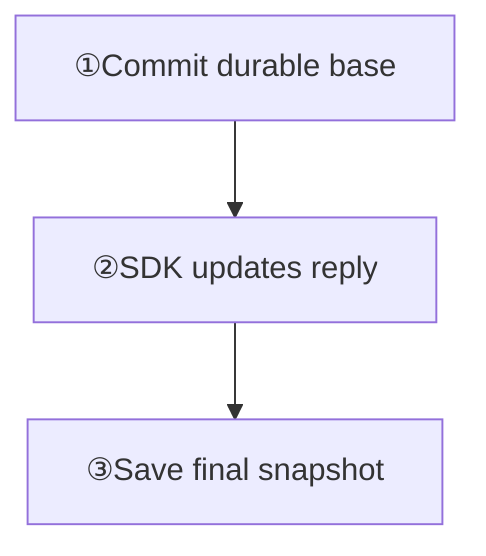
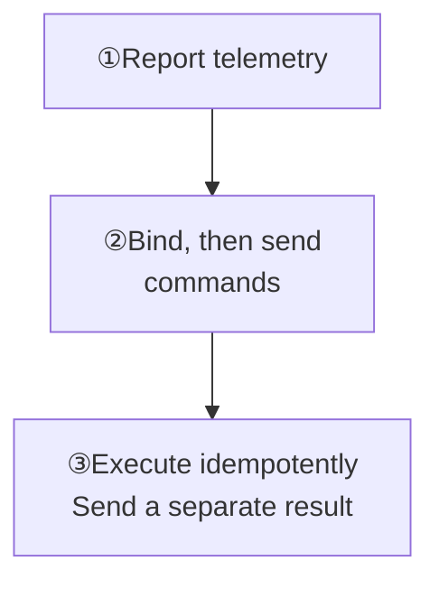

Choose the outcome you want:

<Cards>
  <Card title="AI: streaming replies" description="Connect a real model, update one answer, and verify cancellation and recovery." href="/en/sdk/easy/agent-streaming" />
  <Card title="IoT: telemetry and control" description="Report state, send recoverable commands, and check device execution results." href="/en/guide/tutorials/ai-and-iot#iot-send-bounded-telemetry" />
</Cards>

<Callout type="warn" title="Keep credentials and HTTP mutations in a trusted backend">
  The default Gateway validates device CONNECT credentials; current Product HTTP routes have no general product authentication. Authorize browsers, mobile clients, and firmware through the product backend. Keep model API keys, token writes, and management requests there.
</Callout>

## AI: streaming replies

Run the real-model Demo in [Agent Streaming Replies](/en/sdk/easy/agent-streaming), then integrate the frontend SDK and Agent backend. The server must contain online EVENT delivery; an older image with event endpoints may not support live push.

<div className="tutorial-diagram">



</div>

**Check:** Set the stream setting on the base; wait for a successful SENDACK before serial event writes. Use SDK push online. On reconnect, the BFF reads the final snapshot without polling history.

<Callout type="warn" title="Terminal stream state must be recoverable">
  Increments may live only in a bounded Leader cache. After leadership changes, missing evidence makes finish fail closed. Replay complete deltas or the final snapshot, then retry. The full tutorial also covers cancellation and failures.
</Callout>

<details id="ai-create-a-durable-stream-anchor">
  <summary>AI: full backend request for the base message</summary>

The product service first enforces model authorization, quotas, content safety, and cancellation policy. After a user prompt, send one base answer with a stable `client_msg_no` and the legacy stream bit. `setting=2` marks a stream message:

```bash
curl -sS http://127.0.0.1:5001/message/send \
  -H 'Content-Type: application/json' \
  -d '{
    "from_uid":"ai-assistant",
    "channel_id":"alice",
    "channel_type":1,
    "client_msg_no":"ai-answer-req-42",
    "setting":2,
    "payload":"eyJ2ZXJzaW9uIjoxLCJ0eXBlIjoiYWlfYW5zd2VyIiwic3RhdHVzIjoic3RyZWFtaW5nIiwicmVxdWVzdF9pZCI6InJlcS00MiJ9"
  }'
```

Wait for `reason=1` before appending events. It proves that the base message reached Channel quorum commit, not that model generation, client rendering, or the product task completed.

The current product path verifies that the base is committed, has the stream setting, and matches the event identity. Preserve the exact Channel, sender, and `client_msg_no`; the base must not be NoPersist or SyncOnce. See [Agent Streaming Replies](/en/sdk/easy/agent-streaming) for the complete SDK and real-model tutorial.

</details>

<details id="ai-append-deltas-and-finish">
  <summary>AI: delta, idempotency, and finish requests</summary>

Open the default event lane:

```bash
curl -sS http://127.0.0.1:5001/message/event \
  -H 'Content-Type: application/json' \
  -d '{
    "channel_id":"alice",
    "channel_type":1,
    "from_uid":"ai-assistant",
    "client_msg_no":"ai-answer-req-42",
    "event_id":"ai-answer-req-42-open",
    "event_type":"stream.open",
    "payload":{"kind":"text"}
  }'
```

Give every generated chunk a new stable `event_id`. Retry an uncertain result with the same ID and identical payload:

```bash
curl -sS http://127.0.0.1:5001/message/event \
  -H 'Content-Type: application/json' \
  -d '{
    "channel_id":"alice",
    "channel_type":1,
    "from_uid":"ai-assistant",
    "client_msg_no":"ai-answer-req-42",
    "event_id":"ai-answer-req-42-delta-0001",
    "event_type":"stream.delta",
    "payload":{"kind":"text","delta":"Hello"}
  }'
```

Reusing an applied `event_id` returns its original result; it does not replace the event with a different payload. `stream.open`, `stream.delta`, and `stream.snapshot` may remain only in the bounded Slot-Leader cache, in which case `msg_event_seq` can be `0`.

Commit the terminal state when generation ends:

```bash
curl -sS http://127.0.0.1:5001/message/event \
  -H 'Content-Type: application/json' \
  -d '{
    "channel_id":"alice",
    "channel_type":1,
    "from_uid":"ai-assistant",
    "client_msg_no":"ai-answer-req-42",
    "event_id":"ai-answer-req-42-finish",
    "event_type":"stream.finish",
    "payload":{"snapshot":{"kind":"text","text":"Hello"}}
  }'
```

`stream.finish` places all still-open lanes and the reserved finish marker into one Slot proposal to create the terminal projection. If leadership changes and the new leader lacks cached evidence, finish fails closed. Replay the complete deltas or final snapshot before retrying finish instead of recording an incomplete answer as complete.

</details>

<details id="ai-sync-the-terminal-projection">
  <summary>AI: terminal projection and recovery request</summary>

A reconnecting client can request compact event metadata:

```bash
curl -sS http://127.0.0.1:5001/channel/messagesync \
  -H 'Content-Type: application/json' \
  -d '{
    "login_uid":"alice",
    "channel_id":"ai-assistant",
    "channel_type":1,
    "start_message_seq":0,
    "limit":20,
    "pull_mode":1,
    "event_summary_mode":"full"
  }'
```

The response can include `event_meta`, completion state, and the final snapshot. A server containing online event delivery sends public increments to online Sessions as EVENT; EasySDK-JS receives them through `WKIMEvent.CustomEvent`. Do not poll history online; `/message/eventsync` is unnecessary. Offline recovery calls `/channel/messagesync` through the BFF. An older release with an event endpoint is not proof of live delivery support; see the deployment requirements in [Agent Streaming Replies](/en/sdk/easy/agent-streaming).

</details>

## IoT: send bounded telemetry

① Assign `device-42` a stable UID and revocable credentials. The backend creates `fleet-west` and authorizes the device and control service through membership policy.

**Check:** The device reports state and the control service independently receives it. Aggregate, sample, or send only changes; bound device rate, payload, and recovery windows. `reset=1` replaces members; reconcile an existing group against the product list first.

<div className="tutorial-diagram">



</div>

<details>
  <summary>Telemetry: group setup, send, and capacity limits</summary>

Assign every device a stable UID and revocable credential policy. A group Channel must already exist, and the sending device must satisfy its membership policy. Create the product-owned telemetry Channel from a trusted service network:

```bash
curl -sS http://127.0.0.1:5001/channel \
  -H 'Content-Type: application/json' \
  -d '{
    "channel_id":"fleet-west",
    "channel_type":2,
    "reset":1,
    "subscribers":["device-42","control-service"]
  }'
```

`reset=1` replaces membership with the supplied list, so use it for first-time provisioning or product-owned desired-state reconciliation, not blindly against unknown existing members. This example authorizes both the device and control service. After it succeeds, the device can send an ordinary durable message:

```bash
curl -sS http://127.0.0.1:5001/message/send \
  -H 'Content-Type: application/json' \
  -d '{
    "from_uid":"device-42",
    "channel_id":"fleet-west",
    "channel_type":2,
    "client_msg_no":"device-42-telemetry-1785897600",
    "payload":"eyJ2ZXJzaW9uIjoxLCJ0eXBlIjoidGVsZW1ldHJ5IiwidGVtcGVyYXR1cmVfYyI6MjEuNCwicmVwb3J0ZWRfYXQiOjE3ODU4OTc2MDB9"
  }'
```

Do not write every high-frequency sample forever as a chat message. Aggregate by device and time window, sample, or emit only state changes. Bound per-device rate, payload size, Channel hotspots, webhook/plugin consumption, and offline recovery windows independently.

</details>

## IoT: send a recoverable command

② Bind the device with `/message/cmd/bind` before its first command, then send `sync_once=1` on the same source Channel. Binding starts after the current CMD-log tail and does not backfill older commands.

**Check:** On reconnect, use `/message/sync` to recover commands sent after binding, then advance the cursor with `/message/syncack`. Cursor advance does not prove execution; NoPersist has no offline recovery.

<details>
  <summary>Commands: bind, send, sync, and unbind</summary>

A recoverable command should reuse a stable source Channel. Before sending the first target command, create durable CMD discovery for the device:

```bash
curl -sS http://127.0.0.1:5001/message/cmd/bind \
  -H 'Content-Type: application/json' \
  -d '{
    "uid":"device-42",
    "channel_id":"fleet-west",
    "channel_type":2
  }'
```

Binding starts at the sequence after the current CMD-log tail and does not backfill older commands, so it must happen before SEND. The trusted control service then sets `sync_once=1` on that same source Channel:

```bash
curl -sS http://127.0.0.1:5001/message/send \
  -H 'Content-Type: application/json' \
  -d '{
    "from_uid":"control-service",
    "channel_id":"fleet-west",
    "channel_type":2,
    "sync_once":1,
    "client_msg_no":"device-command-op-42",
    "payload":"eyJ2ZXJzaW9uIjoxLCJ0eXBlIjoiZGV2aWNlX2NvbW1hbmQiLCJvcGVyYXRpb25faWQiOiJvcC00MiIsImFjdGlvbiI6InNldF9mYW4iLCJ2YWx1ZSI6MiwiZGVhZGxpbmUiOjE3ODU4OTc2NjB9"
  }'
```

It enters the separate CMD log, and the binding creates a UID-owned CMD discovery directory rather than an ordinary conversation. After reconnecting, the device synchronizes the latest command generation:

```bash
curl -sS http://127.0.0.1:5001/message/sync \
  -H 'Content-Type: application/json' \
  -d '{"uid":"device-42","limit":20}'
```

Call `/message/syncack` after processing that response. It advances the server-recorded latest CMD sync generation; the request `last_message_seq` is a required compatibility field, not proof of device execution. When the device permanently loses command access to this source Channel, call `/message/cmd/unbind` with the same binding request shape.

Request-scoped `subscribers` can provide bounded immediate targeting, but they do not automatically create CMD discovery membership and cannot directly promise reconnect recovery. An online-only command must set both `no_persist=1` and `sync_once=1`. It has no durable sequence, offline sync, ordinary conversation, or `msg.offline`. Ordinary online-only messages can use `no_persist=1, sync_once=0` and retain their source Channel, with the same lack of offline recovery.

</details>

## Close the loop with a business result

③ Include `operation_id`, deadline, desired state, and version in the command. The device executes idempotently by `operation_id`, then sends a separate durable result message.

| Observation | What it confirms |
| --- | --- |
| SENDACK / `reason=1` | Message commit |
| RECV / RECVACK / syncack | Online delivery, receive feedback, or cursor advance |
| Product execution receipt | Desired state and execution outcome under product rules |

**Check:** Retrying one command does not repeat execution. Apply product rules to expired commands; compare the actual device state with its result message.

<details>
  <summary>Business receipts and launch checks</summary>

Every device command carries a product `operation_id`, deadline, desired state, and version. The device executes idempotently by `operation_id`, then sends a separate durable result message. SENDACK, RECV, RECVACK, and `/message/syncack` mean commit, online write, receive feedback, and cursor advance respectively; none proves that the fan reached the requested speed.

Before launch, test model cancellation, duplicate deltas, leader movement, cache pressure, terminal replay, device power loss, expired commands, repeated execution, out-of-order business results, hot device groups, and control-service rate limits. Continue with [Messages](/en/guide/core-concepts/messages), [Webhooks](/en/guide/integration/webhooks), and [Messaging](/en/guide/integration/messaging).

</details>

Continue with [Messaging](/en/guide/integration/messaging) and [Group membership](/en/guide/tutorials/large-groups).
