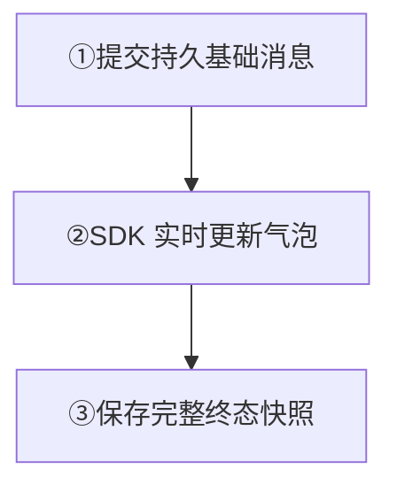
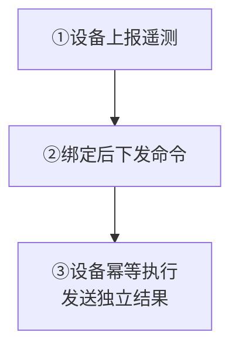

先选择要完成的场景：

<Cards>
  <Card title="AI：流式回复" description="接入真实模型，让同一条回答持续更新，验证取消与恢复。" href="/zh/sdk/easy/agent-streaming" />
  <Card title="IoT：遥测与设备控制" description="上报状态、发送可恢复命令，再核对设备执行结果。" href="/zh/guide/tutorials/ai-and-iot#iot发送有界遥测" />
</Cards>

<Callout type="warn" title="凭据与 HTTP 变更留在受信后端">
  默认 Gateway 校验设备 CONNECT 凭据，当前 Product HTTP 路由没有通用业务鉴权。浏览器、移动端和固件通过业务后端授权；模型 API Key、Token 写入和管理请求留在后端。
</Callout>

## AI：流式回复

从 [Agent 流式回复](/zh/sdk/easy/agent-streaming)运行真实模型 Demo，再接入前端 SDK 和 Agent 后端。服务端须包含在线 EVENT 投递实现；有事件接口的旧镜像不一定支持在线推送。

<div className="tutorial-diagram">



</div>

**核对：** 基础消息带 stream setting，SENDACK 成功后再串行写入事件。在线使用 SDK 推送；重连由 BFF 查询最终快照，不轮询历史。

<Callout type="warn" title="流式终态必须可恢复">
  增量可能只在有界 Leader 缓存中。Leader 切换后缺少证据时，finish 会拒绝完成；业务需重放完整增量或最终快照，再重试。完整教程同时说明取消与失败处理。
</Callout>

<details id="ai创建持久流锚点">
  <summary>AI：基础消息的完整后端请求</summary>

业务服务先完成模型权限、配额、内容安全和取消策略。收到用户问题后，以稳定 `client_msg_no` 发送一条带 legacy stream bit 的基础回答消息；`setting=2` 表示流式消息：

```bash
curl -sS http://127.0.0.1:5001/message/send \
  -H 'Content-Type: application/json' \
  -d '{
    "from_uid":"ai-assistant",
    "channel_id":"alice",
    "channel_type":1,
    "client_msg_no":"ai-answer-req-42",
    "setting":2,
    "payload":"eyJ2ZXJzaW9uIjoxLCJ0eXBlIjoiYWlfYW5zd2VyIiwic3RhdHVzIjoic3RyZWFtaW5nIiwicmVxdWVzdF9pZCI6InJlcS00MiJ9"
  }'
```

等待 `reason=1` 后再写事件。这证明基础消息已达到 Channel quorum commit，但不表示模型生成、客户端渲染或业务任务已完成。

当前产品路径会校验基础消息已提交、带 stream setting 且身份匹配。业务服务仍须保持完全相同的 Channel、发送者与 `client_msg_no`；基础消息不能是 NoPersist 或 SyncOnce。面向 SDK 和真实模型的完整教程见 [Agent 流式回复](/zh/sdk/easy/agent-streaming)。

</details>

<details id="ai追加增量并完成">
  <summary>AI：增量、幂等与完成请求</summary>

先打开默认事件 lane：

```bash
curl -sS http://127.0.0.1:5001/message/event \
  -H 'Content-Type: application/json' \
  -d '{
    "channel_id":"alice",
    "channel_type":1,
    "from_uid":"ai-assistant",
    "client_msg_no":"ai-answer-req-42",
    "event_id":"ai-answer-req-42-open",
    "event_type":"stream.open",
    "payload":{"kind":"text"}
  }'
```

每个生成块使用新的稳定 `event_id`；结果不明确时，用同一个 ID 和相同 Payload 重试：

```bash
curl -sS http://127.0.0.1:5001/message/event \
  -H 'Content-Type: application/json' \
  -d '{
    "channel_id":"alice",
    "channel_type":1,
    "from_uid":"ai-assistant",
    "client_msg_no":"ai-answer-req-42",
    "event_id":"ai-answer-req-42-delta-0001",
    "event_type":"stream.delta",
    "payload":{"kind":"text","delta":"Hello"}
  }'
```

已应用的 `event_id` 再次出现时返回原结果，不会用新 Payload 重写它。`stream.open`、`stream.delta` 和 `stream.snapshot` 可能只保存在 Slot Leader 的有界缓存中，此时 `msg_event_seq` 可以是 `0`。

生成结束后提交终态：

```bash
curl -sS http://127.0.0.1:5001/message/event \
  -H 'Content-Type: application/json' \
  -d '{
    "channel_id":"alice",
    "channel_type":1,
    "from_uid":"ai-assistant",
    "client_msg_no":"ai-answer-req-42",
    "event_id":"ai-answer-req-42-finish",
    "event_type":"stream.finish",
    "payload":{"snapshot":{"kind":"text","text":"Hello"}}
  }'
```

`stream.finish` 把仍打开的 lane 和保留的 finish marker 作为一个 Slot proposal 形成终态投影。如果领导权变化后新 Leader 没有缓存证据，finish 会 fail-closed；业务服务必须重放完整增量或终态快照，再重试 finish，不能把缺失内容标记为完成。

</details>

<details id="ai同步最终投影">
  <summary>AI：最终投影与恢复请求</summary>

重连客户端可以请求紧凑事件摘要：

```bash
curl -sS http://127.0.0.1:5001/channel/messagesync \
  -H 'Content-Type: application/json' \
  -d '{
    "login_uid":"alice",
    "channel_id":"ai-assistant",
    "channel_type":1,
    "start_message_seq":0,
    "limit":20,
    "pull_mode":1,
    "event_summary_mode":"full"
  }'
```

响应可包含 `event_meta`、完成状态和最终 snapshot。包含在线事件投递实现的服务端会把公开增量作为 EVENT 发给在线 Session；EasySDK-JS 用 `WKIMEvent.CustomEvent` 接收。在线不轮询历史、不需要 `/message/eventsync`；离线恢复由 BFF 调用 `/channel/messagesync`。旧发布版本不能仅因有事件接口而视为支持在线推送，部署要求见 [Agent 流式回复](/zh/sdk/easy/agent-streaming)。

</details>

## IoT：发送有界遥测

① 为 `device-42` 分配稳定 UID 与可撤销凭据，后端创建 `fleet-west`，按成员策略授权设备与控制服务。

**核对：** 设备上报状态，控制服务独立接收。高频采样先聚合、采样或只发变化；限制单设备速率、Payload 和恢复窗口。`reset=1` 会替换成员，已有群先核对业务名单。

<div className="tutorial-diagram">



</div>

<details>
  <summary>遥测：建群、发送与容量边界</summary>

为每台设备分配稳定 UID 和可撤销凭据。群 Channel 必须先存在，而且发送设备必须满足成员策略；在受信服务网络中创建产品拥有的遥测 Channel：

```bash
curl -sS http://127.0.0.1:5001/channel \
  -H 'Content-Type: application/json' \
  -d '{
    "channel_id":"fleet-west",
    "channel_type":2,
    "reset":1,
    "subscribers":["device-42","control-service"]
  }'
```

`reset=1` 用给定列表替换成员，适合首次配置或业务侧期望状态对账；不要在未知现有成员时盲目使用。这里同时授权设备和控制服务，成功后设备可以发送普通持久消息：

```bash
curl -sS http://127.0.0.1:5001/message/send \
  -H 'Content-Type: application/json' \
  -d '{
    "from_uid":"device-42",
    "channel_id":"fleet-west",
    "channel_type":2,
    "client_msg_no":"device-42-telemetry-1785897600",
    "payload":"eyJ2ZXJzaW9uIjoxLCJ0eXBlIjoidGVsZW1ldHJ5IiwidGVtcGVyYXR1cmVfYyI6MjEuNCwicmVwb3J0ZWRfYXQiOjE3ODU4OTc2MDB9"
  }'
```

高频采样不要逐条无限写入聊天日志。按设备/时间窗聚合、采样或只发送状态变化，并分别限制单设备速率、Payload 大小、Channel 热点、Webhook/插件消费和离线恢复窗口。

</details>

## IoT：发送可恢复命令

② 在第一条命令之前用 `/message/cmd/bind` 绑定设备，再在同一源 Channel 发送 `sync_once=1`。绑定从当前 CMD 日志尾部之后开始，不补回更早命令。

**核对：** 设备重连后用 `/message/sync` 恢复绑定后的命令，再调用 `/message/syncack` 推进游标。推进游标不代表执行成功；NoPersist 没有离线恢复。

<details>
  <summary>命令：绑定、发送、同步与解除绑定</summary>

可恢复命令应复用一个稳定的源 Channel。必须在第一条目标命令发送前，为设备建立持久 CMD 发现绑定：

```bash
curl -sS http://127.0.0.1:5001/message/cmd/bind \
  -H 'Content-Type: application/json' \
  -d '{
    "uid":"device-42",
    "channel_id":"fleet-west",
    "channel_type":2
  }'
```

绑定从当前 CMD 日志尾部的下一条 sequence 开始，不会补回更早的命令；因此必须先绑定再发送。随后，受信控制服务在同一源 Channel 上设置 `sync_once=1`：

```bash
curl -sS http://127.0.0.1:5001/message/send \
  -H 'Content-Type: application/json' \
  -d '{
    "from_uid":"control-service",
    "channel_id":"fleet-west",
    "channel_type":2,
    "sync_once":1,
    "client_msg_no":"device-command-op-42",
    "payload":"eyJ2ZXJzaW9uIjoxLCJ0eXBlIjoiZGV2aWNlX2NvbW1hbmQiLCJvcGVyYXRpb25faWQiOiJvcC00MiIsImFjdGlvbiI6InNldF9mYW4iLCJ2YWx1ZSI6MiwiZGVhZGxpbmUiOjE3ODU4OTc2NjB9"
  }'
```

它进入独立 CMD 日志，绑定创建 UID-owned CMD 发现目录，不污染普通会话。设备重连后同步最新命令 generation：

```bash
curl -sS http://127.0.0.1:5001/message/sync \
  -H 'Content-Type: application/json' \
  -d '{"uid":"device-42","limit":20}'
```

处理完本次返回后调用 `/message/syncack`。该调用推进服务端记录的最新 CMD sync generation；请求 `last_message_seq` 是兼容必填字段，不是设备执行成功证明。设备永久失去该源 Channel 的命令权限时，用相同请求结构调用 `/message/cmd/unbind`。

请求级 `subscribers` 可以做有界的即时目标投递，但不会自动创建 CMD 发现绑定，不能直接承诺重连恢复。在线瞬时命令必须同时设置 `no_persist=1` 和 `sync_once=1`；它没有持久 sequence、离线同步、普通会话或 `msg.offline`。普通在线消息可以使用 `no_persist=1, sync_once=0` 并保留源频道，同样不支持离线恢复。

</details>

## 用业务结果闭环

③ 命令携带 `operation_id`、deadline、期望状态与版本。设备按 `operation_id` 幂等执行，再发送独立的持久结果消息。

| 观察结果 | 能确认什么 |
| --- | --- |
| SENDACK / `reason=1` | 消息已提交 |
| RECV / RECVACK / syncack | 在线投递、接收反馈或游标推进 |
| 业务执行回执 | 按业务规则核对目标状态与执行结果 |

**核对：** 同一命令重试不重复执行，过期命令按业务规则处理；实际设备状态与结果消息一致。

<details>
  <summary>业务回执与上线核对</summary>

每个设备命令携带产品级 `operation_id`、deadline、期望状态和版本。设备先按 `operation_id` 幂等执行，再发送一条独立持久结果消息。SENDACK、RECV、RECVACK 和 `/message/syncack` 分别代表提交、在线写入、接收反馈和游标推进，都不代表风扇已经设置为目标档位。

上线前测试模型取消、重复 delta、Leader 切换、缓存压力、终态重放、设备断电、过期命令、重复执行、乱序业务结果、热点设备群和控制服务限流。继续阅读 [消息](/zh/guide/core-concepts/messages)、[Webhook](/zh/guide/integration/webhooks) 和 [消息收发](/zh/guide/integration/messaging)。

</details>

继续阅读[消息收发](/zh/guide/integration/messaging)与[群成员维护](/zh/guide/tutorials/large-groups)。
