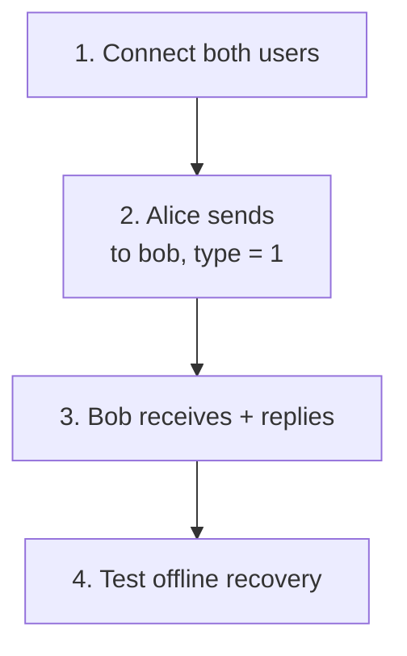

Goal: Alice sends to Bob, Bob replies, and missing persistent messages recover through the chosen SDK path.

<div className="tutorial-diagram">



</div>

## 1. Connect both users

Prepare a [single-node cluster](/en/server/deployment/docker) and two independent clients. Start with the [Web two-user example](/en/sdk/javascript/quickstart), or use the [Chat Demo](/en/guide/quick-start/first-message) for an initial exchange.

Your backend owns login, friendship, bans, and token issuance. Use stable UIDs and matching device categories. Protect Product HTTP; enforce token expiry, rotation, and revocation as described in [Authentication](/en/guide/integration/authentication).

**Check:** both clients reach a connected, send-ready state. Run HTTP examples only from your trusted backend or protected test network.

<details>
  <summary>Prepare test credentials from the backend</summary>

The product service owns account login, friendship, bans, and content policy. Choose stable UIDs for the two test users; do not substitute a nickname, connection ID, or device ID for the UID.

If the [Web two-user example](/en/sdk/javascript/quickstart) is running, its BFF has already prepared Alice and Bob; continue at step 2. For your own integration, store development tokens from the trusted backend. This example uses the Web device category `device_flag=1`; the client must use the same category:

```bash
curl -sS http://127.0.0.1:5001/user/token \
  -H 'Content-Type: application/json' \
  -d '{"uid":"alice","token":"alice-local-only","device_flag":1,"device_level":1}'
```


Store separate metadata for Bob, then connect both clients with their own UID, device identity, and token. If no SDK integration exists yet, use the [embedded Chat Demo](/en/guide/quick-start/first-message) to validate two browser sessions first.

</details>

## 2. Send to the peer UID

Alice sends to `channel_id=bob`, `channel_type=1`. Bob replies to `channel_id=alice`. Let the server normalize the internal person Channel ID.

Retain a stable `client_msg_no`. For an uncertain result, preserve the same logical-send identity and use the supported retry path. **Check:** inspect SENDACK or HTTP `reason=1` for the default persistent send; this does not prove reception or reading.

<details>
  <summary>Backend send: text format and complete request</summary>

The client uses the **peer UID** as `channel_id` and sets `channel_type=1`. Do not construct or persist the internal canonical person Channel ID; the server normalizes it from sender and receiver UIDs.

A trusted product service can send with the same semantics:

This example uses the built-in SDK text format, matching the Web example. Before encoding, the JSON is:

```json
{"type":1,"content":"hello Bob"}
```

The `payload` below is the UTF-8 Base64 encoding of this JSON. Custom types and fields need a matching client decoder; see [Custom Messages](/en/sdk/javascript/advanced/custom-messages).

```bash
curl -sS http://127.0.0.1:5001/message/send \
  -H 'Content-Type: application/json' \
  -d '{
    "from_uid":"alice",
    "channel_id":"bob",
    "channel_type":1,
    "client_msg_no":"dm-alice-bob-0001",
    "payload":"eyJ0eXBlIjoxLCJjb250ZW50IjoiaGVsbG8gQm9iIn0="
  }'
```

Retain a stable, unique `client_msg_no`. If the network outcome is unclear, retry the same logical send with the same number instead of creating a duplicate with a new number. HTTP `reason=1` means the durable send reached durable Channel commit; it does not mean every Bob device received it.

</details>

## 3. Verify reception and reply

Bob receives Alice's exact text once and replies; Alice independently verifies reception. Do not substitute the sender's success indicator for this check.

<TutorialScreenshot
  src="/tutorials/first-message/exchange-en.jpg"
  alt="Bob's Chat Demo receives hello from alice and replies hello from bob"
  width={1280}
  height={280}
  marks={[{ x: 42, y: 57 }, { x: 81, y: 82 }]}
>
  ① Bob receives. ② Bob replies. The real Chat Demo capture uses the `quickstart-alice` / `quickstart-bob` test UIDs; it does not prove a read receipt. Click for the original.
</TutorialScreenshot>

## 4. Test disconnect and recovery

Disconnect Bob, send a new persistent message from Alice, then reconnect Bob. Verify the missing message appears once, with the correct Channel order.

| SDK path | Recovery check |
| --- | --- |
| Full SDK | Synchronize missing persistent messages and merge/deduplicate online and recovered results |
| EasySDK | Verify online reconnect; history, conversations, and unread recovery require your backend implementation |

NoPersist has no durable history or offline recovery. `message_seq` orders one Channel, not all chats.

<TutorialScreenshot
  src="/tutorials/web-sdk/recovery.jpg"
  alt="The Web example recovers one missing message through SYNCED after Bob reconnects"
  width={1280}
  height={720}
  marks={[{ x: 53, y: 78 }, { x: 53, y: 83 }]}
>
  ① SYNCED is the recovered message. ② Sync complete · 1 recovered is this run’s result. This is the full Web SDK example, not automatic EasySDK history sync. Click for the original.
</TutorialScreenshot>

<details>
  <summary>Backend history query and merge rules</summary>

An online Bob should receive `RECV` and send `RECVACK` after processing it. Verify the durable log through the compatibility sync route; a person-Channel query still uses the peer UID:

```bash
curl -sS http://127.0.0.1:5001/channel/messagesync \
  -H 'Content-Type: application/json' \
  -d '{
    "login_uid":"bob",
    "channel_id":"alice",
    "channel_type":1,
    "start_message_seq":0,
    "limit":20,
    "pull_mode":1
  }'
```

The response maps `channel_id` back to `alice`; `message_seq` is ordered only within this person Channel. Merge online delivery and reconnect sync by message ID, `client_msg_no`, and Channel sequence while tolerating duplicate arrival.

</details>

<details>
  <summary>Account conversation and unread checks</summary>

```bash
curl -sS http://127.0.0.1:5001/conversation/list \
  -H 'Content-Type: application/json' \
  -d '{"uid":"bob","limit":20}'
```

Bob's item uses `channel_id=alice`. `unread` is computed from Bob's read position and visible messages in the Channel; it is not the total number of deliveries across devices. After the user confirms the current conversation is read, call through the trusted boundary:

```bash
curl -sS http://127.0.0.1:5001/conversations/clearUnread \
  -H 'Content-Type: application/json' \
  -d '{"uid":"bob","channel_id":"alice","channel_type":1}'
```

`clearUnread` advances Bob's read position (`read_seq`) to the newest committed ordinary message. Messages arriving during the operation can also have their unread badge cleared; this does not prove to Alice which messages Bob actually read. Other devices using the same UID see the update after synchronization.

</details>

<details>
  <summary>Multiple devices and release scenarios</summary>

1. Connect a second Bob Session with a different `device_id`.
2. Define the product's primary/secondary-device conflict policy; one UID does not imply one connection.
3. Disconnect one device, then publish another durable message.
4. Reconnect and recover the missing sequence through SDK sync or `/channel/messagesync`.
5. Verify that online delivery, offline recovery, and account unread state are not treated as one completion signal.

Before launch, also test friendship removal, denylist policy, token revocation, disconnect retries, duplicate sends, direct-Channel distribution, and duplicate webhook consumption. Continue with [Groups & Large Groups](/en/guide/tutorials/large-groups) or [Messaging](/en/guide/integration/messaging).

</details>

Next: [Groups & Large Groups](/en/guide/tutorials/large-groups) and [release checks](/en/guide/integration/acceptance). Capture versions are recorded in the [Web tutorial](/en/sdk/javascript/quickstart).
