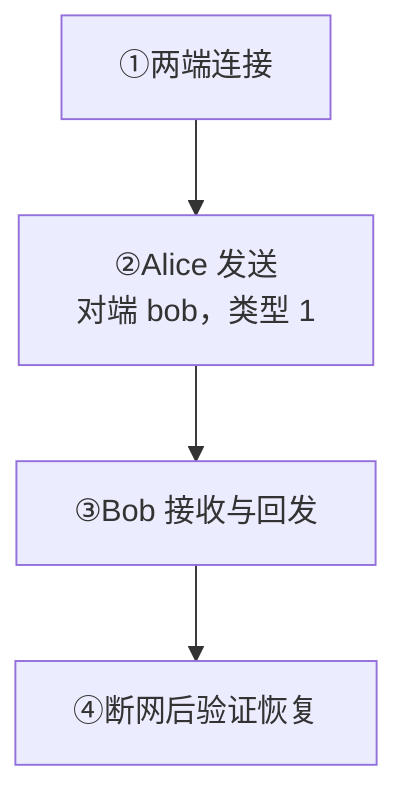

目标：Alice 发给 Bob，Bob 回发，并按所选 SDK 的能力恢复缺失的持久消息。

<div className="tutorial-diagram">



</div>

## 1. 连接两个用户

准备[单节点集群](/zh/server/deployment/docker)和两个独立客户端。可先运行 [Web 双用户示例](/zh/sdk/javascript/quickstart)，或用 [Chat Demo](/zh/guide/quick-start/first-message)验证收发。

业务后端负责登录、好友、封禁与 Token 发放。UID 保持稳定，设备类别与凭据一致。保护 Product HTTP，按[身份认证](/zh/guide/integration/authentication)实现过期、轮换与撤销。

**核对：** 两端都已连接并可发送。HTTP 示例只在受信业务后端或受保护的测试网络执行。

<details>
  <summary>后端准备测试凭据</summary>

业务服务应拥有账号登录、好友关系、封禁和内容策略。为两个测试用户选择稳定 UID；不要使用昵称、连接 ID 或设备 ID 代替 UID。

已运行 [Web 双用户示例](/zh/sdk/javascript/quickstart)时，Alice 和 Bob 的凭据已由 BFF 准备，可以直接进入第 2 步。自行接入时，由受信后端保存测试设备 Token；下例使用 Web 设备类别 `device_flag=1`，客户端须保持一致：

```bash
curl -sS http://127.0.0.1:5001/user/token \
  -H 'Content-Type: application/json' \
  -d '{"uid":"alice","token":"alice-local-only","device_flag":1,"device_level":1}'
```


为 Bob 保存独立凭据，然后让两个客户端分别使用自己的 UID、设备标识和 Token 建立连接。没有 SDK 集成时，可以先用[内嵌 Chat Demo](/zh/guide/quick-start/first-message)验证两个浏览器会话。

</details>

## 2. 向对端 UID 发送

Alice 使用 `channel_id=bob`、`channel_type=1`；Bob 回发使用 `channel_id=alice`。内部单聊频道 ID 由服务端归一化。

保留稳定的 `client_msg_no`。结果不确定时，保留同一次逻辑发送的标识，按支持的方式重试。**核对：** 默认持久消息检查 SENDACK 或 HTTP `reason=1`；成功不代表 Bob 已收到或已读。

<details>
  <summary>后端发送：文本格式与完整请求</summary>

客户端发送时使用**对端 UID** 作为 `channel_id`，并设置 `channel_type=1`。不要自行拼接或存储服务端内部的单聊频道 ID；服务端会用发送方和接收方 UID 归一化。

受信业务服务也可以用同一语义发送：

本例使用 SDK 内置文本格式，与 Web 示例一致。编码前的 JSON 是：

```json
{"type":1,"content":"hello Bob"}
```

下方 `payload` 是该 JSON 的 UTF-8 Base64。自定义字段和类型需要配套客户端消息解码器，见[自定义消息](/zh/sdk/javascript/advanced/custom-messages)。

```bash
curl -sS http://127.0.0.1:5001/message/send \
  -H 'Content-Type: application/json' \
  -d '{
    "from_uid":"alice",
    "channel_id":"bob",
    "channel_type":1,
    "client_msg_no":"dm-alice-bob-0001",
    "payload":"eyJ0eXBlIjoxLCJjb250ZW50IjoiaGVsbG8gQm9iIn0="
  }'
```

保留稳定且唯一的 `client_msg_no`。网络结果不明确时，用同一个编号重试同一次逻辑发送，不要换编号制造重复消息。HTTP 返回 `reason=1` 表示持久发送到达 频道持久提交；它不表示 Bob 的每台设备都已收到。

</details>

## 3. 接收并回发

Bob 收到 Alice 的原文且只显示一次，再回发给 Alice；Alice 独立验证接收。发送方成功提示不能代替这一检查。

<TutorialScreenshot
  src="/tutorials/first-message/exchange.jpg"
  alt="Chat Demo 的 Bob 页面收到 hello from alice，并回复 hello from bob"
  width={1280}
  height={280}
  marks={[{ x: 42, y: 57 }, { x: 81, y: 82 }]}
>
  ① Bob 收到。② Bob 回发。实测 Chat Demo 使用 `quickstart-alice` / `quickstart-bob` 测试 UID，截图不证明对方已读。点击查看原图。
</TutorialScreenshot>

## 4. 断网后核对恢复

先断开 Bob，再由 Alice 发送一条新的持久消息。Bob 重连后，核对缺失消息只显示一次，频道内顺序正确。

| SDK 路径 | 验收方式 |
| --- | --- |
| 完整版 SDK | 同步缺失持久消息，合并在线与恢复结果并去重 |
| EasySDK | 验证在线重连；历史、会话和未读恢复由业务后端另行实现 |

NoPersist 没有持久历史与离线恢复。`message_seq` 只表示一个频道内的顺序。

<TutorialScreenshot
  src="/tutorials/web-sdk/recovery.jpg"
  alt="Web 示例中 Bob 重连后，通过 SYNCED 恢复一条缺失消息"
  width={1280}
  height={720}
  marks={[{ x: 53, y: 78 }, { x: 53, y: 83 }]}
>
  ① SYNCED 是恢复的消息。② Sync complete · 1 recovered 是本次实测结果。这是完整版 Web SDK 示例，不表示 EasySDK 自动同步历史。点击查看原图。
</TutorialScreenshot>

<details>
  <summary>后端历史查询与合并规则</summary>

在线 Bob 应收到 `RECV` 并在处理后发送 `RECVACK`。再用兼容同步接口验证持久日志；个人频道查询仍使用对端 UID：

```bash
curl -sS http://127.0.0.1:5001/channel/messagesync \
  -H 'Content-Type: application/json' \
  -d '{
    "login_uid":"bob",
    "channel_id":"alice",
    "channel_type":1,
    "start_message_seq":0,
    "limit":20,
    "pull_mode":1
  }'
```

响应中的 `channel_id` 会映射回 `alice`，`message_seq` 只在这一个 person Channel 内有序。客户端应按消息 ID、`client_msg_no` 和 Channel sequence 合并在线投递与重连同步，允许重复到达。

</details>

<details>
  <summary>账号会话与未读检查</summary>

```bash
curl -sS http://127.0.0.1:5001/conversation/list \
  -H 'Content-Type: application/json' \
  -d '{"uid":"bob","limit":20}'
```

Bob 的会话项使用 `channel_id=alice`。`unread` 根据 Bob 在该频道的已读位置和可见消息计算，不是所有设备收到消息的总次数。用户确认当前会话已读后，由受信边界调用：

```bash
curl -sS http://127.0.0.1:5001/conversations/clearUnread \
  -H 'Content-Type: application/json' \
  -d '{"uid":"bob","channel_id":"alice","channel_type":1}'
```

`clearUnread` 会把 Bob 的已读位置（`read_seq`）推进到最新已提交的普通消息。因此操作期间新到达的消息也可能一起被清除红点；这不会向 Alice 证明 Bob 实际阅读了哪些消息。同一 UID 的其他设备在同步后也会看到更新。

</details>

<details>
  <summary>多设备与上线场景</summary>

1. 用不同 `device_id` 建立 Bob 的第二个 Session。
2. 明确产品的主/从设备冲突策略，不把“同 UID”理解为“只有一条连接”。
3. 断开其中一个设备，再发送一条新的持久消息。
4. 重连后通过 SDK 同步或 `/channel/messagesync` 恢复缺失 sequence。
5. 验证在线投递、离线恢复和 账号未读状态不会被当成同一个完成信号。

上线前还要测试好友解除、黑名单、Token 撤销、断线重试、重复发送、热点单聊分布和 Webhook 重复消费。继续阅读[群聊与超大群](/zh/guide/tutorials/large-groups)或[消息收发](/zh/guide/integration/messaging)。

</details>

下一步：[群聊与超大群](/zh/guide/tutorials/large-groups)与[上线检查](/zh/guide/integration/acceptance)。截图版本见 [Web 教程](/zh/sdk/javascript/quickstart)。
