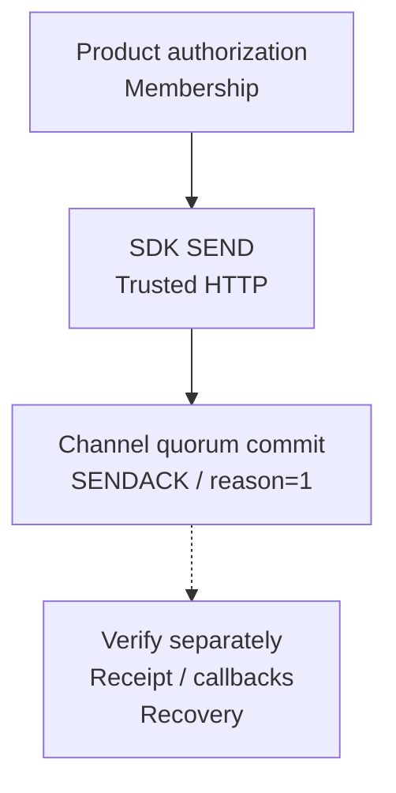

Choose an outcome, then check each tutorial's results.

<Cards>
  <Card title="Exchange messages" description="Connect Alice and Bob, verify both directions, then test disconnect recovery." href="/en/guide/tutorials/direct-chat" />
  <Card title="Create a group" description="Prepare three members, check each receiver, then verify member removal." href="/en/guide/tutorials/large-groups" />
  <Card title="Send offline notifications" description="Register devices → receive callbacks → call a provider → recover on open." href="/en/guide/tutorials/push" />
  <Card title="Stream an AI reply" description="Run a real-model Demo; verify live updates, cancellation, and recovery." href="/en/sdk/easy/agent-streaming" />
  <Card title="Report and control devices" description="Send telemetry and recoverable commands; check separate execution receipts." href="/en/guide/tutorials/ai-and-iot#iot-send-bounded-telemetry" />
  <Card title="Scale to 100,000 members" description="Reconcile bounded member batches and verify hotspot and delivery capacity." href="/en/guide/tutorials/large-groups#scale-to-100000-members" />
  <Card title="Exchange MQTT messages" description="Authenticate Node.js clients, subscribe and verify both directions; development preview." href="/en/guide/tutorials/mqtt" />
</Cards>

<Callout type="warn" title="Establish a trusted boundary first">
  Current WuKongIM HTTP API routes have no general product authentication. HTTP management requests belong only in a trusted product backend or a protected test environment.
</Callout>

**Verify separately:** Message commit, peer receipt, recovery, and business completion. Unread changes, provider acceptance, and command-sync cursors cannot replace business results.

  
Shared success model for all tutorials

The product service uses its own database, idempotency keys, and compensation flow when business results require strong consistency.

Continue with [Integration Architecture](/en/guide/integration/architecture) and [Release Checks](/en/guide/integration/acceptance).
