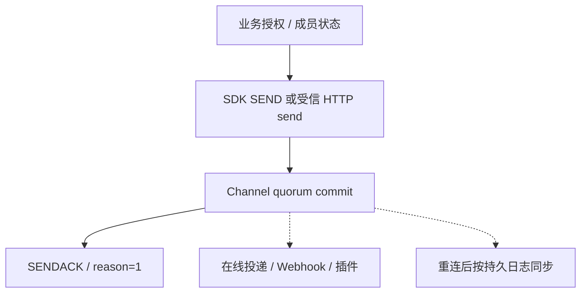

场景教程从业务目标出发，把业务服务、客户端 SDK 与 WuKongIM 集群串成端到端路径。它们不是 API 字段全集，而是帮助你确定职责、顺序、成功条件和故障补偿。

<Callout type="warn" title="先建立受信边界">
  教程中的 HTTP 命令只应由本地开发环境或受信业务服务调用。当前产品 HTTP 路由没有通用业务鉴权中间件，浏览器和移动端不能直接持有这些管理能力。
</Callout>

<Cards>
  <Card title="单聊" description="完成身份接入、个人 Channel 消息、离线恢复、会话未读与多设备验证。" href="/zh/guide/tutorials/direct-chat" />
  <Card title="群聊与超大群" description="完成群成员维护、群消息、成员变更与十万成员容量边界。" href="/zh/guide/tutorials/large-groups" />
  <Card title="消息推送" description="用离线 Webhook、业务 Outbox 和推送厂商完成可恢复通知。" href="/zh/guide/tutorials/push" />
  <Card title="AI 与 IoT 通信" description="组合 AI 流式投影、设备遥测、持久命令与业务回执。" href="/zh/guide/tutorials/ai-and-iot" />
</Cards>

## 如何选择

| 目标 | 从这里开始 | 最重要的边界 |
| --- | --- | --- |
| 两个用户互发消息 | [单聊](/zh/guide/tutorials/direct-chat) | 使用对端 UID，canonical person Channel 由服务端生成 |
| 普通群聊 | [群聊与超大群](/zh/guide/tutorials/large-groups) | 业务系统维护群生命周期和成员，WuKongIM 维护消息日志 |
| 十万成员社区或房间 | [群聊与超大群](/zh/guide/tutorials/large-groups#扩展到十万成员) | 成员分批协调、提交后分页 Fan-out、热点容量验证 |
| 离线移动通知 | [消息推送](/zh/guide/tutorials/push) | Webhook 只产生候选，业务 Outbox 和厂商回执负责可靠性 |
| AI 流式回答 | [AI 与 IoT 通信](/zh/guide/tutorials/ai-and-iot#ai创建持久流锚点) | 基础消息先提交，终态投影持久化，实时 Token 流由业务侧拥有 |
| 设备遥测与控制 | [AI 与 IoT 通信](/zh/guide/tutorials/ai-and-iot#iot发送有界遥测) | 命令同步游标不等于设备业务执行成功 |

## 所有教程共用的成功模型

把“消息已提交”“某个 Session 已在线收到”“用户会话未读已更新”和“业务动作已完成”作为四种不同结果。需要强一致业务结果时，由业务服务使用自己的数据库、幂等键和补偿流程完成。

四个场景教程现在都已发布。继续阅读[适用场景](/zh/guide/product-overview/use-cases)、[集成架构](/zh/guide/integration/architecture)和[消息收发](/zh/guide/integration/messaging)，把示例收敛为自己的业务协议与可靠性目标。
