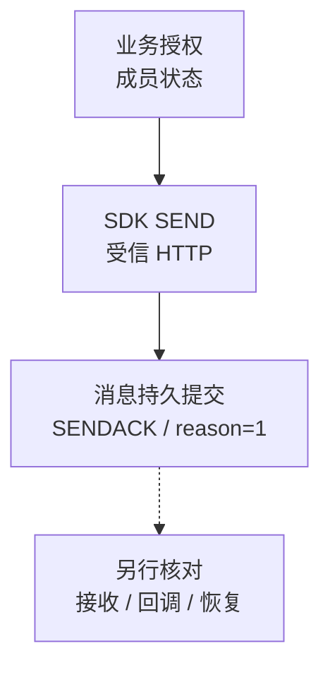

选择目标，按教程的步骤核对结果。

<Cards>
  <Card title="两人互发消息" description="连接 Alice 与 Bob，检查双向收发和断网恢复。" href="/zh/guide/tutorials/direct-chat" />
  <Card title="建立群聊" description="准备三人群，分别检查接收，再验证移除成员。" href="/zh/guide/tutorials/large-groups" />
  <Card title="发送离线通知" description="设备登记 → 离线回调 → 厂商推送 → 点击后恢复。" href="/zh/guide/tutorials/push" />
  <Card title="AI 流式回复" description="运行真实模型 Demo，验证持续更新、取消与恢复。" href="/zh/sdk/easy/agent-streaming" />
  <Card title="设备遥测与控制" description="上报状态、发送可恢复命令，核对独立执行回执。" href="/zh/guide/tutorials/ai-and-iot#iot发送有界遥测" />
  <Card title="十万成员群" description="按有界批次协调成员，验证热点与投递容量。" href="/zh/guide/tutorials/large-groups#扩展到十万成员" />
  <Card title="MQTT 收发消息" description="Node.js 客户端认证、订阅并完成双向收发；开发预览。" href="/zh/guide/tutorials/mqtt" />
</Cards>

<Callout type="warn" title="先建立受信边界">
  当前 Product HTTP 没有通用业务鉴权。教程里的 HTTP 管理请求只由受信业务后端或受保护的测试环境执行。
</Callout>

**分别核对：** 消息提交、对端接收、恢复与业务完成。未读更新、推送厂商受理或命令同步游标，都不能代替业务结果。

  
所有教程共用的成功模型

```mermaid
flowchart TD
  policy["业务授权<br/>成员状态"] --> send["SDK SEND<br/>受信 HTTP"]
  send --> commit["消息持久提交<br/>SENDACK / reason=1"]
  commit -.-> effects["另行核对<br/>接收 / 回调 / 恢复"]
```

需要强一致业务结果时，由业务服务使用自己的数据库、幂等键和补偿流程完成。

继续阅读[集成架构](/zh/guide/integration/architecture)与[上线检查](/zh/guide/integration/acceptance)。
